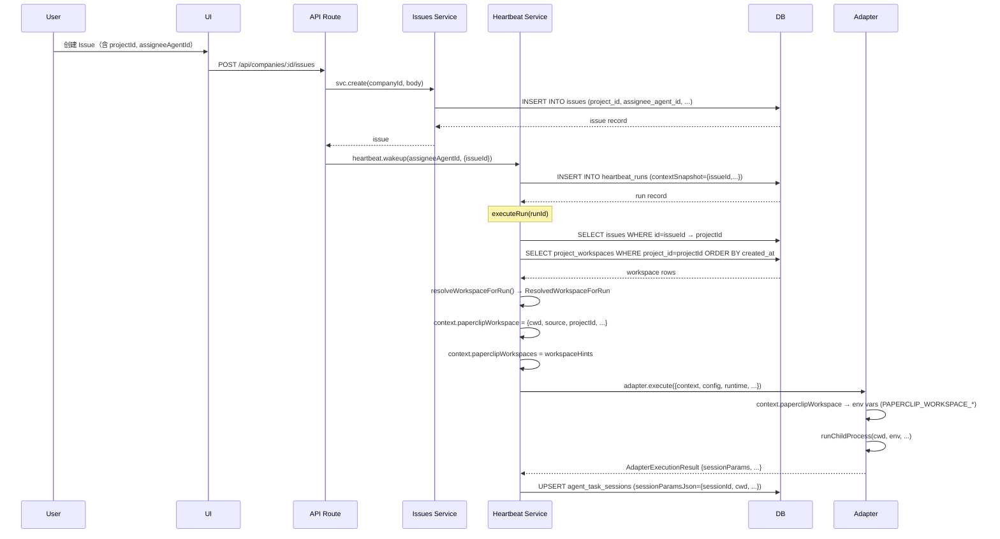
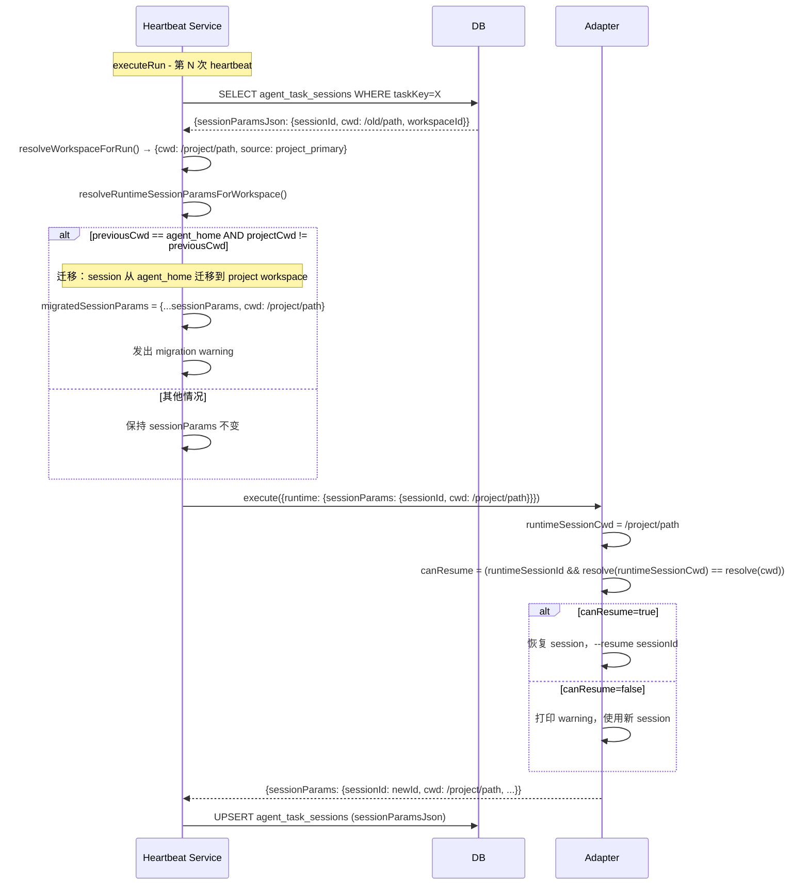

# 设计说明文档：Assignee 使用 Project 环境信息的完整过程

**文档版本**: 1.0  
**日期**: 2026-03-12  
**受众**: 系统工程师、集成开发者、代码审计人员  
**主问题**: Assignee 在执行 Issue 时，Project 的环境信息到底是如何进入 Assignee 运行时的？这是否真的是环境变量传递？

---

## 1. 文档目标

1. **明确回答**：Project 信息是否通过"环境变量"传递给 Assignee，以及真实传递机制是什么。
2. **完整追踪**：从 Issue 创建 → wakeup → heartbeat 执行 → adapter 调用 → 进程运行，完整说明 Project workspace 信息的流动路径。
3. **消除歧义**：区分"真正的环境变量（OS-level env var）"与"运行时上下文（runtime context）"与"adapter 配置（adapterConfig）"。
4. **说明决策链**：精确描述 Assignee 最终运行目录 `cwd` 的决定优先级与分支条件。
5. **记录证据**：所有结论均附代码文件路径与行号，不允许臆测。

---

## 2. 结论摘要

| # | 结论 | 证据 |
|---|---|---|
| 1 | **不存在"Project 环境变量"** — Project 信息首先作为运行时 context 字段传递，部分字段在 adapter 执行时才被转化为 OS 环境变量（`PAPERCLIP_WORKSPACE_*`）。 | `heartbeat.ts:1119-1127`；`claude-local/execute.ts:180-196` |
| 2 | **不存在名为 `$AGENT_HOME` 的环境变量** — 与该概念最接近的是 `resolveDefaultAgentWorkspaceDir(agentId)`，它基于 `PAPERCLIP_HOME` / `PAPERCLIP_INSTANCE_ID` 计算出 `~/.paperclip/instances/default/workspaces/<agentId>`。 | `home-paths.ts:56-62` |
| 3 | **Project 与 Assignee 在 Issue 创建时不存在强约束** — `createIssueSchema` 中 `projectId` 与 `assigneeAgentId` 是完全独立的可选字段，系统不校验 Assignee 是否属于 Project。 | `validators/issue.ts:11-25`；`issues.ts route:416-456` |
| 4 | **cwd 决策链（降序优先级）**: project workspace `cwd`（存在且目录可访问）→ task_session 保存的 `cwd`（目录可访问）→ agent_home fallback（`resolveDefaultAgentWorkspaceDir`）。 | `heartbeat.ts:519-620` |
| 5 | **adapterConfig.cwd 优先于 agent_home fallback，但低于 project workspace** — 仅当 workspace source 为 `agent_home` 且 `config.cwd` 非空时，才使用 `config.cwd` 替代 agent_home 路径。 | `claude-local/execute.ts:126-129`；`codex-local/execute.ts:137-140` |
| 6 | **Workspace 信息被写入 `context.paperclipWorkspace`（对象）和 `context.paperclipWorkspaces`（数组）** — 这是 runtime context 字段，不是环境变量。 | `heartbeat.ts:1119-1127` |
| 7 | **Adapter 层再将 context 字段转化为 `PAPERCLIP_WORKSPACE_*` 系列 OS 环境变量** — 这是真正的环境变量注入点，由每个 adapter 的 `execute()` 函数完成。 | `claude-local/execute.ts:180-196`；`codex-local/execute.ts:189-206`；`cursor-local/execute.ts:226-243`；`opencode-local/execute.ts:148-153` |
| 8 | **session 恢复要求 `cwd` 一致** — adapter 在恢复 session 时检查保存的 `sessionParams.cwd` 与当前 `cwd` 是否匹配，不一致则放弃 resume。 | `claude-local/execute.ts:324-327`；`codex-local/execute.ts:228-231` |
| 9 | **Project 可以有多个 workspace** — `project_workspaces` 表以 `projectId` 为外键，无唯一约束。`isPrimary` 字段用于标记主 workspace，但系统在 `resolveWorkspaceForRun` 中实际上**按创建时间升序扫描全部 workspace**，返回第一个本地路径可访问的。 | `project_workspaces.ts:13-32`；`heartbeat.ts:499-545` |
| 10 | **`PAPERCLIP_HOME` 和 `PAPERCLIP_INSTANCE_ID` 影响所有默认路径** — 包括 agent_home workspace、嵌入式数据库、日志、密钥等。 | `home-paths.ts:14-30` |
| 11 | **`process` adapter 不注入 `PAPERCLIP_WORKSPACE_*` 系列** — 基础 process adapter 仅调用 `buildPaperclipEnv(agent)`，不读取 context，不注入 workspace 相关环境变量。 | `server/adapters/process/execute.ts:18-20` |
| 12 | **`useProjectWorkspace=false` 可在 Issue 级别跳过 project workspace 解析** — 通过 `issue.assigneeAdapterOverrides.useProjectWorkspace` 控制。 | `heartbeat.ts:1096-1101`；`validators/issue.ts:4-9` |

---

## 3. 背景：Issue 创建时 Project 与 Assignee 的关系

### 3.1 `projectId` 如何进入 Issue

Issue 创建请求经过 `createIssueSchema`（`packages/shared/src/validators/issue.ts:11`）验证，`projectId` 是可选字段（`z.string().uuid().optional().nullable()`）。路由处理器（`server/src/routes/issues.ts:416`）直接将请求体传递给 `svc.create()`，无额外 project 存在性校验（在 `issues` service 层校验）。

### 3.2 `assigneeAgentId` 如何进入 Issue

同在 `createIssueSchema` 中定义（`validators/issue.ts:19`），也是可选字段。若请求体包含 `assigneeAgentId` 或 `assigneeUserId`，路由层调用 `assertCanAssignTasks(req, companyId)` 校验权限（`issues.ts route:419-421`）。

### 3.3 是否存在 "Assignee 必须属于 Project" 规则

**不存在**。Issue 创建时，`projectId` 与 `assigneeAgentId` 之间无任何联动校验。任意 agent 均可被分配到任意项目下的 Issue，无成员关系约束。

### 3.4 Issue 创建后的 wakeup 触发

若新建 Issue 的 `assigneeAgentId` 非空且 `status != "backlog"`，路由层立即调用 `heartbeat.wakeup(issue.assigneeAgentId, {...})`，并在 `contextSnapshot` 中写入 `{ issueId: issue.id, source: "issue.create" }`（`issues.ts route:442-453`）。这是 `issueId` 进入 context 的起点。

---

## 4. 主链路：Assignee 使用 Project 信息的完整过程

### 步骤 1：Project Workspace 配置

用户通过 `POST /api/companies/:companyId/projects`（含 `workspace` 字段）或 `POST /api/projects/:projectId/workspaces` 创建 workspace 记录，写入 `project_workspaces` 表（`packages/db/src/schema/project_workspaces.ts:13`）。  
字段含义：
- `cwd`：本地绝对路径（可为 null，表示仅有远端仓库）
- `repoUrl`：远端仓库 URL（如 GitHub 地址）
- `repoRef`：分支/tag/commit（可选）
- `isPrimary`：是否为主 workspace（布尔值，默认 `false`）
- `name`：workspace 名称

### 步骤 2：Issue 绑定 `projectId`

Issue 创建时，`projectId` 字段直接存入 `issues.project_id`（`schema/issues.ts:23`），无触发逻辑。

### 步骤 3：Wakeup 携带 `issueId`

Issue 创建/状态变更/评论等事件触发 `heartbeat.wakeup(agentId, opts)`（`services/heartbeat.ts:1619`）。`opts.payload.issueId` 或 `opts.contextSnapshot.issueId` 包含 Issue ID。`enqueueWakeup` 创建 `heartbeat_runs` 记录，将 `contextSnapshot`（含 `issueId`）持久化（`heartbeat.ts:1619-1850 approx`）。

### 步骤 4：Heartbeat 通过 `issueId` 找回 `projectId`

`executeRun(runId)` 读取 run 记录，解析 `contextSnapshot`（`heartbeat.ts:1067`）。调用 `resolveWorkspaceForRun(agent, context, previousSessionParams, opts)`（`heartbeat.ts:1096`）。在该函数内（`heartbeat.ts:480-621`）：
```
const issueId = readNonEmptyString(context.issueId);
const issueProjectId = issueId
  ? await db.select({ projectId: issues.projectId }).from(issues).where(...)
  : null;
const resolvedProjectId = issueProjectId ?? contextProjectId;
```

### 步骤 5：Heartbeat 解析 Project Workspace

确定 `resolvedProjectId` 后，查询 `project_workspaces`（`heartbeat.ts:499-510`）：
```sql
SELECT * FROM project_workspaces
WHERE company_id = ? AND project_id = ?
ORDER BY created_at ASC, id ASC
```
遍历所有 workspace 行，逐一检查 `cwd` 是否为本地可访问目录（`fs.stat`）。返回第一个可访问的 workspace（`heartbeat.ts:519-543`）。若无可访问 workspace，fallback 到 `resolveDefaultAgentWorkspaceDir(agent.id)`（`heartbeat.ts:547`）。

### 步骤 6：Runtime Context 组装

`resolveWorkspaceForRun` 返回 `ResolvedWorkspaceForRun` 对象（`heartbeat.ts:77-91`），随即写入 context（`heartbeat.ts:1119-1130`）：
```typescript
context.paperclipWorkspace = {
  cwd: resolvedWorkspace.cwd,
  source: resolvedWorkspace.source,       // "project_primary" | "task_session" | "agent_home"
  projectId: resolvedWorkspace.projectId,
  workspaceId: resolvedWorkspace.workspaceId,
  repoUrl: resolvedWorkspace.repoUrl,
  repoRef: resolvedWorkspace.repoRef,
};
context.paperclipWorkspaces = resolvedWorkspace.workspaceHints;
if (resolvedWorkspace.projectId && !readNonEmptyString(context.projectId)) {
  context.projectId = resolvedWorkspace.projectId;
}
```

### 步骤 7：Adapter 消费 `paperclipWorkspace`

以 `claude_local` 为例（`packages/adapters/claude-local/src/server/execute.ts:115-129`）：
```typescript
const workspaceContext = parseObject(context.paperclipWorkspace);
const workspaceCwd = asString(workspaceContext.cwd, "");
const workspaceSource = asString(workspaceContext.source, "");
const configuredCwd = asString(config.cwd, "");
const useConfiguredInsteadOfAgentHome = workspaceSource === "agent_home" && configuredCwd.length > 0;
const effectiveWorkspaceCwd = useConfiguredInsteadOfAgentHome ? "" : workspaceCwd;
const cwd = effectiveWorkspaceCwd || configuredCwd || process.cwd();
```

### 步骤 8：最终 `cwd` 决定

见第 7 节"cwd 决策链"。

### 步骤 9：Session 恢复或失效

Adapter 读取 `runtime.sessionParams`（含 `sessionId` 和历史 `cwd`）。若历史 `cwd` 与当前 `cwd` 一致，则恢复 session（`claude-local/execute.ts:324-327`）。否则放弃 resume，打印警告日志，使用新 session。

Session 保存时，adapter 返回 `sessionParams = { sessionId, cwd, workspaceId, repoUrl, repoRef }`（`claude-local/execute.ts:468-476`），heartbeat service 将其 upsert 到 `agent_task_sessions`（`heartbeat.ts:1387-1398`）。

### 步骤 10：Fallback 链

1. `project_primary`：项目 workspace 存在且本地 `cwd` 可访问 → 优先使用
2. 项目 workspace 存在但 `cwd` 不可访问 → fallback 到 agent_home，`source` 仍为 `"project_primary"`，发出 warning
3. 无项目 workspace → 检查 `task_session` 的 `cwd`
4. 无 task_session 或 session `cwd` 不可访问 → `agent_home`，`source = "agent_home"`

---

## 5. "环境变量 vs 运行时上下文"辨析

### 5.1 真正的 OS 环境变量（OS-level environment variables）

由 adapter 的 `execute()` 函数构造，通过 `runChildProcess(...)` 的 `env` 参数传给子进程：

| 变量名 | 来源 | 证据 |
|---|---|---|
| `PAPERCLIP_AGENT_ID` | `buildPaperclipEnv(agent)` | `server-utils.ts:114` |
| `PAPERCLIP_COMPANY_ID` | `buildPaperclipEnv(agent)` | `server-utils.ts:115` |
| `PAPERCLIP_API_URL` | `buildPaperclipEnv(agent)` | `server-utils.ts:122` |
| `PAPERCLIP_API_KEY` | JWT token（local adapters）或 adapterConfig.env | `claude-local/execute.ts:203-205` |
| `PAPERCLIP_RUN_ID` | `run.id` | `claude-local/execute.ts:136` |
| `PAPERCLIP_TASK_ID` | `context.taskId \|\| context.issueId` | `claude-local/execute.ts:163` |
| `PAPERCLIP_WAKE_REASON` | `context.wakeReason` | `claude-local/execute.ts:165` |
| `PAPERCLIP_WAKE_COMMENT_ID` | `context.wakeCommentId \|\| context.commentId` | `claude-local/execute.ts:168` |
| `PAPERCLIP_APPROVAL_ID` | `context.approvalId` | `claude-local/execute.ts:170` |
| `PAPERCLIP_APPROVAL_STATUS` | `context.approvalStatus` | `claude-local/execute.ts:173` |
| `PAPERCLIP_LINKED_ISSUE_IDS` | `context.issueIds` | `claude-local/execute.ts:176-179` |
| `PAPERCLIP_WORKSPACE_CWD` | `effectiveWorkspaceCwd`（来自 `context.paperclipWorkspace.cwd`） | `claude-local/execute.ts:180-182` |
| `PAPERCLIP_WORKSPACE_SOURCE` | `context.paperclipWorkspace.source` | `claude-local/execute.ts:183-185` |
| `PAPERCLIP_WORKSPACE_ID` | `context.paperclipWorkspace.workspaceId` | `claude-local/execute.ts:186-188` |
| `PAPERCLIP_WORKSPACE_REPO_URL` | `context.paperclipWorkspace.repoUrl` | `claude-local/execute.ts:189-191` |
| `PAPERCLIP_WORKSPACE_REPO_REF` | `context.paperclipWorkspace.repoRef` | `claude-local/execute.ts:192-194` |
| `PAPERCLIP_WORKSPACES_JSON` | `context.paperclipWorkspaces`（JSON 序列化） | `claude-local/execute.ts:195-197` |
| 用户自定义 | `adapterConfig.env` 的所有字段 | `claude-local/execute.ts:199-201` |

**注意**：`process` adapter（基础进程 adapter）不注入 `PAPERCLIP_WORKSPACE_*` 系列。只有 `claude_local`、`codex_local`、`opencode_local`、`cursor_local` 注入这些变量（`server/adapters/process/execute.ts:20`）。

### 5.2 运行时上下文（runtime context）

`context` 是 `heartbeat_runs.contextSnapshot` 的内存展开，是 TypeScript 对象，不是 OS 环境变量。heartbeat service 读取它，用于：
- 解析 `issueId`、`projectId`（`heartbeat.ts:486-495`）
- 组装 `context.paperclipWorkspace`（`heartbeat.ts:1119-1127`）
- 传递给 adapter 的 `AdapterExecutionContext.context`（`heartbeat.ts:1277-1286`）

### 5.3 Adapter 配置（adapterConfig）

`agent.adapterConfig` 是保存在 DB 的 JSON，由用户在创建/编辑 agent 时配置。关键字段：
- `adapterConfig.cwd`：可覆盖 agent_home 路径（仅当 workspace source 为 `agent_home` 时生效）
- `adapterConfig.env`：可注入任意 OS 环境变量到子进程
- `adapterConfig.command`、`model`、`timeoutSec` 等：控制 adapter 行为

### 5.4 Workspace metadata（workspace 元数据）

`project_workspaces` 表中的字段（`cwd`, `repoUrl`, `repoRef`, `isPrimary`）是纯数据，不直接是环境变量。它们通过以下路径进入运行时：
1. 查询 DB → `ResolvedWorkspaceForRun`（`heartbeat.ts:77-91`）
2. 写入 `context.paperclipWorkspace`（runtime context）
3. adapter 读取 context → 设置 OS 环境变量

### 5.5 Session 参数（sessionParams）

保存在 `agent_task_sessions.session_params_json`，由 adapter 写回（adapter result 的 `sessionParams` 字段），heartbeat service 持久化。包含 `{ sessionId, cwd, workspaceId, repoUrl, repoRef }`。下次 wakeup 时读取，用于 session 恢复和 cwd 继承。

### 5.6 对"Project 环境变量"说法的精确结论

> **"Project 环境变量"这个说法在代码中并不成立。**  
> Project workspace 信息首先是数据库记录，经 heartbeat service 解析后成为 **runtime context 字段**（`context.paperclipWorkspace`），最终由 adapter 层转化为 **`PAPERCLIP_WORKSPACE_*` 系列 OS 环境变量**注入子进程。整个链路是：`DB record → runtime context → OS env var`，不存在"Project 自带一批环境变量"的机制。

---

## 6. Assignee 实际拿到的信息清单

| 字段名 | 类型/形态 | 来源 | 写入位置 | 消费位置 | 用途 | 证据 |
|---|---|---|---|---|---|---|
| `paperclipWorkspace.cwd` | `string` | resolvedWorkspace.cwd | `heartbeat.ts:1120` | adapter `execute.ts` | 决定子进程工作目录 | `claude-local/execute.ts:116,129` |
| `paperclipWorkspace.source` | `"project_primary"\|"task_session"\|"agent_home"` | resolveWorkspaceForRun 返回值 | `heartbeat.ts:1121` | adapter `execute.ts` | 决定是否用 `config.cwd` 覆盖 | `claude-local/execute.ts:117,127` |
| `paperclipWorkspace.projectId` | `string\|null` | `issues.projectId` 或 `context.projectId` | `heartbeat.ts:1122` | adapter context（不转为 env var） | 可用于 agent 查询 project 信息 | `heartbeat.ts:1122` |
| `paperclipWorkspace.workspaceId` | `string\|null` | `project_workspaces.id` | `heartbeat.ts:1123` | adapter `execute.ts`，`sessionParams` | 识别具体 workspace；保存至 session | `claude-local/execute.ts:118,472` |
| `paperclipWorkspace.repoUrl` | `string\|null` | `project_workspaces.repo_url` | `heartbeat.ts:1124` | adapter `execute.ts`，`sessionParams`，`PAPERCLIP_WORKSPACE_REPO_URL` | 远端仓库地址 | `claude-local/execute.ts:189-191,473` |
| `paperclipWorkspace.repoRef` | `string\|null` | `project_workspaces.repo_ref` | `heartbeat.ts:1125` | adapter `execute.ts`，`sessionParams`，`PAPERCLIP_WORKSPACE_REPO_REF` | 分支/tag | `claude-local/execute.ts:192-194,474` |
| `paperclipWorkspaces[]` | `Array<{workspaceId,cwd,repoUrl,repoRef}>` | 全部 project workspace 行 | `heartbeat.ts:1127` | adapter `execute.ts` → `PAPERCLIP_WORKSPACES_JSON` | 让 agent 了解所有 workspace | `claude-local/execute.ts:121-125,195-197` |
| `context.projectId` | `string\|null` | resolvedWorkspace.projectId（补填） | `heartbeat.ts:1128-1130` | adapter context（不转为 env var） | agent 可读取 project ID | `heartbeat.ts:1128-1130` |
| `adapterConfig.cwd` | `string` | `agent.adapterConfig.cwd`（用户配置） | agent DB 记录 | adapter `execute.ts:126-129` | 当 source=agent_home 时替代 agent_home | `claude-local/execute.ts:126-129` |
| `sessionParams.cwd` | `string` | adapter `execute.ts` 写回（当次 `cwd`） | `agent_task_sessions.session_params_json` | 下次 heartbeat `resolveWorkspaceForRun` 和 adapter session 恢复 | cwd 一致性校验；session 恢复 | `claude-local/execute.ts:468-476` |

---

## 7. `cwd` 决策链

Assignee 最终运行目录按如下优先级决定：

```
Priority 1: project_primary
  └─ resolveWorkspaceForRun 找到 issue.projectId 对应的 project_workspaces
     └─ 遍历 workspace 行（按 created_at ASC, id ASC）
        ├─ cwd 非空 && cwd != REPO_ONLY_SENTINEL && fs.stat(cwd).isDirectory() == true
        │   └─ → 使用该 cwd，source = "project_primary" ✓
        └─ 所有 workspace 的 cwd 都不可访问
            └─ → fallback_cwd = resolveDefaultAgentWorkspaceDir(agent.id)
               └─ source 仍为 "project_primary"（但实际使用 agent_home 路径）
               └─ 发出 warning 日志

Priority 2: task_session
  └─ (仅当无 project workspace 时触发)
  └─ previousSessionParams.cwd 非空 && fs.stat(cwd).isDirectory() == true
     └─ → 使用 sessionCwd，source = "task_session" ✓

Priority 3: agent_home fallback
  └─ (仅当无 project workspace 且无可用 session cwd 时触发)
  └─ cwd = resolveDefaultAgentWorkspaceDir(agent.id)
      = $PAPERCLIP_HOME/instances/$PAPERCLIP_INSTANCE_ID/workspaces/<agentId>
      默认 = ~/.paperclip/instances/default/workspaces/<agentId>
  └─ source = "agent_home"

[Adapter 层的额外逻辑]
  └─ 当 source == "agent_home" && adapterConfig.cwd 非空时
     └─ → 使用 adapterConfig.cwd 替代 agent_home 路径
     └─ effectiveWorkspaceCwd = "" (不使用 workspace cwd)
     └─ cwd = configuredCwd ✓

  └─ 最终兜底：上述均为空 → process.cwd()（server 进程工作目录）
```

**关键约束**：
- `process` 基础 adapter 直接使用 `config.cwd`（不读 context），不走上述决策链（`server/adapters/process/execute.ts:18`）。
- Session 恢复的 cwd 校验：`path.resolve(sessionCwd) === path.resolve(currentCwd)` 必须相等（`claude-local/execute.ts:324-327`）。

---

## 8. Mermaid 时序图

### 图 1：Issue → Heartbeat → Project Workspace → Adapter



### 图 2：cwd 决策与 Fallback

```mermaid
flowchart TD
    A[Start: executeRun] --> B{issue.projectId 存在?}
    B -- 是 --> C[查询 project_workspaces]
    B -- 否 --> H[检查 task_session]
    C --> D{有 workspace 行?}
    D -- 否 --> H
    D -- 是 --> E{遍历 workspace: cwd 存在且目录可访问?}
    E -- 找到 --> F[source=project_primary, cwd=workspace.cwd ✓]
    E -- 全部不可访问 --> G[source=project_primary, cwd=agent_home, 发 warning]
    H --> I{sessionParams.cwd 存在且目录可访问?}
    I -- 是 --> J[source=task_session, cwd=sessionCwd ✓]
    I -- 否 --> K[source=agent_home, cwd=resolveDefaultAgentWorkspaceDir]

    F --> L[Adapter: effectiveWorkspaceCwd = cwd]
    G --> M[Adapter: effectiveWorkspaceCwd = cwd = agent_home]
    J --> N[Adapter: effectiveWorkspaceCwd = cwd]
    K --> O{source=agent_home AND config.cwd 非空?}
    O -- 是 --> P[effectiveWorkspaceCwd = '', cwd = config.cwd ✓]
    O -- 否 --> Q[effectiveWorkspaceCwd = cwd = agent_home]

    L --> R[runChildProcess in cwd]
    M --> R
    N --> R
    P --> R
    Q --> S{config.cwd 非空?}
    S -- 是 --> R
    S -- 否 --> T[cwd = process.cwd()]
    T --> R
```

### 图 3：Session Resume / Workspace Migration



---

## 9. 决策矩阵

| 场景 | 使用的来源 | 是否成功使用 Project 信息 | 最终 cwd | 备注 | 证据 |
|---|---|---|---|---|---|
| 有 project workspace，本地 `cwd` 可访问 | `project_primary` | ✅ 是 | `workspace.cwd` | 正常路径 | `heartbeat.ts:532-543` |
| 有 project workspace，本地 `cwd` 不可访问 | `project_primary`（fallback） | ⚠️ 部分（repoUrl/repoRef 仍传递） | `agent_home` | 发出 warning，使用 fallback | `heartbeat.ts:547-572` |
| 只有 `repoUrl` 无本地 `cwd` | `project_primary`（fallback） | ⚠️ 部分（repoUrl/repoRef 传递） | `agent_home` | `REPO_ONLY_CWD_SENTINEL` 分支跳过 | `heartbeat.ts:524,558-561` |
| 无 project workspace（issue 无 projectId） | `task_session` 或 `agent_home` | ❌ 否 | session cwd 或 agent_home | 无 project 信息 | `heartbeat.ts:575-620` |
| 有历史 session，`cwd` 与当前一致 | `task_session` | ✅ 是 | session.cwd | session 正常 resume | `claude-local/execute.ts:324-327` |
| 有历史 session，`cwd` 不一致 | 按优先级决定 | 取决于 workspace | 当前决策链 cwd | session 不 resume，打印 warning | `claude-local/execute.ts:328-333` |
| `useProjectWorkspace=false` | `task_session` 或 `agent_home` | ❌ 否 | 忽略 project workspace | 通过 `assigneeAdapterOverrides` 控制 | `heartbeat.ts:1096-1101` |
| `adapterConfig.cwd` 已配置，source=agent_home | `agent_home` + config.cwd | ❌ 否（project 层面） | `adapterConfig.cwd` | config.cwd 覆盖 agent_home | `claude-local/execute.ts:127-129` |
| 完全 fallback，无 project、无 session、无 config.cwd | `agent_home` | ❌ 否 | `~/.paperclip/instances/default/workspaces/<agentId>` | 最终兜底 | `heartbeat.ts:595-620` |

---

## 10. 与 `$AGENT_HOME` 相关的结论

### 10.1 是否存在名为 `$AGENT_HOME` 的环境变量

**不存在**。在全部代码中未发现名为 `AGENT_HOME` 的环境变量定义或引用。

### 10.2 最接近 `$AGENT_HOME` 的等价概念

函数 `resolveDefaultAgentWorkspaceDir(agentId: string): string`（`server/src/home-paths.ts:56-62`）是系统中与 `$AGENT_HOME` 最接近的概念。它返回每个 agent 的专属默认工作目录：
```typescript
return path.resolve(resolvePaperclipInstanceRoot(), "workspaces", trimmed);
// 展开：~/.paperclip/instances/default/workspaces/<agentId>
```

### 10.3 默认路径

```
~/.paperclip/instances/default/workspaces/<agentId>
```

### 10.4 受哪些配置影响

| 环境变量 | 影响 | 默认值 |
|---|---|---|
| `PAPERCLIP_HOME` | 根目录（替代 `~/.paperclip`） | `~/.paperclip` |
| `PAPERCLIP_INSTANCE_ID` | 实例 ID（替代 `default`） | `default` |

完整路径公式：`$PAPERCLIP_HOME/instances/$PAPERCLIP_INSTANCE_ID/workspaces/<agentId>`。

### 10.5 在代码中的使用方式

1. `resolveWorkspaceForRun`：当 project workspace 不可用时，作为 fallback cwd（`heartbeat.ts:547,595`）。
2. `resolveRuntimeSessionParamsForWorkspace`：检测 `previousCwd` 是否等于 `fallbackAgentHomeCwd`，以判断 session 是否在 agent_home 下保存（`heartbeat.ts:124`）。
3. 目录在首次使用前自动创建（`fs.mkdir(fallbackCwd, { recursive: true })`，`heartbeat.ts:548`）。
4. `adapterConfig.cwd` 可在 source 为 `agent_home` 时替代它（`claude-local/execute.ts:127-129`）。

---

## 11. 风险与误解点

按影响度从高到低排序：

1. **"Project 环境变量"误解**（高）  
   用户常将"给 Issue 绑定 Project workspace"理解为"给 agent 注入了一批环境变量"，但实际上 Project 信息先进入 runtime context，再由 adapter 层转化为 `PAPERCLIP_WORKSPACE_*` OS env var。`process` adapter 甚至不执行这一转化。

2. **`isPrimary` 字段不决定优先级**（高）  
   `project_workspaces` 表有 `isPrimary` 字段，但 `resolveWorkspaceForRun` 并不优先使用 `isPrimary=true` 的 workspace；它按 `created_at ASC, id ASC` 遍历全部行，返回第一个可访问的（`heartbeat.ts:509,519-543`）。这是**已知技术债**：`isPrimary` 字段有 DB 索引（`project_workspaces_project_primary_idx`，`project_workspaces.ts:30`），但运行时逻辑未使用该索引或字段。若需修复，应在查询中优先排列 `isPrimary=true` 的行（`ORDER BY is_primary DESC, created_at ASC`）。

3. **source=`project_primary` 但实际 cwd 是 agent_home**（高）  
   当 project workspace 存在但本地路径不可访问时，`source` 字段仍为 `"project_primary"`，但 `cwd` 实际是 agent_home（`heartbeat.ts:563-572`）。这是一个**设计不一致**：adapter 逻辑中 `useConfiguredInsteadOfAgentHome` 判断 `workspaceSource === "agent_home"`（`claude-local/execute.ts:127`），因此当 source 为 `"project_primary"` 但 cwd 实为 agent_home 时，`adapterConfig.cwd` 不会生效。更准确的做法是：当 project workspace 存在但路径不可访问时，将 source 设为 `"project_primary_unavailable"` 或单独的 fallback 值。

4. **`adapterConfig.cwd` 仅对 agent_home 有效**（中）  
   用户可能以为 `adapterConfig.cwd` 能覆盖所有场景的工作目录，但实际上仅当 `workspaceSource === "agent_home"` 时才生效（`claude-local/execute.ts:127`）。若存在 project workspace，`adapterConfig.cwd` 被忽略。

5. **`assigneeAgentId` 与 `projectId` 无强关联**（中）  
   用户可能假设"只有 project 成员才能被分配到该 project 的 issue"，但代码中不存在此约束（`validators/issue.ts:11-25`）。

6. **Session 迁移逻辑的隐式条件**（中）  
   `resolveRuntimeSessionParamsForWorkspace` 仅在特定条件下触发迁移（`heartbeat.ts:111-163`）：source 必须是 `project_primary`，且 `previousCwd` 必须等于 agent_home。条件较隐式，调试困难。

7. **`PAPERCLIP_WORKSPACE_CWD` 与进程实际 cwd 可能不同**（低）  
   `PAPERCLIP_WORKSPACE_CWD` 注入的是 `effectiveWorkspaceCwd`（可能为空），而进程实际运行的 `cwd` 是 `effectiveWorkspaceCwd || configuredCwd || process.cwd()`（`claude-local/execute.ts:129`）。

8. **`process` adapter 缺乏 workspace env var 注入**（低）  
   使用基础 `process` adapter 的 agent 不会收到 `PAPERCLIP_WORKSPACE_*` 系列变量（`server/adapters/process/execute.ts:18-20`），这对依赖这些变量的 agent 脚本是一个陷阱。

---

## 12. 术语表

| 术语 | 定义 |
|---|---|
| **Project workspace** | `project_workspaces` 表中的一条记录，描述项目关联的本地目录（`cwd`）和/或远端仓库（`repoUrl`、`repoRef`）。一个 Project 可有多个 workspace。 |
| **primary workspace** | `isPrimary=true` 的 workspace 记录。注意：`resolveWorkspaceForRun` 当前不优先使用它，而是按创建时间遍历所有 workspace。 |
| **`paperclipWorkspace`** | `context.paperclipWorkspace`，heartbeat service 写入 run context 的对象，包含 `{cwd, source, projectId, workspaceId, repoUrl, repoRef}`。是 runtime context，不是 OS env var。 |
| **`paperclipWorkspaces`** | `context.paperclipWorkspaces`，所有 project workspace 的 hint 数组，由 adapter 序列化为 `PAPERCLIP_WORKSPACES_JSON` env var。 |
| **`agent_home`** | workspace source 的一种取值，指向 `resolveDefaultAgentWorkspaceDir(agentId)`，即 `~/.paperclip/instances/default/workspaces/<agentId>`。 |
| **`task_session`** | workspace source 的一种取值，指向 `agent_task_sessions` 中保存的 `cwd`（来自上次 heartbeat 的 session 参数）。 |
| **`adapterConfig.cwd`** | 保存在 `agents.adapter_config` 的用户配置字段，仅在 workspace source 为 `agent_home` 时生效，替代 agent_home 路径。 |
| **`sessionParams`** | adapter 返回并由 heartbeat service 持久化到 `agent_task_sessions.session_params_json` 的对象，包含 `{sessionId, cwd, workspaceId, repoUrl, repoRef}`。用于 session 恢复和 cwd 一致性校验。 |
| **runtime context** | `heartbeat_runs.context_snapshot` 的内存展开，传递给 adapter 的 `AdapterExecutionContext.context`。是 TypeScript 对象，不是 OS 环境变量。包含 wakeup 信息、issue/task ID、workspace 信息等。 |
| **environment variables** | 操作系统级环境变量，由 adapter 的 `execute()` 函数通过 `runChildProcess()` 的 `env` 参数传给子进程。`PAPERCLIP_WORKSPACE_*` 系列是 Project workspace 信息在子进程中的最终体现形式。 |

---

## 13. 证据清单

### DB Schema

| 文件路径 | 行号 | 内容 |
|---|---|---|
| `packages/db/src/schema/project_workspaces.ts` | 13-32 | `projectWorkspaces` 表定义（`cwd`, `repoUrl`, `repoRef`, `isPrimary`） |
| `packages/db/src/schema/issues.ts` | 23,30 | `issues.project_id`（外键 projects）、`issues.assignee_agent_id` |
| `packages/db/src/schema/agent_task_sessions.ts` | 6-39 | `agent_task_sessions` 表（`session_params_json`, `task_key`） |
| `packages/db/src/schema/agents.ts` | — | `agents.adapter_config`（adapterConfig 存储） |

### Shared Validators

| 文件路径 | 行号 | 内容 |
|---|---|---|
| `packages/shared/src/validators/issue.ts` | 11-25 | `createIssueSchema`（`projectId` 和 `assigneeAgentId` 均为可选，无联动约束） |
| `packages/shared/src/validators/issue.ts` | 4-9 | `issueAssigneeAdapterOverridesSchema`（含 `useProjectWorkspace`） |
| `packages/shared/src/validators/project.ts` | 4-25 | `createProjectWorkspaceSchema`（要求 cwd 或 repoUrl 至少一个） |

### API Routes

| 文件路径 | 行号 | 内容 |
|---|---|---|
| `server/src/routes/issues.ts` | 416-456 | Issue 创建路由，触发 wakeup（含 `contextSnapshot: {issueId}` ） |
| `server/src/routes/issues.ts` | 442-453 | `heartbeat.wakeup(assigneeAgentId, {issueId})` |

### Heartbeat Service

| 文件路径 | 行号 | 内容 |
|---|---|---|
| `server/src/services/heartbeat.ts` | 77-91 | `ResolvedWorkspaceForRun` 类型定义（含 `source` 枚举） |
| `server/src/services/heartbeat.ts` | 480-621 | `resolveWorkspaceForRun()` 完整实现 |
| `server/src/services/heartbeat.ts` | 499-510 | 查询 `project_workspaces`（按 `created_at ASC`） |
| `server/src/services/heartbeat.ts` | 519-543 | 遍历 workspace，`fs.stat` 检查 `cwd` 是否可访问 |
| `server/src/services/heartbeat.ts` | 547-572 | project workspace 存在但 cwd 不可访问时的 fallback 逻辑 |
| `server/src/services/heartbeat.ts` | 575-620 | 无 project workspace 时的 task_session / agent_home fallback |
| `server/src/services/heartbeat.ts` | 97-163 | `resolveRuntimeSessionParamsForWorkspace()`（session 迁移逻辑） |
| `server/src/services/heartbeat.ts` | 1096-1101 | 读取 `issueAssigneeOverrides.useProjectWorkspace` |
| `server/src/services/heartbeat.ts` | 1119-1130 | 写入 `context.paperclipWorkspace` 和 `context.paperclipWorkspaces` |
| `server/src/services/heartbeat.ts` | 1277-1286 | 调用 `adapter.execute({context, config, runtime, ...})` |
| `server/src/services/heartbeat.ts` | 32 | `REPO_ONLY_CWD_SENTINEL = "/__paperclip_repo_only__"` |

### Home Paths

| 文件路径 | 行号 | 内容 |
|---|---|---|
| `server/src/home-paths.ts` | 14-18 | `resolvePaperclipHomeDir()`（读取 `PAPERCLIP_HOME`） |
| `server/src/home-paths.ts` | 20-26 | `resolvePaperclipInstanceId()`（读取 `PAPERCLIP_INSTANCE_ID`） |
| `server/src/home-paths.ts` | 56-62 | `resolveDefaultAgentWorkspaceDir(agentId)`（agent_home 路径） |

### Adapter Utils

| 文件路径 | 行号 | 内容 |
|---|---|---|
| `packages/adapter-utils/src/server-utils.ts` | 106-123 | `buildPaperclipEnv(agent)`（注入 `PAPERCLIP_AGENT_ID`, `PAPERCLIP_COMPANY_ID`, `PAPERCLIP_API_URL`） |

### Claude Local Adapter

| 文件路径 | 行号 | 内容 |
|---|---|---|
| `packages/adapters/claude-local/src/server/execute.ts` | 115-129 | 读取 `context.paperclipWorkspace`，决定 `cwd` |
| `packages/adapters/claude-local/src/server/execute.ts` | 135-196 | 构建 env，注入 `PAPERCLIP_*` 系列环境变量 |
| `packages/adapters/claude-local/src/server/execute.ts` | 180-196 | 注入 `PAPERCLIP_WORKSPACE_*` 系列 |
| `packages/adapters/claude-local/src/server/execute.ts` | 324-327 | `canResumeSession` 逻辑（cwd 一致性校验） |
| `packages/adapters/claude-local/src/server/execute.ts` | 465-476 | 返回 `sessionParams = {sessionId, cwd, workspaceId, repoUrl, repoRef}` |

### Codex Local Adapter

| 文件路径 | 行号 | 内容 |
|---|---|---|
| `packages/adapters/codex-local/src/server/execute.ts` | 126-140 | 读取 `context.paperclipWorkspace`，决定 `cwd` |
| `packages/adapters/codex-local/src/server/execute.ts` | 189-206 | 注入 `PAPERCLIP_WORKSPACE_*` 系列 |
| `packages/adapters/codex-local/src/server/execute.ts` | 228-231 | `canResumeSession` 逻辑 |
| `packages/adapters/codex-local/src/server/execute.ts` | 354-362 | 返回 `sessionParams` |

### OpenCode Local Adapter

| 文件路径 | 行号 | 内容 |
|---|---|---|
| `packages/adapters/opencode-local/src/server/execute.ts` | 96-110 | 读取 `context.paperclipWorkspace`，决定 `cwd` |
| `packages/adapters/opencode-local/src/server/execute.ts` | 148-153 | 注入 `PAPERCLIP_WORKSPACE_*` 系列 |
| `packages/adapters/opencode-local/src/server/execute.ts` | 186-188 | `canResumeSession` 逻辑 |
| `packages/adapters/opencode-local/src/server/execute.ts` | 306-314 | 返回 `sessionParams` |

### Cursor Local Adapter

| 文件路径 | 行号 | 内容 |
|---|---|---|
| `packages/adapters/cursor-local/src/server/execute.ts` | 162-176 | 读取 `context.paperclipWorkspace`，决定 `cwd` |
| `packages/adapters/cursor-local/src/server/execute.ts` | 226-243 | 注入 `PAPERCLIP_WORKSPACE_*` 系列 |
| `packages/adapters/cursor-local/src/server/execute.ts` | 266-268 | `canResumeSession` 逻辑 |
| `packages/adapters/cursor-local/src/server/execute.ts` | 428-436 | 返回 `sessionParams` |

### Process Adapter（基础）

| 文件路径 | 行号 | 内容 |
|---|---|---|
| `server/src/adapters/process/execute.ts` | 18-20 | 仅 `buildPaperclipEnv(agent)` + `config.env`，不读取 context，不注入 workspace env var |

---

## 附录 A：10 分钟速读版（工程负责人）

**核心结论（3 条）**：
1. **Project workspace 信息不是"环境变量"**，而是 DB → runtime context → OS env var 的三段式链路。
2. **`cwd` 决策优先级**：project workspace `cwd`（可访问）> session `cwd`（可访问）> agent_home（`~/.paperclip/instances/default/workspaces/<agentId>`）> `adapterConfig.cwd`（仅替代 agent_home）。
3. **Assignee 与 Project 无强约束**，`projectId` 与 `assigneeAgentId` 互相独立。

**主要风险**：
- `isPrimary` 字段目前在 `resolveWorkspaceForRun` 中不被优先使用（按创建时间排序）。
- project workspace 存在但路径不可访问时，`source` 仍标记为 `project_primary`，实际运行在 agent_home。
- `adapterConfig.cwd` 仅对 agent_home source 生效，存在 project workspace 时会被忽略。

---

## 附录 B：可执行验证清单

### UI 层
- [ ] 创建 Project，添加 workspace（cwd 指向本地存在路径），确认 `isPrimary` 字段保存正确
- [ ] 创建 Issue，绑定 projectId 和 assigneeAgentId（来自不同 project），确认无报错
- [ ] 查看 Issue 详情，确认 `project.workspaces` 在 API 响应中存在

### API 层
- [ ] `POST /api/companies/:id/issues` 传入 `{ projectId, assigneeAgentId }`，确认两者无交叉校验
- [ ] `GET /api/issues/:id` 确认响应包含 `project` 对象（含 workspaces）
- [ ] `POST /api/projects/:id/workspaces` 创建第二个 workspace，确认 `isPrimary=false` 默认值

### Service 层
- [ ] 在 `resolveWorkspaceForRun` 添加日志，确认遍历所有 workspace 行（按 `created_at ASC`）
- [ ] 将 project workspace `cwd` 设为不存在路径，确认 warning 日志出现且 source 为 `project_primary`
- [ ] 设置 `issue.assigneeAdapterOverrides.useProjectWorkspace=false`，确认跳过 project workspace 查询

### Runtime / Heartbeat 层
- [ ] 触发 heartbeat，检查 `heartbeat_run_events`，确认 `adapter.invoke` 事件的 `cwd` 字段正确
- [ ] 检查 `agent_task_sessions.session_params_json`，确认包含 `{sessionId, cwd, workspaceId}`
- [ ] 修改 `PAPERCLIP_HOME` 环境变量，确认 agent_home 路径随之变化

### Adapter 层
- [ ] 在 `claude_local` adapter 触发 run，查看运行日志中 `PAPERCLIP_WORKSPACE_*` 系列 env var
- [ ] 用 `process` adapter，确认不注入 `PAPERCLIP_WORKSPACE_CWD`
- [ ] 将 project workspace `cwd` 改为与 session 保存的 `cwd` 不一致，确认打印 "session will not be resumed" warning

---

## 附录 C：最小改动建议（如需将 Project 信息做成真正的环境变量）

目前 `PAPERCLIP_WORKSPACE_*` 系列已经是 OS 环境变量，但仅在特定 adapter 中注入（`claude_local`、`codex_local`、`opencode_local`、`cursor_local`）。若需要在 `process` adapter 也注入，需修改：

1. **`server/src/adapters/process/execute.ts`**：在 `buildPaperclipEnv(agent)` 之后，从 `context.paperclipWorkspace` 读取字段并注入 `PAPERCLIP_WORKSPACE_*`（参考 `claude-local/execute.ts:180-196` 模式）。
2. **`server/src/adapters/http/execute.ts`**：同上，若 HTTP adapter 也需要传递 workspace 信息到 webhook payload。
3. **`packages/adapter-utils/src/server-utils.ts`**：可提取通用的 `buildWorkspaceEnv(context)` 函数，供所有 adapter 复用，避免重复代码。
