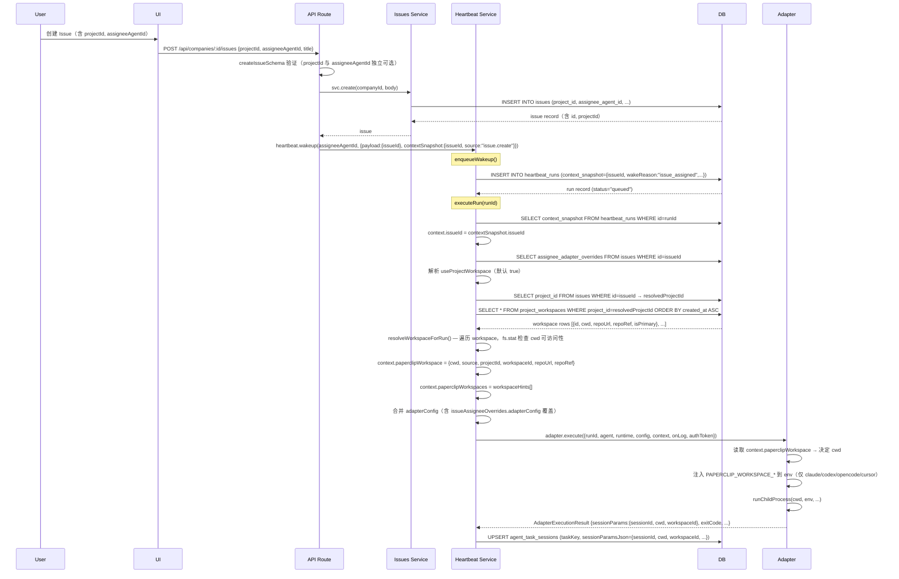
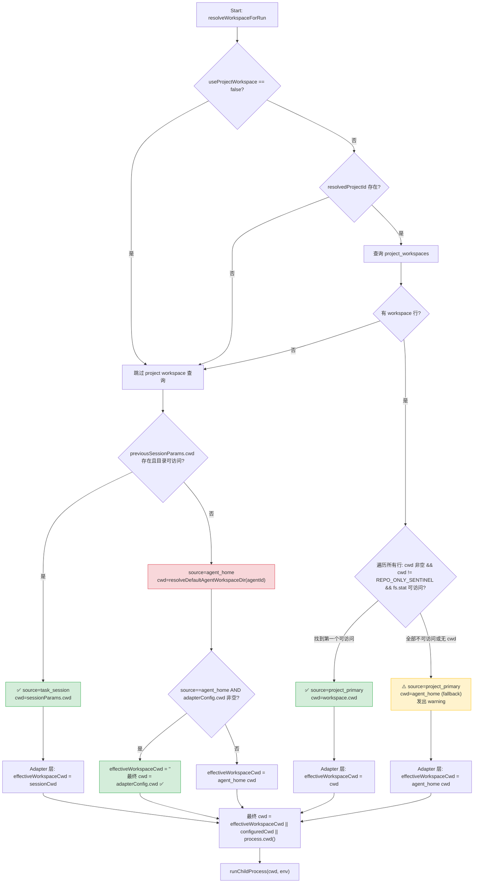
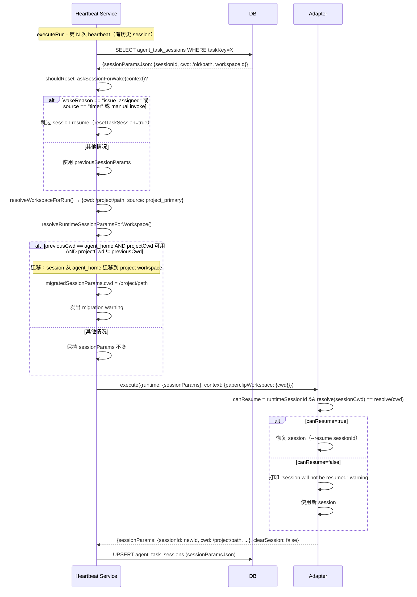
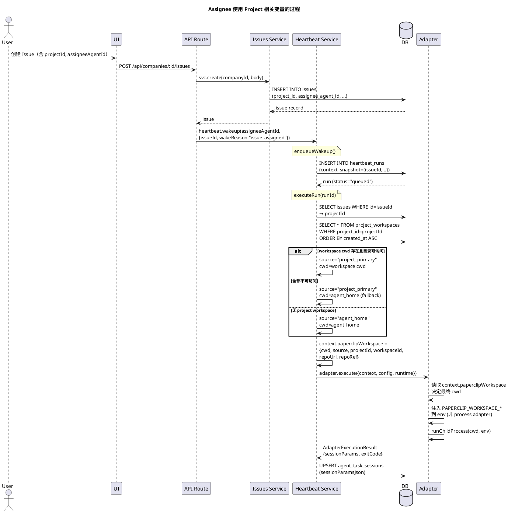

# 设计说明文档：Assignee 使用 Project 相关变量的过程

**文档版本**: 2.0  
**日期**: 2026-03-12  
**受众**: 系统工程师、集成开发者、代码审计人员  
**主问题**: Assignee 在执行 Issue 时，Project 的相关信息（变量/配置/上下文）是如何进入运行时的？是否属于"环境变量"？

> **审计约束**：所有结论均基于仓库内代码与文档的静态分析，附文件路径与行号。未在代码中找到明确证据的内容会标注 **"未在代码中发现明确证据"**。

---

## 1. 核心结论

| # | 结论 | 证据文件路径 + 行号 |
|---|---|---|
| 1 | **不存在"Project 环境变量"机制** — Project 信息以 DB 记录形式存储，经 heartbeat service 解析后写入 **runtime context**（`context.paperclipWorkspace`），最终在 adapter 层由特定 adapter 转化为 `PAPERCLIP_WORKSPACE_*` 系列 OS 环境变量。完整链路为：`DB record → runtime context → OS env var`。 | `server/src/services/heartbeat.ts:1119-1127`；`packages/adapters/claude-local/src/server/execute.ts:180-196` |
| 2 | **不存在名为 `$AGENT_HOME` 的环境变量** — 最接近的等价机制是函数 `resolveDefaultAgentWorkspaceDir(agentId)`，返回 `$PAPERCLIP_HOME/instances/$PAPERCLIP_INSTANCE_ID/workspaces/<agentId>`，默认值为 `~/.paperclip/instances/default/workspaces/<agentId>`。 | `server/src/home-paths.ts:56-62` |
| 3 | **Assignee 最终使用 Project 信息的真实机制**：heartbeat service 在 `executeRun()` 中通过 `issueId` 查回 `projectId`，再查询 `project_workspaces` 表得到 workspace 元数据，组装为 `context.paperclipWorkspace`（runtime context 对象），传递给 adapter。Adapter 决定最终 `cwd` 并将部分 workspace 字段注入 OS 环境变量。 | `server/src/services/heartbeat.ts:486-495,1096-1130,1277-1286` |
| 4 | **`cwd` 决策优先级（降序）**：① project workspace `cwd`（存在且目录可访问）→ ② `task_session` 保存的 `cwd`（目录可访问）→ ③ agent_home fallback → ④ `adapterConfig.cwd`（仅替代 agent_home）→ ⑤ `process.cwd()`。 | `server/src/services/heartbeat.ts:519-620`；`packages/adapters/claude-local/src/server/execute.ts:126-129` |
| 5 | **基础 `process` adapter 不注入 `PAPERCLIP_WORKSPACE_*` 系列** — 仅 `claude_local`、`codex_local`、`opencode_local`、`cursor_local` 注入。`process` adapter 仅调用 `buildPaperclipEnv(agent)` + `config.env`。 | `server/src/adapters/process/execute.ts:18-23` |
| 6 | **`useProjectWorkspace=false` 可跳过 project workspace 解析** — 通过 `issue.assigneeAdapterOverrides.useProjectWorkspace` 字段控制。 | `server/src/services/heartbeat.ts:1096-1101`；`packages/shared/src/validators/issue.ts:4-9` |
| 7 | **Session 恢复要求 `cwd` 一致** — adapter 比较 `path.resolve(sessionParams.cwd)` 与 `path.resolve(currentCwd)`，不匹配则放弃 resume。 | `packages/adapters/claude-local/src/server/execute.ts:324-327` |
| 8 | **`PAPERCLIP_HOME` 和 `PAPERCLIP_INSTANCE_ID` 是真正的 OS 环境变量** — 影响所有默认路径（agent_home、DB、日志、密钥）。 | `server/src/home-paths.ts:14-26` |

---

## 2. 相关变量说明

### 2.1 变量/字段表

| 变量/字段名 | 所属层 | 来源 | 写入位置 | 消费位置 | 作用 | 是否真正属于 environment variables | 是否影响最终 cwd | 证据 |
|---|---|---|---|---|---|---|---|---|
| `issue.projectId` | Issue | 用户创建 Issue 时传入 | `issues` 表 `project_id` 列 | `heartbeat.ts:resolveWorkspaceForRun` 查询 | 关联 project → 解析 workspace | 否，DB 字段 | 间接（决定 workspace 来源） | `packages/db/src/schema/issues.ts:23` |
| `issue.assigneeAgentId` | Issue | 用户创建 Issue 时传入 | `issues` 表 `assignee_agent_id` 列 | route 层触发 `heartbeat.wakeup()` | 决定哪个 agent 被唤醒 | 否，DB 字段 | 间接（决定 agent_home 路径中的 agentId） | `packages/db/src/schema/issues.ts:30` |
| `contextSnapshot.issueId` | Heartbeat | `enqueueWakeup` 时 `payload.issueId` 或 `contextSnapshot.issueId` | `heartbeat_runs.context_snapshot` JSONB | `executeRun` → `resolveWorkspaceForRun` | 用于查回 `issue.projectId` | 否，runtime context（JSONB） | 间接（是查回 projectId 的入口） | `server/src/services/heartbeat.ts:247-257,486` |
| `context.projectId` | Context | `resolvedWorkspace.projectId` 补填 | `heartbeat.ts:1128-1130`（内存） | adapter context，不转为 env var | agent 可读取 project ID | 否，runtime context | 否 | `server/src/services/heartbeat.ts:1128-1130` |
| `context.paperclipWorkspace.cwd` | Context | `resolveWorkspaceForRun` 返回值 | `heartbeat.ts:1120`（内存） | adapter `execute.ts` → 决定进程 `cwd` | 决定子进程工作目录 | 否，runtime context（adapter 层再转为 `PAPERCLIP_WORKSPACE_CWD`） | **是** | `server/src/services/heartbeat.ts:1120`；`packages/adapters/claude-local/src/server/execute.ts:116,129` |
| `context.paperclipWorkspace.source` | Context | `resolveWorkspaceForRun` 返回值 | `heartbeat.ts:1121`（内存） | adapter `execute.ts` → 决定是否用 `config.cwd` 覆盖 | 区分 cwd 来源（`project_primary`/`task_session`/`agent_home`） | 否，runtime context（adapter 层可转为 `PAPERCLIP_WORKSPACE_SOURCE`） | **是**（影响 `adapterConfig.cwd` 是否生效） | `server/src/services/heartbeat.ts:1121`；`packages/adapters/claude-local/src/server/execute.ts:117,127` |
| `context.paperclipWorkspace.projectId` | Context | `issues.projectId` 或 `context.projectId` | `heartbeat.ts:1122`（内存） | adapter context | agent 可读取关联 project | 否，runtime context | 否 | `server/src/services/heartbeat.ts:1122` |
| `context.paperclipWorkspace.workspaceId` | Context | `project_workspaces.id` | `heartbeat.ts:1123`（内存） | adapter `execute.ts`、`sessionParams` | 识别具体 workspace；保存至 session | 否，runtime context（可转为 `PAPERCLIP_WORKSPACE_ID`） | 否 | `server/src/services/heartbeat.ts:1123`；`packages/adapters/claude-local/src/server/execute.ts:118,472` |
| `context.paperclipWorkspace.repoUrl` | Context | `project_workspaces.repo_url` | `heartbeat.ts:1124`（内存） | adapter → `PAPERCLIP_WORKSPACE_REPO_URL`、`sessionParams` | 远端仓库地址 | 否，runtime context（adapter 层可转为 env var） | 否 | `server/src/services/heartbeat.ts:1124`；`packages/adapters/claude-local/src/server/execute.ts:189-191` |
| `context.paperclipWorkspace.repoRef` | Context | `project_workspaces.repo_ref` | `heartbeat.ts:1125`（内存） | adapter → `PAPERCLIP_WORKSPACE_REPO_REF`、`sessionParams` | 分支/tag | 否，runtime context（adapter 层可转为 env var） | 否 | `server/src/services/heartbeat.ts:1125`；`packages/adapters/claude-local/src/server/execute.ts:192-194` |
| `context.paperclipWorkspaces[]` | Context | 全部 `project_workspaces` 行 | `heartbeat.ts:1127`（内存） | adapter → `PAPERCLIP_WORKSPACES_JSON` | 让 agent 了解所有 workspace | 否，runtime context（adapter 层可转为 JSON env var） | 否 | `server/src/services/heartbeat.ts:512-517,1127`；`packages/adapters/claude-local/src/server/execute.ts:121-125,195-197` |
| `assigneeAdapterOverrides.useProjectWorkspace` | Issue/Config | Issue 的 `assignee_adapter_overrides` JSONB 字段 | `issues` 表 `assignee_adapter_overrides` 列 | `heartbeat.ts:resolveWorkspaceForRun` 的 `opts` 参数 | `false` 时跳过 project workspace 查询 | 否，DB 字段 | **是**（`false` 时完全跳过 project workspace） | `packages/db/src/schema/issues.ts:42`；`server/src/services/heartbeat.ts:1096-1101` |
| `adapterConfig.cwd` | Config | `agents.adapter_config` JSONB | agent DB 记录 | adapter `execute.ts` | 当 source=`agent_home` 时替代 agent_home 路径 | 否，adapter 配置字段 | **是**（替代 agent_home 路径，但不覆盖 project workspace） | `packages/adapters/claude-local/src/server/execute.ts:126-129` |
| `sessionParams.cwd` | Session | adapter 执行后返回（当次 `cwd`） | `agent_task_sessions.session_params_json` JSONB | 下次 heartbeat `resolveWorkspaceForRun`；adapter session 恢复 | cwd 一致性校验；session 恢复 | 否，session 持久化字段 | **是**（无 project workspace 时作为 `task_session` 来源的 cwd） | `packages/adapters/claude-local/src/server/execute.ts:468-476`；`server/src/services/heartbeat.ts:575-593` |
| `PAPERCLIP_HOME` | Env | 用户设置的 OS 环境变量 | `process.env` | `server/src/home-paths.ts:resolvePaperclipHomeDir` | 覆盖默认根目录 `~/.paperclip` | **是** | **是**（影响 agent_home 路径） | `server/src/home-paths.ts:15-16` |
| `PAPERCLIP_INSTANCE_ID` | Env | 用户设置的 OS 环境变量 | `process.env` | `server/src/home-paths.ts:resolvePaperclipInstanceId` | 覆盖默认实例 ID `default` | **是** | **是**（影响 agent_home 路径） | `server/src/home-paths.ts:21-22` |
| `$AGENT_HOME` | — | **不存在** | — | — | 用户概念，非代码字段 | **否，不存在此变量** | — | 全局搜索未找到 `AGENT_HOME` 的定义或赋值 |

### 2.2 术语对照

| 术语 | 英文 | 定义 | 示例 |
|---|---|---|---|
| **OS 环境变量** | environment variables | 操作系统级变量，通过 `runChildProcess()` 的 `env` 参数注入子进程 | `PAPERCLIP_AGENT_ID`、`PAPERCLIP_WORKSPACE_CWD`、`PAPERCLIP_HOME` |
| **运行时上下文** | runtime context | `heartbeat_runs.context_snapshot` 的内存展开，TypeScript 对象，传递给 `AdapterExecutionContext.context` | `context.paperclipWorkspace`、`context.issueId`、`context.projectId` |
| **Workspace 元数据** | workspace metadata | `project_workspaces` 表中的字段，纯 DB 数据 | `cwd`、`repoUrl`、`repoRef`、`isPrimary`、`name` |
| **Session 参数** | session params | adapter 写回并持久化到 `agent_task_sessions.session_params_json` 的对象 | `{ sessionId, cwd, workspaceId, repoUrl, repoRef }` |
| **Adapter 配置** | adapter config | `agents.adapter_config` JSONB，用户配置 | `{ command, cwd, env, model, timeoutSec }` |

---

## 3. 变量流转过程

### 步骤 1：Project Workspace 配置（UI / API → DB）

- **输入**：用户通过 `POST /api/companies/:companyId/projects`（含 `workspace` 字段）或 `POST /api/projects/:projectId/workspaces` 提交 workspace 信息
- **处理**：路由层验证请求体，service 层写入 DB
- **输出**：`project_workspaces` 表新增记录（`id`, `projectId`, `cwd`, `repoUrl`, `repoRef`, `isPrimary`）
- **层级**：UI → API Route → Service → DB
- **证据**：`packages/db/src/schema/project_workspaces.ts:13-32`

### 步骤 2：Issue 绑定 projectId 和 assigneeAgentId（UI / API → DB）

- **输入**：用户创建 Issue 时传入 `projectId`（可选）和 `assigneeAgentId`（可选）
- **处理**：`createIssueSchema` 验证（两者互相独立、无联动约束），写入 `issues` 表
- **输出**：`issues` 表记录含 `project_id` 和 `assignee_agent_id`
- **层级**：UI → API Route → Validator → Service → DB
- **变量变化**：`projectId` → `issues.project_id`；`assigneeAgentId` → `issues.assignee_agent_id`
- **证据**：`packages/shared/src/validators/issue.ts:11-25`；`packages/db/src/schema/issues.ts:23,30`

### 步骤 3：Wakeup 携带 issueId（API Route → Heartbeat Service → DB）

- **输入**：Issue 创建后，路由层检查 `assigneeAgentId` 非空且 `status != "backlog"`
- **处理**：调用 `heartbeat.wakeup(assigneeAgentId, { payload: { issueId }, contextSnapshot: { issueId, source: "issue.create" } })`
- **输出**：`heartbeat_runs` 表新增 `queued` 状态记录，`context_snapshot` JSONB 含 `{ issueId }`
- **层级**：API Route → Heartbeat Service → DB
- **变量变化**：`issue.id` → `contextSnapshot.issueId` → `heartbeat_runs.context_snapshot.issueId`
- **证据**：`server/src/routes/issues.ts:442-454`；`server/src/services/heartbeat.ts:1619-1650`

### 步骤 4：Heartbeat 通过 issueId 找回 projectId（Heartbeat Service → DB）

- **输入**：`context.issueId`（从 `heartbeat_runs.context_snapshot` 解析）
- **处理**：`resolveWorkspaceForRun()` 中 `SELECT issues WHERE id = issueId → projectId`
- **输出**：`resolvedProjectId = issueProjectId ?? contextProjectId`
- **层级**：Heartbeat Service → DB
- **变量变化**：`context.issueId` → DB 查询 → `issueProjectId` → `resolvedProjectId`
- **证据**：`server/src/services/heartbeat.ts:486-495`

### 步骤 5：Heartbeat 解析 project_workspaces（Heartbeat Service → DB → fs）

- **输入**：`resolvedProjectId`
- **处理**：`SELECT * FROM project_workspaces WHERE project_id = ? ORDER BY created_at ASC, id ASC`；逐行检查 `cwd` 是否为本地可访问目录（`fs.stat`）
- **输出**：`ResolvedWorkspaceForRun { cwd, source, projectId, workspaceId, repoUrl, repoRef, workspaceHints, warnings }`
- **层级**：Heartbeat Service → DB → 文件系统
- **变量变化**：`resolvedProjectId` → `project_workspaces` rows → 遍历 → 第一个可访问的 `workspace.cwd` → `resolvedWorkspace.cwd`
- **证据**：`server/src/services/heartbeat.ts:499-572`

### 步骤 6：Runtime context 组装并注入到 adapter（Heartbeat Service）

- **输入**：`resolvedWorkspace`（步骤 5 返回值）
- **处理**：将 workspace 信息写入 `context` 对象
- **输出**：`context.paperclipWorkspace = { cwd, source, projectId, workspaceId, repoUrl, repoRef }`；`context.paperclipWorkspaces = workspaceHints[]`；`context.projectId` 补填
- **层级**：Heartbeat Service（内存）
- **变量变化**：`resolvedWorkspace` 各字段 → `context.paperclipWorkspace.*`
- **证据**：`server/src/services/heartbeat.ts:1119-1130`

### 步骤 7：Adapter 决定最终 cwd（Adapter）

- **输入**：`context.paperclipWorkspace`、`config.cwd`（adapterConfig）
- **处理**：读取 `workspaceSource`、`workspaceCwd`、`configuredCwd`；当 `workspaceSource === "agent_home" && configuredCwd` 非空时用 `configuredCwd` 替代；否则用 `workspaceCwd`；最终兜底 `process.cwd()`
- **输出**：`const cwd = effectiveWorkspaceCwd || configuredCwd || process.cwd()`
- **层级**：Adapter
- **变量变化**：`context.paperclipWorkspace.cwd` + `context.paperclipWorkspace.source` + `config.cwd` → `effectiveWorkspaceCwd` → `cwd`
- **证据**：`packages/adapters/claude-local/src/server/execute.ts:115-129`

### 步骤 8：Adapter 注入 PAPERCLIP_WORKSPACE_* OS 环境变量（Adapter）

- **输入**：`effectiveWorkspaceCwd`、`workspaceSource`、`workspaceId`、`workspaceRepoUrl`、`workspaceRepoRef`、`workspaceHints`
- **处理**：条件性写入 `env.PAPERCLIP_WORKSPACE_CWD` 等变量
- **输出**：子进程的 `env` 对象包含 `PAPERCLIP_WORKSPACE_*` 系列（仅限 claude_local/codex_local/opencode_local/cursor_local；`process` adapter 不注入）
- **层级**：Adapter
- **变量变化**：runtime context 字段 → OS 环境变量
- **证据**：`packages/adapters/claude-local/src/server/execute.ts:180-197`；`server/src/adapters/process/execute.ts:18-23`（不注入）

### 步骤 9：Session 恢复或失效（Adapter）

- **输入**：`runtime.sessionParams`（含 `sessionId`、`cwd`）
- **处理**：比较 `path.resolve(sessionParams.cwd) === path.resolve(currentCwd)`
- **输出**：`canResumeSession` → 若 `true` 则 `--resume sessionId`；若 `false` 则打印 warning、使用新 session
- **层级**：Adapter
- **失效条件**：保存的 `sessionParams.cwd` 与当前 `cwd` 不一致
- **证据**：`packages/adapters/claude-local/src/server/execute.ts:321-333`

### 步骤 10：Session 保存与 cwd 持久化（Adapter → Heartbeat Service → DB）

- **输入**：adapter 返回 `sessionParams = { sessionId, cwd, workspaceId, repoUrl, repoRef }`
- **处理**：heartbeat service 调用 `upsertTaskSession()` 将 `sessionParams` 持久化
- **输出**：`agent_task_sessions.session_params_json` 更新
- **层级**：Adapter → Heartbeat Service → DB
- **变量变化**：adapter result `sessionParams` → `agent_task_sessions.session_params_json`
- **证据**：`packages/adapters/claude-local/src/server/execute.ts:468-476`；`server/src/services/heartbeat.ts:1387-1398`

### 步骤 11：Fallback — project workspace 不可用时（Heartbeat Service → fs）

- **输入**：所有 `project_workspaces` 行的 `cwd` 均不可访问（或为空 / `REPO_ONLY_CWD_SENTINEL`）
- **处理**：`fallbackCwd = resolveDefaultAgentWorkspaceDir(agent.id)`；`fs.mkdir(fallbackCwd, { recursive: true })`
- **输出**：`source = "project_primary"`（注意：source 不变，但实际 cwd 是 agent_home）；发出 warning
- **层级**：Heartbeat Service → 文件系统
- **变量变化**：workspace 不可用 → `cwd = agent_home`，`source` 保持 `"project_primary"`
- **证据**：`server/src/services/heartbeat.ts:547-572`

### 优先级关系：`adapterConfig.cwd` vs `agent_home` vs `task_session` vs `project_primary`

```
adapterConfig.cwd 与其他来源的优先级：

project_primary (cwd 可访问)  >  所有其他来源  → adapterConfig.cwd 被忽略
project_primary (cwd 不可访问) >  task_session   → adapterConfig.cwd 被忽略（source 仍为 project_primary）
task_session (cwd 可访问)     >  agent_home     → adapterConfig.cwd 被忽略
agent_home                   <  adapterConfig.cwd → 使用 adapterConfig.cwd（仅此场景生效）
```

---

## 4. 交互时序图（Mermaid）

### 图 1：Project 信息进入 Assignee 运行时



### 图 2：fallback / cwd 决策过程



### 图 3（附加）：Session Resume / Workspace Migration



### 图 4（附加）：PlantUML 版 — Project 信息进入 Assignee 运行时



---

## 5. 简短结论：这是不是"Project 环境变量"

### 5.1 "Project 环境变量"这个说法在当前代码里是否准确

**不准确。** 代码中不存在"Project 自带一批环境变量"的机制。Project workspace 信息首先是 **DB 记录**（`project_workspaces` 表），经 heartbeat service 解析后成为 **runtime context 字段**（`context.paperclipWorkspace`），最终在 **adapter 层** 由特定 adapter（claude_local / codex_local / opencode_local / cursor_local）转化为 **`PAPERCLIP_WORKSPACE_*` 系列 OS 环境变量** 注入子进程。

完整链路：**`DB record → runtime context → OS env var`**

基础 `process` adapter 甚至不执行这一转化（`server/src/adapters/process/execute.ts:18-23`）。

### 5.2 更准确的表述应该是什么

> **"Assignee 通过 heartbeat 执行链路获取 Project workspace 的运行时上下文（runtime context），部分 adapter 会将其中的 workspace 元数据注入为 OS 环境变量。"**

### 5.3 如果用户问"Assignee 如何使用 Project 环境变量"，应如何重新表述为工程上准确的问题

工程上准确的问法是：

> **"当 Issue 关联了 Project 时，heartbeat 如何解析 project_workspaces 并将其信息注入 adapter 的执行上下文和子进程环境？最终如何影响 Assignee 的工作目录（cwd）和可读取的 PAPERCLIP_WORKSPACE_* 环境变量？"**

---

## 6. 证据清单

### DB Schema

| 文件路径 | 行号 | 内容 |
|---|---|---|
| `packages/db/src/schema/project_workspaces.ts` | 13-32 | `projectWorkspaces` 表定义（`cwd`, `repoUrl`, `repoRef`, `isPrimary`） |
| `packages/db/src/schema/issues.ts` | 23 | `issues.project_id`（外键 projects） |
| `packages/db/src/schema/issues.ts` | 30 | `issues.assignee_agent_id`（外键 agents） |
| `packages/db/src/schema/issues.ts` | 42 | `issues.assignee_adapter_overrides`（JSONB，含 `useProjectWorkspace`） |
| `packages/db/src/schema/agent_task_sessions.ts` | 6-39 | `agent_task_sessions` 表（`session_params_json`, `task_key`） |
| `packages/db/src/schema/agents.ts` | 26 | `agents.adapter_config`（JSONB，adapterConfig 存储） |
| `packages/db/src/schema/heartbeat_runs.ts` | 34 | `heartbeat_runs.context_snapshot`（JSONB，runtime context 持久化） |

### Shared Validators

| 文件路径 | 行号 | 内容 |
|---|---|---|
| `packages/shared/src/validators/issue.ts` | 4-9 | `issueAssigneeAdapterOverridesSchema`（含 `useProjectWorkspace: z.boolean().optional()`） |
| `packages/shared/src/validators/issue.ts` | 11-25 | `createIssueSchema`（`projectId` 和 `assigneeAgentId` 均为可选，无联动约束） |

### API Routes

| 文件路径 | 行号 | 内容 |
|---|---|---|
| `server/src/routes/issues.ts` | 416 | Issue 创建路由入口 |
| `server/src/routes/issues.ts` | 442-454 | `heartbeat.wakeup(assigneeAgentId, {issueId})` — Issue 创建后触发 wakeup |

### Heartbeat Service

| 文件路径 | 行号 | 内容 |
|---|---|---|
| `server/src/services/heartbeat.ts` | 32 | `REPO_ONLY_CWD_SENTINEL = "/__paperclip_repo_only__"` |
| `server/src/services/heartbeat.ts` | 72-75 | `ParsedIssueAssigneeAdapterOverrides` 类型（含 `useProjectWorkspace`） |
| `server/src/services/heartbeat.ts` | 77-91 | `ResolvedWorkspaceForRun` 类型定义（`source` 枚举） |
| `server/src/services/heartbeat.ts` | 97-163 | `resolveRuntimeSessionParamsForWorkspace()`（session 迁移逻辑） |
| `server/src/services/heartbeat.ts` | 165-181 | `parseIssueAssigneeAdapterOverrides()`（解析 `useProjectWorkspace`） |
| `server/src/services/heartbeat.ts` | 480-621 | `resolveWorkspaceForRun()` 完整实现 |
| `server/src/services/heartbeat.ts` | 486-495 | 通过 `issueId` 查回 `projectId` |
| `server/src/services/heartbeat.ts` | 496-497 | `useProjectWorkspace` 控制是否查询 project workspace |
| `server/src/services/heartbeat.ts` | 499-510 | 查询 `project_workspaces`（按 `created_at ASC, id ASC`） |
| `server/src/services/heartbeat.ts` | 519-543 | 遍历 workspace，`fs.stat` 检查 `cwd` 是否可访问 |
| `server/src/services/heartbeat.ts` | 547-572 | project workspace 存在但 cwd 不可访问时的 fallback 逻辑 |
| `server/src/services/heartbeat.ts` | 575-620 | 无 project workspace 时的 task_session / agent_home fallback |
| `server/src/services/heartbeat.ts` | 1067-1068 | `executeRun` 解析 `contextSnapshot` |
| `server/src/services/heartbeat.ts` | 1071-1086 | 读取 `issueAssigneeOverrides`（含 `useProjectWorkspace`） |
| `server/src/services/heartbeat.ts` | 1096-1101 | 调用 `resolveWorkspaceForRun` 传入 `useProjectWorkspace` |
| `server/src/services/heartbeat.ts` | 1119-1127 | 写入 `context.paperclipWorkspace` |
| `server/src/services/heartbeat.ts` | 1127 | 写入 `context.paperclipWorkspaces` |
| `server/src/services/heartbeat.ts` | 1128-1130 | 补填 `context.projectId` |
| `server/src/services/heartbeat.ts` | 1239-1246 | 合并 `adapterConfig`（含 `issueAssigneeOverrides.adapterConfig`） |
| `server/src/services/heartbeat.ts` | 1277-1286 | 调用 `adapter.execute({context, config, runtime, ...})` |
| `server/src/services/heartbeat.ts` | 1387-1398 | upsert `agent_task_sessions`（持久化 sessionParams） |

### Home Paths

| 文件路径 | 行号 | 内容 |
|---|---|---|
| `server/src/home-paths.ts` | 14-18 | `resolvePaperclipHomeDir()`（读取 `PAPERCLIP_HOME`） |
| `server/src/home-paths.ts` | 20-26 | `resolvePaperclipInstanceId()`（读取 `PAPERCLIP_INSTANCE_ID`） |
| `server/src/home-paths.ts` | 28-30 | `resolvePaperclipInstanceRoot()`（组合 home + instance） |
| `server/src/home-paths.ts` | 56-62 | `resolveDefaultAgentWorkspaceDir(agentId)`（agent_home 路径） |

### Adapter Utils

| 文件路径 | 行号 | 内容 |
|---|---|---|
| `packages/adapter-utils/src/server-utils.ts` | 106-124 | `buildPaperclipEnv(agent)`（注入 `PAPERCLIP_AGENT_ID`, `PAPERCLIP_COMPANY_ID`, `PAPERCLIP_API_URL`） |
| `packages/adapter-utils/src/types.ts` | 75-84 | `AdapterExecutionContext` 接口（含 `context: Record<string, unknown>`） |

### Claude Local Adapter（代表性 adapter）

| 文件路径 | 行号 | 内容 |
|---|---|---|
| `packages/adapters/claude-local/src/server/execute.ts` | 115-129 | 读取 `context.paperclipWorkspace`，决定最终 `cwd` |
| `packages/adapters/claude-local/src/server/execute.ts` | 127 | `useConfiguredInsteadOfAgentHome` 判断（`workspaceSource === "agent_home" && configuredCwd.length > 0`） |
| `packages/adapters/claude-local/src/server/execute.ts` | 135-197 | 构建 env，注入 `PAPERCLIP_*` 系列环境变量 |
| `packages/adapters/claude-local/src/server/execute.ts` | 180-197 | 注入 `PAPERCLIP_WORKSPACE_*` 系列（`CWD`, `SOURCE`, `ID`, `REPO_URL`, `REPO_REF`, `WORKSPACES_JSON`） |
| `packages/adapters/claude-local/src/server/execute.ts` | 321-333 | `canResumeSession` 逻辑（cwd 一致性校验） |
| `packages/adapters/claude-local/src/server/execute.ts` | 465-476 | 返回 `sessionParams = {sessionId, cwd, workspaceId, repoUrl, repoRef}` |

### Process Adapter（基础）

| 文件路径 | 行号 | 内容 |
|---|---|---|
| `server/src/adapters/process/execute.ts` | 18-23 | 仅 `buildPaperclipEnv(agent)` + `config.env`，不读取 `context`，不注入 `PAPERCLIP_WORKSPACE_*` |
