# Paperclip Database ER Model

> Generated: 2026-03-28 | ORM: Drizzle ORM | Database: PostgreSQL 15+

---

## Table of Contents

1. [概览 Overview](#1-概览-overview)
2. [域分区 Domain Partitions](#2-域分区-domain-partitions)
3. [表结构详细说明 Table Definitions](#3-表结构详细说明-table-definitions)
4. [实体关系图 ER Diagram (Mermaid)](#4-实体关系图-er-diagram-mermaid)
5. [外键关系汇总 Foreign Key Reference Matrix](#5-外键关系汇总-foreign-key-reference-matrix)
6. [索引策略 Index Strategy](#6-索引策略-index-strategy)

---

## 1. 概览 Overview

Paperclip 是一个 AI 代理公司（Agent Company）的控制平面（Control Plane）。数据库围绕 **company（公司）** 作为顶层租户隔离维度，所有业务实体均通过 `company_id` 外键绑定到所属公司。

| 统计项 | 数量 |
|--------|------|
| 总表数 | **57** |
| 域分区 | 10 |
| 联合表（Join tables） | 3 |
| 自引用表 | 4 |

---

## 2. 域分区 Domain Partitions

| 域 | 表 | 说明 |
|----|----|----|
| **Core Identity** | `companies`, `company_logos`, `company_memberships`, `company_skills`, `company_secrets`, `company_secret_versions` | 公司、品牌、成员关系、技能和密钥 |
| **Auth & Access** | `user`, `session`, `account`, `verification`, `instance_settings`, `instance_user_roles`, `board_api_keys`, `cli_auth_challenges`, `invites`, `join_requests`, `principal_permission_grants` | 用户认证、会话、实例设置、权限与邀请 |
| **Agents** | `agents`, `agent_api_keys`, `agent_config_revisions`, `agent_runtime_state`, `agent_task_sessions`, `agent_wakeup_requests` | 代理定义、API 密钥、配置版本、运行时状态和任务会话 |
| **Projects & Workspaces** | `projects`, `project_workspaces`, `project_goals`, `execution_workspaces`, `workspace_operations`, `workspace_runtime_services` | 项目、工作区、执行环境和运行时服务 |
| **Goals** | `goals` | 目标树（支持层级嵌套） |
| **Issues (Task Management)** | `issues`, `issue_labels`, `issue_comments`, `issue_approvals`, `issue_attachments`, `issue_work_products`, `issue_documents`, `issue_inbox_archives`, `issue_read_states` | 任务管理全生命周期 |
| **Routines** | `routines`, `routine_triggers`, `routine_runs` | 周期任务/自动化触发 |
| **Documents & Assets** | `documents`, `document_revisions`, `assets`, `labels` | 文档版本、文件资产和标签 |
| **Finance & Budget** | `budget_policies`, `budget_incidents`, `cost_events`, `finance_events` | 预算策略、成本追踪和财务事件 |
| **Approvals & Audit** | `approvals`, `approval_comments`, `activity_log` | 审批流程和操作审计 |
| **Execution** | `heartbeat_runs`, `heartbeat_run_events` | 代理运行和事件日志 |
| **Plugins** | `plugins`, `plugin_config`, `plugin_company_settings`, `plugin_state`, `plugin_entities`, `plugin_jobs`, `plugin_job_runs`, `plugin_webhook_deliveries`, `plugin_logs` | 插件系统全生命周期 |

---

## 3. 表结构详细说明 Table Definitions

### 3.1 Core Identity

#### `companies`
公司/租户主表，所有业务数据的顶层隔离单元。

| Column | Type | Nullable | Default | Description |
|--------|------|----------|---------|-------------|
| `id` | uuid | PK | random | 主键 |
| `name` | text | NOT NULL | — | 公司名称 |
| `description` | text | NULL | — | 公司描述 |
| `status` | text | NOT NULL | `'active'` | 状态: active/paused |
| `pause_reason` | text | NULL | — | 暂停原因 |
| `paused_at` | timestamptz | NULL | — | 暂停时间 |
| `issue_prefix` | text | NOT NULL | `'PAP'` | Issue 编号前缀 (唯一) |
| `issue_counter` | integer | NOT NULL | `0` | Issue 自增计数 |
| `budget_monthly_cents` | integer | NOT NULL | `0` | 月度预算(美分) |
| `spent_monthly_cents` | integer | NOT NULL | `0` | 月度已花费(美分) |
| `require_board_approval_for_new_agents` | boolean | NOT NULL | `true` | 新代理是否需要审批 |
| `brand_color` | text | NULL | — | 品牌色 |
| `created_at` | timestamptz | NOT NULL | now() | 创建时间 |
| `updated_at` | timestamptz | NOT NULL | now() | 更新时间 |

**Unique Indexes:** `issue_prefix`

---

#### `company_logos`
公司 Logo（一对一关联 asset）。

| Column | Type | Nullable | FK → | Description |
|--------|------|----------|------|-------------|
| `id` | uuid | PK | — | 主键 |
| `company_id` | uuid | NOT NULL | `companies.id` (cascade) | 公司 |
| `asset_id` | uuid | NOT NULL | `assets.id` (cascade) | 资产文件 |
| `created_at` | timestamptz | NOT NULL | — | — |
| `updated_at` | timestamptz | NOT NULL | — | — |

**Unique Indexes:** `company_id`, `asset_id`

---

#### `company_memberships`
公司成员关系（用户或代理 → 公司）。

| Column | Type | Nullable | FK → | Description |
|--------|------|----------|------|-------------|
| `id` | uuid | PK | — | 主键 |
| `company_id` | uuid | NOT NULL | `companies.id` | 公司 |
| `principal_type` | text | NOT NULL | — | 主体类型(user/agent) |
| `principal_id` | text | NOT NULL | — | 主体 ID |
| `status` | text | NOT NULL | `'active'` | 成员状态 |
| `membership_role` | text | NULL | — | 成员角色 |
| `created_at` / `updated_at` | timestamptz | NOT NULL | — | — |

**Unique Indexes:** `(company_id, principal_type, principal_id)`

---

#### `company_skills`
公司拥有的技能（Skill）清单。

| Column | Type | Nullable | FK → | Description |
|--------|------|----------|------|-------------|
| `id` | uuid | PK | — | 主键 |
| `company_id` | uuid | NOT NULL | `companies.id` | 公司 |
| `key` | text | NOT NULL | — | 技能唯一键 |
| `slug` | text | NOT NULL | — | URL slug |
| `name` | text | NOT NULL | — | 技能名称 |
| `description` | text | NULL | — | 技能描述 |
| `markdown` | text | NOT NULL | — | Markdown 内容 |
| `source_type` | text | NOT NULL | `'local_path'` | 来源类型 |
| `source_locator` | text | NULL | — | 来源路径 |
| `source_ref` | text | NULL | — | 来源引用 |
| `trust_level` | text | NOT NULL | `'markdown_only'` | 信任级别 |
| `compatibility` | text | NOT NULL | `'compatible'` | 兼容性 |
| `file_inventory` | jsonb | NOT NULL | `[]` | 文件清单 |
| `metadata` | jsonb | NULL | — | 元数据 |
| `created_at` / `updated_at` | timestamptz | NOT NULL | — | — |

**Unique Indexes:** `(company_id, key)`

---

#### `company_secrets`
公司密钥元数据。

| Column | Type | Nullable | FK → | Description |
|--------|------|----------|------|-------------|
| `id` | uuid | PK | — | 主键 |
| `company_id` | uuid | NOT NULL | `companies.id` | 公司 |
| `name` | text | NOT NULL | — | 密钥名称(公司内唯一) |
| `provider` | text | NOT NULL | `'local_encrypted'` | 密钥存储提供者 |
| `external_ref` | text | NULL | — | 外部引用 |
| `latest_version` | integer | NOT NULL | `1` | 最新版本号 |
| `description` | text | NULL | — | 描述 |
| `created_by_agent_id` | uuid | NULL | `agents.id` | 创建代理 |
| `created_by_user_id` | text | NULL | — | 创建用户 |
| `created_at` / `updated_at` | timestamptz | NOT NULL | — | — |

**Unique Indexes:** `(company_id, name)`

---

#### `company_secret_versions`
密钥版本（加密存储的密钥材料）。

| Column | Type | Nullable | FK → | Description |
|--------|------|----------|------|-------------|
| `id` | uuid | PK | — | 主键 |
| `secret_id` | uuid | NOT NULL | `company_secrets.id` (cascade) | 父密钥 |
| `version` | integer | NOT NULL | — | 版本号 |
| `material` | jsonb | NOT NULL | — | 加密材料 |
| `value_sha256` | text | NOT NULL | — | 值 SHA256 |
| `created_by_agent_id` | uuid | NULL | `agents.id` | 创建代理 |
| `created_by_user_id` | text | NULL | — | 创建用户 |
| `created_at` | timestamptz | NOT NULL | — | — |
| `revoked_at` | timestamptz | NULL | — | 撤销时间 |

**Unique Indexes:** `(secret_id, version)`

---

### 3.2 Auth & Access

#### `user` (auth_users)
Better Auth 用户表。

| Column | Type | Nullable | Description |
|--------|------|----------|-------------|
| `id` | text | PK | 用户 ID |
| `name` | text | NOT NULL | 用户名 |
| `email` | text | NOT NULL | 邮箱 |
| `email_verified` | boolean | NOT NULL | 邮箱是否验证 |
| `image` | text | NULL | 头像 URL |
| `created_at` / `updated_at` | timestamptz | NOT NULL | — |

#### `session` (auth_sessions)
用户会话。

| Column | Type | FK → | Description |
|--------|------|------|-------------|
| `id` | text (PK) | — | 会话 ID |
| `user_id` | text | `user.id` (cascade) | 用户 |
| `token` | text | — | 会话 Token |
| `expires_at` | timestamptz | — | 过期时间 |
| `ip_address` | text | — | IP |
| `user_agent` | text | — | UA |

#### `account` (auth_accounts)
OAuth / 密码账户。

| Column | Type | FK → | Description |
|--------|------|------|-------------|
| `id` | text (PK) | — | 账户 ID |
| `user_id` | text | `user.id` (cascade) | 用户 |
| `provider_id` | text | — | 提供者 |
| `account_id` | text | — | 提供者账户 ID |
| `access_token` / `refresh_token` / `id_token` | text | — | OAuth tokens |
| `password` | text | — | 密码(hashed) |

#### `verification` (auth_verifications)
邮箱验证 / 密码重置 token。

| Column | Type | Description |
|--------|------|-------------|
| `id` | text (PK) | ID |
| `identifier` | text | 标识符 |
| `value` | text | 验证值 |
| `expires_at` | timestamptz | 过期 |

#### `instance_settings`
全局实例配置（单例）。

| Column | Type | Description |
|--------|------|-------------|
| `id` | uuid (PK) | ID |
| `singleton_key` | text (unique) | 默认 `'default'` |
| `general` | jsonb | 通用配置 |
| `experimental` | jsonb | 实验性配置 |

#### `instance_user_roles`
实例级用户角色。

| Column | Type | Description |
|--------|------|-------------|
| `id` | uuid (PK) | ID |
| `user_id` | text | 用户 ID |
| `role` | text | 角色 (默认 `'instance_admin'`) |

**Unique Indexes:** `(user_id, role)`

#### `board_api_keys`
Board（管理面板）API 密钥。

| Column | Type | FK → | Description |
|--------|------|------|-------------|
| `id` | uuid (PK) | — | ID |
| `user_id` | text | `user.id` (cascade) | 所属用户 |
| `name` | text | — | 密钥名称 |
| `key_hash` | text (unique) | — | 密钥哈希 |
| `expires_at` | timestamptz | — | 过期时间 |
| `revoked_at` | timestamptz | — | 撤销时间 |

#### `cli_auth_challenges`
CLI 认证挑战（设备流）。

| Column | Type | FK → | Description |
|--------|------|------|-------------|
| `id` | uuid (PK) | — | ID |
| `secret_hash` | text | — | 密钥哈希 |
| `command` | text | — | CLI 命令 |
| `requested_company_id` | uuid | `companies.id` | 请求的公司 |
| `approved_by_user_id` | text | `user.id` | 审批用户 |
| `board_api_key_id` | uuid | `board_api_keys.id` | 关联的 API key |
| `expires_at` | timestamptz | — | 过期时间 |

#### `invites`
邀请令牌。

| Column | Type | FK → | Description |
|--------|------|------|-------------|
| `id` | uuid (PK) | — | ID |
| `company_id` | uuid | `companies.id` | 公司 |
| `invite_type` | text | — | 邀请类型 |
| `token_hash` | text (unique) | — | Token 哈希 |
| `allowed_join_types` | text | — | 允许的加入类型 |
| `expires_at` | timestamptz | — | 过期时间 |
| `invited_by_user_id` | text | — | 邀请人 |

#### `join_requests`
加入请求（用户或代理申请加入公司）。

| Column | Type | FK → | Description |
|--------|------|------|-------------|
| `id` | uuid (PK) | — | ID |
| `invite_id` | uuid (unique) | `invites.id` | 关联邀请 |
| `company_id` | uuid | `companies.id` | 公司 |
| `request_type` | text | — | 请求类型 |
| `status` | text | — | 状态 |
| `created_agent_id` | uuid | `agents.id` | 创建的代理 |
| `agent_name` / `adapter_type` / `capabilities` | text | — | 代理信息 |
| `claim_secret_hash` | text | — | 认领密钥 |

#### `principal_permission_grants`
细粒度权限授权。

| Column | Type | FK → | Description |
|--------|------|------|-------------|
| `id` | uuid (PK) | — | ID |
| `company_id` | uuid | `companies.id` | 公司 |
| `principal_type` | text | — | 主体类型 |
| `principal_id` | text | — | 主体 ID |
| `permission_key` | text | — | 权限键 |
| `scope` | jsonb | — | 权限范围 |

**Unique Indexes:** `(company_id, principal_type, principal_id, permission_key)`

---

### 3.3 Agents

#### `agents`
AI 代理定义。**自引用**: `reports_to → agents.id`。

| Column | Type | Nullable | FK → | Description |
|--------|------|----------|------|-------------|
| `id` | uuid | PK | — | 主键 |
| `company_id` | uuid | NOT NULL | `companies.id` | 公司 |
| `name` | text | NOT NULL | — | 代理名称 |
| `role` | text | NOT NULL | `'general'` | 角色 |
| `title` | text | NULL | — | 职称 |
| `icon` | text | NULL | — | 图标 |
| `status` | text | NOT NULL | `'idle'` | 状态 |
| `reports_to` | uuid | NULL | `agents.id` (self) | 上级代理 |
| `capabilities` | text | NULL | — | 能力描述 |
| `adapter_type` | text | NOT NULL | `'process'` | 适配器类型 |
| `adapter_config` | jsonb | NOT NULL | `{}` | 适配器配置 |
| `runtime_config` | jsonb | NOT NULL | `{}` | 运行时配置 |
| `budget_monthly_cents` | integer | NOT NULL | `0` | 月预算 |
| `spent_monthly_cents` | integer | NOT NULL | `0` | 月已花费 |
| `pause_reason` | text | NULL | — | 暂停原因 |
| `permissions` | jsonb | NOT NULL | `{}` | 权限配置 |
| `last_heartbeat_at` | timestamptz | NULL | — | 最后心跳 |
| `metadata` | jsonb | NULL | — | 元数据 |

---

#### `agent_api_keys`
代理 API 密钥（Bearer token, hashed at rest）。

| Column | Type | FK → | Description |
|--------|------|------|-------------|
| `id` | uuid (PK) | — | ID |
| `agent_id` | uuid | `agents.id` | 代理 |
| `company_id` | uuid | `companies.id` | 公司 |
| `name` | text | — | 密钥名称 |
| `key_hash` | text | — | 密钥哈希 |
| `revoked_at` | timestamptz | — | 撤销时间 |

#### `agent_config_revisions`
代理配置变更历史。

| Column | Type | FK → | Description |
|--------|------|------|-------------|
| `id` | uuid (PK) | — | ID |
| `company_id` | uuid | `companies.id` | 公司 |
| `agent_id` | uuid | `agents.id` (cascade) | 代理 |
| `created_by_agent_id` | uuid | `agents.id` | 修改发起代理 |
| `source` | text | — | 来源 (`patch` 等) |
| `changed_keys` | jsonb | — | 变更键列表 |
| `before_config` / `after_config` | jsonb | — | 变更前/后配置 |

#### `agent_runtime_state`
代理运行时状态（一对一，PK = agent_id）。

| Column | Type | FK → | Description |
|--------|------|------|-------------|
| `agent_id` | uuid (PK) | `agents.id` | 代理 |
| `company_id` | uuid | `companies.id` | 公司 |
| `adapter_type` | text | — | 适配器类型 |
| `session_id` | text | — | 会话 ID |
| `state_json` | jsonb | — | 状态 JSON |
| `total_input_tokens` / `total_output_tokens` / `total_cached_input_tokens` | bigint | — | Token 统计 |
| `total_cost_cents` | bigint | — | 总成本 |

#### `agent_task_sessions`
代理任务会话（一个代理对一个任务键的会话）。

| Column | Type | FK → | Description |
|--------|------|------|-------------|
| `id` | uuid (PK) | — | ID |
| `company_id` | uuid | `companies.id` | 公司 |
| `agent_id` | uuid | `agents.id` | 代理 |
| `adapter_type` | text | — | 适配器类型 |
| `task_key` | text | — | 任务键 |
| `last_run_id` | uuid | `heartbeat_runs.id` | 最后运行 |

**Unique Indexes:** `(company_id, agent_id, adapter_type, task_key)`

#### `agent_wakeup_requests`
代理唤醒请求队列。

| Column | Type | FK → | Description |
|--------|------|------|-------------|
| `id` | uuid (PK) | — | ID |
| `company_id` | uuid | `companies.id` | 公司 |
| `agent_id` | uuid | `agents.id` | 代理 |
| `source` | text | — | 唤醒来源 |
| `status` | text | — | 状态 (`queued` 等) |
| `run_id` | uuid | — | 关联运行 ID |
| `idempotency_key` | text | — | 幂等键 |
| `payload` | jsonb | — | 负载 |

---

### 3.4 Projects & Workspaces

#### `projects`
项目。

| Column | Type | FK → | Description |
|--------|------|------|-------------|
| `id` | uuid (PK) | — | ID |
| `company_id` | uuid | `companies.id` | 公司 |
| `goal_id` | uuid | `goals.id` | 关联目标 |
| `name` | text | — | 项目名称 |
| `status` | text | — | 状态 |
| `lead_agent_id` | uuid | `agents.id` | 项目负责人代理 |
| `target_date` | date | — | 目标日期 |
| `execution_workspace_policy` | jsonb | — | 执行工作区策略 |

#### `project_workspaces`
项目工作区定义（源代码仓库/路径）。

| Column | Type | FK → | Description |
|--------|------|------|-------------|
| `id` | uuid (PK) | — | ID |
| `company_id` | uuid | `companies.id` | 公司 |
| `project_id` | uuid | `projects.id` (cascade) | 项目 |
| `name` | text | — | 工作区名称 |
| `source_type` | text | — | 源类型 |
| `cwd` / `repo_url` / `repo_ref` | text | — | 路径/仓库信息 |
| `is_primary` | boolean | — | 是否主工作区 |
| `remote_provider` / `remote_workspace_ref` | text | — | 远程提供者信息 |

#### `project_goals` (Join Table)
项目 ↔ 目标 多对多关联。

| Column | Type | FK → |
|--------|------|------|
| `project_id` | uuid | `projects.id` (cascade) |
| `goal_id` | uuid | `goals.id` (cascade) |
| `company_id` | uuid | `companies.id` |

**PK:** `(project_id, goal_id)`

#### `execution_workspaces`
执行工作区（Issues 的临时分支/环境）。**自引用**: `derived_from_execution_workspace_id`。

| Column | Type | FK → | Description |
|--------|------|------|-------------|
| `id` | uuid (PK) | — | ID |
| `company_id` | uuid | `companies.id` | 公司 |
| `project_id` | uuid | `projects.id` (cascade) | 项目 |
| `project_workspace_id` | uuid | `project_workspaces.id` | 项目工作区 |
| `source_issue_id` | uuid | `issues.id` | 源 Issue |
| `mode` | text | — | 模式 |
| `strategy_type` | text | — | 策略类型 |
| `name` / `branch_name` | text | — | 名称 / 分支名 |
| `status` | text | — | 状态 |
| `provider_type` | text | — | 提供者类型 |
| `derived_from_execution_workspace_id` | uuid | `execution_workspaces.id` (self) | 派生自 |

#### `workspace_operations`
工作区操作日志（setup/cleanup 命令执行记录）。

| Column | Type | FK → | Description |
|--------|------|------|-------------|
| `id` | uuid (PK) | — | ID |
| `company_id` | uuid | `companies.id` | 公司 |
| `execution_workspace_id` | uuid | `execution_workspaces.id` | 执行工作区 |
| `heartbeat_run_id` | uuid | `heartbeat_runs.id` | 运行 |
| `phase` | text | — | 阶段 |
| `command` | text | — | 命令 |
| `status` | text | — | 状态 |
| `exit_code` | integer | — | 退出码 |

#### `workspace_runtime_services`
工作区运行时服务（dev server, preview 等）。

| Column | Type | FK → | Description |
|--------|------|------|-------------|
| `id` | uuid (PK) | — | ID |
| `company_id` | uuid | `companies.id` | 公司 |
| `project_id` | uuid | `projects.id` | 项目 |
| `project_workspace_id` | uuid | `project_workspaces.id` | 项目工作区 |
| `execution_workspace_id` | uuid | `execution_workspaces.id` | 执行工作区 |
| `issue_id` | uuid | `issues.id` | Issue |
| `scope_type` | text | — | 作用域类型 |
| `service_name` | text | — | 服务名 |
| `status` / `lifecycle` | text | — | 状态 / 生命周期 |
| `port` / `url` | int/text | — | 端口 / URL |
| `owner_agent_id` | uuid | `agents.id` | 拥有者代理 |
| `started_by_run_id` | uuid | `heartbeat_runs.id` | 启动运行 |

---

### 3.5 Goals

#### `goals`
目标树。**自引用**: `parent_id → goals.id`。

| Column | Type | FK → | Description |
|--------|------|------|-------------|
| `id` | uuid (PK) | — | ID |
| `company_id` | uuid | `companies.id` | 公司 |
| `title` | text | — | 目标标题 |
| `description` | text | — | 描述 |
| `level` | text | — | 层级 (task/objective/etc) |
| `status` | text | — | 状态 |
| `parent_id` | uuid | `goals.id` (self) | 父目标 |
| `owner_agent_id` | uuid | `agents.id` | 负责代理 |

---

### 3.6 Issues (Task Management)

#### `issues`
任务/工单主表。**自引用**: `parent_id → issues.id`。核心业务实体。

| Column | Type | FK → | Description |
|--------|------|------|-------------|
| `id` | uuid (PK) | — | ID |
| `company_id` | uuid | `companies.id` | 公司 |
| `project_id` | uuid | `projects.id` | 项目 |
| `project_workspace_id` | uuid | `project_workspaces.id` | 项目工作区 |
| `goal_id` | uuid | `goals.id` | 目标 |
| `parent_id` | uuid | `issues.id` (self) | 父任务 |
| `title` | text | — | 标题 |
| `description` | text | — | 描述 |
| `status` | text | — | 状态 (backlog/todo/in_progress/in_review/blocked/done/cancelled) |
| `priority` | text | — | 优先级 |
| `assignee_agent_id` | uuid | `agents.id` | 分配的代理 |
| `assignee_user_id` | text | — | 分配的用户 |
| `checkout_run_id` | uuid | `heartbeat_runs.id` | 检出运行 |
| `execution_run_id` | uuid | `heartbeat_runs.id` | 执行运行 |
| `created_by_agent_id` | uuid | `agents.id` | 创建者代理 |
| `issue_number` | integer | — | Issue 编号 |
| `identifier` | text (unique) | — | 标识符 (e.g. PAP-123) |
| `origin_kind` | text | — | 来源类型 |
| `execution_workspace_id` | uuid | `execution_workspaces.id` | 执行工作区 |

#### `issue_labels` (Join Table)
Issue ↔ Label 多对多。

| Column | Type | FK → |
|--------|------|------|
| `issue_id` | uuid | `issues.id` (cascade) |
| `label_id` | uuid | `labels.id` (cascade) |
| `company_id` | uuid | `companies.id` (cascade) |

**PK:** `(issue_id, label_id)`

#### `issue_comments`
Issue 评论。

| Column | Type | FK → | Description |
|--------|------|------|-------------|
| `id` | uuid (PK) | — | ID |
| `company_id` | uuid | `companies.id` | 公司 |
| `issue_id` | uuid | `issues.id` | Issue |
| `author_agent_id` | uuid | `agents.id` | 代理作者 |
| `author_user_id` | text | — | 用户作者 |
| `body` | text | — | 评论内容 |

#### `issue_approvals` (Join Table)
Issue ↔ Approval 多对多。

| Column | Type | FK → |
|--------|------|------|
| `issue_id` | uuid | `issues.id` (cascade) |
| `approval_id` | uuid | `approvals.id` (cascade) |
| `company_id` | uuid | `companies.id` |
| `linked_by_agent_id` | uuid | `agents.id` |

**PK:** `(issue_id, approval_id)`

#### `issue_attachments`
Issue 附件（关联 asset）。

| Column | Type | FK → | Description |
|--------|------|------|-------------|
| `id` | uuid (PK) | — | ID |
| `company_id` | uuid | `companies.id` | 公司 |
| `issue_id` | uuid | `issues.id` (cascade) | Issue |
| `asset_id` | uuid | `assets.id` (cascade) | 资产(唯一) |
| `issue_comment_id` | uuid | `issue_comments.id` | 关联评论 |

#### `issue_work_products`
Issue 工作产出（PR、部署等）。

| Column | Type | FK → | Description |
|--------|------|------|-------------|
| `id` | uuid (PK) | — | ID |
| `company_id` | uuid | `companies.id` | 公司 |
| `project_id` | uuid | `projects.id` | 项目 |
| `issue_id` | uuid | `issues.id` (cascade) | Issue |
| `execution_workspace_id` | uuid | `execution_workspaces.id` | 执行工作区 |
| `runtime_service_id` | uuid | `workspace_runtime_services.id` | 运行时服务 |
| `type` | text | — | 类型 (pr/deploy/etc) |
| `provider` | text | — | 提供者 |
| `external_id` | text | — | 外部 ID |
| `title` | text | — | 标题 |
| `url` | text | — | URL |
| `status` / `review_state` / `health_status` | text | — | 状态 |
| `created_by_run_id` | uuid | `heartbeat_runs.id` | 创建的运行 |

#### `issue_documents`
Issue ↔ Document 关联。

| Column | Type | FK → | Description |
|--------|------|------|-------------|
| `id` | uuid (PK) | — | ID |
| `company_id` | uuid | `companies.id` | 公司 |
| `issue_id` | uuid | `issues.id` (cascade) | Issue |
| `document_id` | uuid | `documents.id` (cascade) | 文档(唯一) |
| `key` | text | — | 文档键 |

**Unique Indexes:** `(company_id, issue_id, key)`, `document_id`

#### `issue_inbox_archives`
Issue 收件箱归档状态（per user）。

| Column | Type | FK → |
|--------|------|------|
| `id` | uuid (PK) | — |
| `company_id` | uuid | `companies.id` |
| `issue_id` | uuid | `issues.id` |
| `user_id` | text | — |

**Unique Indexes:** `(company_id, issue_id, user_id)`

#### `issue_read_states`
Issue 已读状态（per user）。

| Column | Type | FK → |
|--------|------|------|
| `id` | uuid (PK) | — |
| `company_id` | uuid | `companies.id` |
| `issue_id` | uuid | `issues.id` |
| `user_id` | text | — |
| `last_read_at` | timestamptz | — |

**Unique Indexes:** `(company_id, issue_id, user_id)`

---

### 3.7 Routines

#### `routines`
周期任务定义。

| Column | Type | FK → | Description |
|--------|------|------|-------------|
| `id` | uuid (PK) | — | ID |
| `company_id` | uuid | `companies.id` (cascade) | 公司 |
| `project_id` | uuid | `projects.id` (cascade) | 项目 |
| `goal_id` | uuid | `goals.id` | 目标 |
| `parent_issue_id` | uuid | `issues.id` | 父 Issue |
| `title` | text | — | 标题 |
| `assignee_agent_id` | uuid | `agents.id` | 分配的代理 |
| `priority` | text | — | 优先级 |
| `status` | text | — | 状态 |
| `concurrency_policy` | text | — | 并发策略 |
| `catch_up_policy` | text | — | 补跑策略 |

#### `routine_triggers`
Routine 触发器（cron / webhook）。

| Column | Type | FK → | Description |
|--------|------|------|-------------|
| `id` | uuid (PK) | — | ID |
| `company_id` | uuid | `companies.id` (cascade) | 公司 |
| `routine_id` | uuid | `routines.id` (cascade) | 关联 routine |
| `kind` | text | — | 触发器类型(cron/webhook) |
| `enabled` | boolean | — | 是否启用 |
| `cron_expression` | text | — | Cron 表达式 |
| `timezone` | text | — | 时区 |
| `next_run_at` | timestamptz | — | 下次运行时间 |
| `public_id` | text (unique) | — | 公共 ID (webhook 回调用) |
| `secret_id` | uuid | `company_secrets.id` | 签名密钥 |
| `signing_mode` | text | — | 签名模式 |

#### `routine_runs`
Routine 运行记录。

| Column | Type | FK → | Description |
|--------|------|------|-------------|
| `id` | uuid (PK) | — | ID |
| `company_id` | uuid | `companies.id` (cascade) | 公司 |
| `routine_id` | uuid | `routines.id` (cascade) | Routine |
| `trigger_id` | uuid | `routine_triggers.id` | 触发器 |
| `source` | text | — | 触发来源 |
| `status` | text | — | 状态 |
| `linked_issue_id` | uuid | `issues.id` | 关联 Issue |
| `idempotency_key` | text | — | 幂等键 |
| `trigger_payload` | jsonb | — | 触发负载 |

---

### 3.8 Documents & Assets

#### `documents`
文档主表。

| Column | Type | FK → | Description |
|--------|------|------|-------------|
| `id` | uuid (PK) | — | ID |
| `company_id` | uuid | `companies.id` | 公司 |
| `title` | text | — | 标题 |
| `format` | text | — | 格式 (`markdown`) |
| `latest_body` | text | — | 最新内容 |
| `latest_revision_id` | uuid | — | 最新修订 ID |
| `latest_revision_number` | integer | — | 最新修订号 |
| `created_by_agent_id` / `updated_by_agent_id` | uuid | `agents.id` | 创建/更新代理 |

#### `document_revisions`
文档修订历史。

| Column | Type | FK → | Description |
|--------|------|------|-------------|
| `id` | uuid (PK) | — | ID |
| `company_id` | uuid | `companies.id` | 公司 |
| `document_id` | uuid | `documents.id` (cascade) | 文档 |
| `revision_number` | integer | — | 修订号 |
| `body` | text | — | 内容 |
| `change_summary` | text | — | 变更摘要 |
| `created_by_agent_id` | uuid | `agents.id` | 创建代理 |

**Unique Indexes:** `(document_id, revision_number)`

#### `assets`
文件资产存储元数据。

| Column | Type | FK → | Description |
|--------|------|------|-------------|
| `id` | uuid (PK) | — | ID |
| `company_id` | uuid | `companies.id` | 公司 |
| `provider` | text | — | 存储提供者 |
| `object_key` | text | — | 对象键(公司内唯一) |
| `content_type` | text | — | MIME 类型 |
| `byte_size` | integer | — | 字节大小 |
| `sha256` | text | — | SHA256 校验 |
| `created_by_agent_id` | uuid | `agents.id` | 创建代理 |

**Unique Indexes:** `(company_id, object_key)`

#### `labels`
标签定义。

| Column | Type | FK → | Description |
|--------|------|------|-------------|
| `id` | uuid (PK) | — | ID |
| `company_id` | uuid | `companies.id` (cascade) | 公司 |
| `name` | text | — | 标签名(公司内唯一) |
| `color` | text | — | 颜色 |

**Unique Indexes:** `(company_id, name)`

---

### 3.9 Finance & Budget

#### `budget_policies`
预算策略。

| Column | Type | FK → | Description |
|--------|------|------|-------------|
| `id` | uuid (PK) | — | ID |
| `company_id` | uuid | `companies.id` | 公司 |
| `scope_type` | text | — | 范围类型(company/agent/project) |
| `scope_id` | uuid | — | 范围 ID |
| `metric` | text | — | 指标 (`billed_cents`) |
| `window_kind` | text | — | 时间窗口 |
| `amount` | integer | — | 金额限制 |
| `warn_percent` | integer | — | 警告百分比 |
| `hard_stop_enabled` | boolean | — | 是否硬停 |

**Unique Indexes:** `(company_id, scope_type, scope_id, metric, window_kind)`

#### `budget_incidents`
预算事件（超支/告警）。

| Column | Type | FK → | Description |
|--------|------|------|-------------|
| `id` | uuid (PK) | — | ID |
| `company_id` | uuid | `companies.id` | 公司 |
| `policy_id` | uuid | `budget_policies.id` | 策略 |
| `threshold_type` | text | — | 阈值类型 |
| `amount_limit` / `amount_observed` | integer | — | 限额 / 观察值 |
| `status` | text | — | 状态 |
| `approval_id` | uuid | `approvals.id` | 关联审批 |

#### `cost_events`
成本事件（API 调用计费）。

| Column | Type | FK → | Description |
|--------|------|------|-------------|
| `id` | uuid (PK) | — | ID |
| `company_id` | uuid | `companies.id` | 公司 |
| `agent_id` | uuid | `agents.id` | 代理 |
| `issue_id` | uuid | `issues.id` | Issue |
| `project_id` | uuid | `projects.id` | 项目 |
| `goal_id` | uuid | `goals.id` | 目标 |
| `heartbeat_run_id` | uuid | `heartbeat_runs.id` | 运行 |
| `provider` / `biller` / `model` | text | — | 提供者/计费方/模型 |
| `input_tokens` / `output_tokens` / `cached_input_tokens` | integer | — | Token 数 |
| `cost_cents` | integer | — | 成本(美分) |
| `occurred_at` | timestamptz | — | 发生时间 |

#### `finance_events`
财务事件（通用收支记录）。

| Column | Type | FK → | Description |
|--------|------|------|-------------|
| `id` | uuid (PK) | — | ID |
| `company_id` | uuid | `companies.id` | 公司 |
| `agent_id` | uuid | `agents.id` | 代理 |
| `issue_id` | uuid | `issues.id` | Issue |
| `project_id` | uuid | `projects.id` | 项目 |
| `goal_id` | uuid | `goals.id` | 目标 |
| `heartbeat_run_id` | uuid | `heartbeat_runs.id` | 运行 |
| `cost_event_id` | uuid | `cost_events.id` | 关联成本事件 |
| `event_kind` | text | — | 事件类型 |
| `direction` | text | — | 方向 (debit/credit) |
| `biller` / `provider` / `model` | text | — | 计费信息 |
| `amount_cents` | integer | — | 金额(美分) |
| `currency` | text | — | 货币 (USD) |

---

### 3.10 Approvals & Audit

#### `approvals`
审批请求。

| Column | Type | FK → | Description |
|--------|------|------|-------------|
| `id` | uuid (PK) | — | ID |
| `company_id` | uuid | `companies.id` | 公司 |
| `type` | text | — | 审批类型 |
| `requested_by_agent_id` | uuid | `agents.id` | 请求代理 |
| `requested_by_user_id` | text | — | 请求用户 |
| `status` | text | — | 状态 (pending/approved/rejected) |
| `payload` | jsonb | — | 审批载荷 |
| `decided_by_user_id` | text | — | 决策用户 |

#### `approval_comments`
审批评论。

| Column | Type | FK → | Description |
|--------|------|------|-------------|
| `id` | uuid (PK) | — | ID |
| `company_id` | uuid | `companies.id` | 公司 |
| `approval_id` | uuid | `approvals.id` | 审批 |
| `author_agent_id` | uuid | `agents.id` | 代理作者 |
| `author_user_id` | text | — | 用户作者 |
| `body` | text | — | 内容 |

#### `activity_log`
操作审计日志（不可变追加表）。

| Column | Type | FK → | Description |
|--------|------|------|-------------|
| `id` | uuid (PK) | — | ID |
| `company_id` | uuid | `companies.id` | 公司 |
| `actor_type` | text | — | 操作者类型 (system/agent/user) |
| `actor_id` | text | — | 操作者 ID |
| `action` | text | — | 动作 |
| `entity_type` | text | — | 实体类型 |
| `entity_id` | text | — | 实体 ID |
| `agent_id` | uuid | `agents.id` | 代理 |
| `run_id` | uuid | `heartbeat_runs.id` | 运行 |
| `details` | jsonb | — | 详情 |

---

### 3.11 Execution (Agent Runs)

#### `heartbeat_runs`
代理运行记录。**自引用**: `retry_of_run_id`。

| Column | Type | FK → | Description |
|--------|------|------|-------------|
| `id` | uuid (PK) | — | ID |
| `company_id` | uuid | `companies.id` | 公司 |
| `agent_id` | uuid | `agents.id` | 代理 |
| `invocation_source` | text | — | 调用来源 |
| `status` | text | — | 状态 |
| `wakeup_request_id` | uuid | `agent_wakeup_requests.id` | 唤醒请求 |
| `exit_code` | integer | — | 退出码 |
| `usage_json` / `result_json` | jsonb | — | 使用/结果 JSON |
| `log_store` / `log_ref` | text | — | 日志存储 |
| `retry_of_run_id` | uuid | `heartbeat_runs.id` (self) | 重试来源 |
| `process_pid` | integer | — | 进程 PID |
| `context_snapshot` | jsonb | — | 上下文快照 |

#### `heartbeat_run_events`
运行内事件流（实时日志）。

| Column | Type | FK → | Description |
|--------|------|------|-------------|
| `id` | bigserial (PK) | — | 自增 ID |
| `company_id` | uuid | `companies.id` | 公司 |
| `run_id` | uuid | `heartbeat_runs.id` | 运行 |
| `agent_id` | uuid | `agents.id` | 代理 |
| `seq` | integer | — | 序号 |
| `event_type` | text | — | 事件类型 |
| `stream` / `level` / `color` | text | — | 流/级别/颜色 |
| `message` | text | — | 消息 |
| `payload` | jsonb | — | 载荷 |

---

### 3.12 Plugins

#### `plugins`
已安装插件注册表。

| Column | Type | Description |
|--------|------|-------------|
| `id` | uuid (PK) | ID |
| `plugin_key` | text (unique) | 插件唯一键 |
| `package_name` | text | npm 包名 |
| `version` | text | 版本 |
| `api_version` | integer | API 版本 |
| `categories` | jsonb | 分类 |
| `manifest_json` | jsonb | 完整 manifest |
| `status` | text | 状态 (installed/active/error) |
| `package_path` | text | 本地包路径 |

#### `plugin_config`
插件实例级配置（一对一）。

| Column | Type | FK → |
|--------|------|------|
| `id` | uuid (PK) | — |
| `plugin_id` | uuid (unique) | `plugins.id` (cascade) |
| `config_json` | jsonb | — |

#### `plugin_company_settings`
插件公司级设置（per company per plugin）。

| Column | Type | FK → |
|--------|------|------|
| `id` | uuid (PK) | — |
| `company_id` | uuid | `companies.id` (cascade) |
| `plugin_id` | uuid | `plugins.id` (cascade) |
| `enabled` | boolean | — |
| `settings_json` | jsonb | — |

**Unique Indexes:** `(company_id, plugin_id)`

#### `plugin_state`
插件键值存储（按 scope 隔离）。

| Column | Type | FK → | Description |
|--------|------|------|-------------|
| `id` | uuid (PK) | — | ID |
| `plugin_id` | uuid | `plugins.id` (cascade) | 插件 |
| `scope_kind` | text | — | 范围类型 (instance/company/project/agent/issue/goal/run) |
| `scope_id` | text | — | 范围 ID |
| `namespace` | text | — | 命名空间 |
| `state_key` | text | — | 键 |
| `value_json` | jsonb | — | 值 |

**Unique Constraint:** `(plugin_id, scope_kind, scope_id, namespace, state_key)` NULLS NOT DISTINCT

#### `plugin_entities`
插件实体映射（外部系统 ID 关联）。

| Column | Type | FK → | Description |
|--------|------|------|-------------|
| `id` | uuid (PK) | — | ID |
| `plugin_id` | uuid | `plugins.id` (cascade) | 插件 |
| `entity_type` | text | — | 实体类型 |
| `scope_kind` | text | — | 范围类型 |
| `scope_id` | text | — | 范围 ID |
| `external_id` | text | — | 外部 ID |
| `data` | jsonb | — | 数据 |

**Unique Indexes:** `(plugin_id, entity_type, external_id)`

#### `plugin_jobs`
插件定时任务。

| Column | Type | FK → | Description |
|--------|------|------|-------------|
| `id` | uuid (PK) | — | ID |
| `plugin_id` | uuid | `plugins.id` (cascade) | 插件 |
| `job_key` | text | — | 任务键(插件内唯一) |
| `schedule` | text | — | Cron 表达式 |
| `status` | text | — | 状态 |
| `next_run_at` | timestamptz | — | 下次运行 |

**Unique Indexes:** `(plugin_id, job_key)`

#### `plugin_job_runs`
插件任务运行历史。

| Column | Type | FK → | Description |
|--------|------|------|-------------|
| `id` | uuid (PK) | — | ID |
| `job_id` | uuid | `plugin_jobs.id` (cascade) | 任务 |
| `plugin_id` | uuid | `plugins.id` (cascade) | 插件 |
| `trigger` | text | — | 触发方式(scheduled/manual) |
| `status` | text | — | 状态 |
| `duration_ms` | integer | — | 耗时(ms) |
| `error` | text | — | 错误信息 |
| `logs` | jsonb | — | 日志行 |

#### `plugin_webhook_deliveries`
插件 Webhook 接收记录。

| Column | Type | FK → | Description |
|--------|------|------|-------------|
| `id` | uuid (PK) | — | ID |
| `plugin_id` | uuid | `plugins.id` (cascade) | 插件 |
| `webhook_key` | text | — | Webhook 键 |
| `external_id` | text | — | 去重 ID |
| `status` | text | — | 状态 |
| `payload` | jsonb | — | HTTP Body |
| `headers` | jsonb | — | HTTP Headers |

#### `plugin_logs`
插件日志。

| Column | Type | FK → | Description |
|--------|------|------|-------------|
| `id` | uuid (PK) | — | ID |
| `plugin_id` | uuid | `plugins.id` (cascade) | 插件 |
| `level` | text | — | 日志级别 |
| `message` | text | — | 日志消息 |
| `meta` | jsonb | — | 元数据 |

---

## 4. 实体关系图 ER Diagram (Mermaid)

```mermaid
erDiagram
    %% ═══════════════════════════════════════════
    %% CORE IDENTITY
    %% ═══════════════════════════════════════════
    companies {
        uuid id PK
        text name
        text status
        text issue_prefix UK
        int budget_monthly_cents
        int spent_monthly_cents
    }

    company_logos {
        uuid id PK
        uuid company_id FK
        uuid asset_id FK
    }

    company_memberships {
        uuid id PK
        uuid company_id FK
        text principal_type
        text principal_id
        text status
    }

    company_skills {
        uuid id PK
        uuid company_id FK
        text key
        text name
    }

    company_secrets {
        uuid id PK
        uuid company_id FK
        text name
        text provider
        int latest_version
    }

    company_secret_versions {
        uuid id PK
        uuid secret_id FK
        int version
        jsonb material
    }

    %% ═══════════════════════════════════════════
    %% AUTH & ACCESS
    %% ═══════════════════════════════════════════
    auth_users {
        text id PK
        text name
        text email
    }

    auth_sessions {
        text id PK
        text user_id FK
        text token
    }

    auth_accounts {
        text id PK
        text user_id FK
        text provider_id
    }

    instance_settings {
        uuid id PK
        text singleton_key UK
        jsonb general
    }

    instance_user_roles {
        uuid id PK
        text user_id
        text role
    }

    board_api_keys {
        uuid id PK
        text user_id FK
        text key_hash UK
    }

    cli_auth_challenges {
        uuid id PK
        text secret_hash
        uuid requested_company_id FK
        text approved_by_user_id FK
        uuid board_api_key_id FK
    }

    invites {
        uuid id PK
        uuid company_id FK
        text token_hash UK
        text invite_type
    }

    join_requests {
        uuid id PK
        uuid invite_id FK
        uuid company_id FK
        text status
        uuid created_agent_id FK
    }

    principal_permission_grants {
        uuid id PK
        uuid company_id FK
        text principal_type
        text principal_id
        text permission_key
    }

    %% ═══════════════════════════════════════════
    %% AGENTS
    %% ═══════════════════════════════════════════
    agents {
        uuid id PK
        uuid company_id FK
        text name
        text role
        text status
        uuid reports_to FK
        text adapter_type
    }

    agent_api_keys {
        uuid id PK
        uuid agent_id FK
        uuid company_id FK
        text key_hash
    }

    agent_config_revisions {
        uuid id PK
        uuid company_id FK
        uuid agent_id FK
        jsonb before_config
        jsonb after_config
    }

    agent_runtime_state {
        uuid agent_id PK
        uuid company_id FK
        text adapter_type
        bigint total_cost_cents
    }

    agent_task_sessions {
        uuid id PK
        uuid company_id FK
        uuid agent_id FK
        text task_key
    }

    agent_wakeup_requests {
        uuid id PK
        uuid company_id FK
        uuid agent_id FK
        text source
        text status
    }

    %% ═══════════════════════════════════════════
    %% PROJECTS & WORKSPACES
    %% ═══════════════════════════════════════════
    projects {
        uuid id PK
        uuid company_id FK
        uuid goal_id FK
        text name
        text status
        uuid lead_agent_id FK
    }

    project_workspaces {
        uuid id PK
        uuid company_id FK
        uuid project_id FK
        text name
        text source_type
    }

    project_goals {
        uuid project_id PK
        uuid goal_id PK
        uuid company_id FK
    }

    execution_workspaces {
        uuid id PK
        uuid company_id FK
        uuid project_id FK
        uuid project_workspace_id FK
        uuid source_issue_id FK
        text mode
        text status
    }

    workspace_operations {
        uuid id PK
        uuid company_id FK
        uuid execution_workspace_id FK
        uuid heartbeat_run_id FK
        text phase
        text status
    }

    workspace_runtime_services {
        uuid id PK
        uuid company_id FK
        uuid project_id FK
        uuid execution_workspace_id FK
        uuid issue_id FK
        text service_name
        text status
    }

    %% ═══════════════════════════════════════════
    %% GOALS
    %% ═══════════════════════════════════════════
    goals {
        uuid id PK
        uuid company_id FK
        text title
        text level
        text status
        uuid parent_id FK
        uuid owner_agent_id FK
    }

    %% ═══════════════════════════════════════════
    %% ISSUES
    %% ═══════════════════════════════════════════
    issues {
        uuid id PK
        uuid company_id FK
        uuid project_id FK
        uuid goal_id FK
        uuid parent_id FK
        text title
        text status
        text priority
        uuid assignee_agent_id FK
        text identifier UK
    }

    issue_labels {
        uuid issue_id PK
        uuid label_id PK
        uuid company_id FK
    }

    issue_comments {
        uuid id PK
        uuid company_id FK
        uuid issue_id FK
        uuid author_agent_id FK
        text body
    }

    issue_approvals {
        uuid issue_id PK
        uuid approval_id PK
        uuid company_id FK
    }

    issue_attachments {
        uuid id PK
        uuid company_id FK
        uuid issue_id FK
        uuid asset_id FK
    }

    issue_work_products {
        uuid id PK
        uuid company_id FK
        uuid issue_id FK
        text type
        text provider
        text status
    }

    issue_documents {
        uuid id PK
        uuid company_id FK
        uuid issue_id FK
        uuid document_id FK
    }

    issue_inbox_archives {
        uuid id PK
        uuid company_id FK
        uuid issue_id FK
        text user_id
    }

    issue_read_states {
        uuid id PK
        uuid company_id FK
        uuid issue_id FK
        text user_id
    }

    %% ═══════════════════════════════════════════
    %% ROUTINES
    %% ═══════════════════════════════════════════
    routines {
        uuid id PK
        uuid company_id FK
        uuid project_id FK
        uuid assignee_agent_id FK
        text title
        text status
    }

    routine_triggers {
        uuid id PK
        uuid company_id FK
        uuid routine_id FK
        text kind
        text cron_expression
    }

    routine_runs {
        uuid id PK
        uuid company_id FK
        uuid routine_id FK
        uuid trigger_id FK
        text status
    }

    %% ═══════════════════════════════════════════
    %% DOCUMENTS & ASSETS
    %% ═══════════════════════════════════════════
    documents {
        uuid id PK
        uuid company_id FK
        text title
        text format
        text latest_body
    }

    document_revisions {
        uuid id PK
        uuid company_id FK
        uuid document_id FK
        int revision_number
        text body
    }

    assets {
        uuid id PK
        uuid company_id FK
        text provider
        text object_key
        text content_type
        int byte_size
    }

    labels {
        uuid id PK
        uuid company_id FK
        text name
        text color
    }

    %% ═══════════════════════════════════════════
    %% FINANCE & BUDGET
    %% ═══════════════════════════════════════════
    budget_policies {
        uuid id PK
        uuid company_id FK
        text scope_type
        uuid scope_id
        int amount
    }

    budget_incidents {
        uuid id PK
        uuid company_id FK
        uuid policy_id FK
        text status
        uuid approval_id FK
    }

    cost_events {
        uuid id PK
        uuid company_id FK
        uuid agent_id FK
        uuid heartbeat_run_id FK
        text provider
        text model
        int cost_cents
    }

    finance_events {
        uuid id PK
        uuid company_id FK
        uuid cost_event_id FK
        text event_kind
        int amount_cents
    }

    %% ═══════════════════════════════════════════
    %% APPROVALS & AUDIT
    %% ═══════════════════════════════════════════
    approvals {
        uuid id PK
        uuid company_id FK
        text type
        text status
        uuid requested_by_agent_id FK
    }

    approval_comments {
        uuid id PK
        uuid company_id FK
        uuid approval_id FK
        uuid author_agent_id FK
    }

    activity_log {
        uuid id PK
        uuid company_id FK
        text actor_type
        text action
        text entity_type
        uuid agent_id FK
        uuid run_id FK
    }

    %% ═══════════════════════════════════════════
    %% EXECUTION
    %% ═══════════════════════════════════════════
    heartbeat_runs {
        uuid id PK
        uuid company_id FK
        uuid agent_id FK
        text status
        uuid wakeup_request_id FK
        uuid retry_of_run_id FK
    }

    heartbeat_run_events {
        bigserial id PK
        uuid company_id FK
        uuid run_id FK
        uuid agent_id FK
        text event_type
    }

    %% ═══════════════════════════════════════════
    %% PLUGINS
    %% ═══════════════════════════════════════════
    plugins {
        uuid id PK
        text plugin_key UK
        text package_name
        text version
        text status
    }

    plugin_config {
        uuid id PK
        uuid plugin_id FK
        jsonb config_json
    }

    plugin_company_settings {
        uuid id PK
        uuid company_id FK
        uuid plugin_id FK
        boolean enabled
    }

    plugin_state {
        uuid id PK
        uuid plugin_id FK
        text scope_kind
        text state_key
        jsonb value_json
    }

    plugin_entities {
        uuid id PK
        uuid plugin_id FK
        text entity_type
        text external_id
    }

    plugin_jobs {
        uuid id PK
        uuid plugin_id FK
        text job_key
        text schedule
    }

    plugin_job_runs {
        uuid id PK
        uuid job_id FK
        uuid plugin_id FK
        text status
    }

    plugin_webhook_deliveries {
        uuid id PK
        uuid plugin_id FK
        text webhook_key
        text status
    }

    plugin_logs {
        uuid id PK
        uuid plugin_id FK
        text level
        text message
    }

    %% ═══════════════════════════════════════════
    %% RELATIONSHIPS
    %% ═══════════════════════════════════════════

    %% Core Identity
    companies ||--o| company_logos : "has logo"
    companies ||--o{ company_memberships : "has members"
    companies ||--o{ company_skills : "owns skills"
    companies ||--o{ company_secrets : "owns secrets"
    company_secrets ||--o{ company_secret_versions : "has versions"
    company_logos }o--|| assets : "references"

    %% Auth
    auth_users ||--o{ auth_sessions : "has sessions"
    auth_users ||--o{ auth_accounts : "has accounts"
    auth_users ||--o{ board_api_keys : "owns keys"
    companies ||--o{ cli_auth_challenges : "targeted by"
    board_api_keys ||--o{ cli_auth_challenges : "creates"
    companies ||--o{ invites : "has invites"
    invites ||--o| join_requests : "receives request"
    companies ||--o{ join_requests : "receives joins"
    companies ||--o{ principal_permission_grants : "grants permissions"

    %% Agents
    companies ||--o{ agents : "employs"
    agents ||--o{ agents : "reports_to"
    agents ||--o{ agent_api_keys : "has keys"
    agents ||--o{ agent_config_revisions : "has revisions"
    agents ||--o| agent_runtime_state : "has state"
    agents ||--o{ agent_task_sessions : "has sessions"
    agents ||--o{ agent_wakeup_requests : "receives wakeups"
    companies ||--o{ agent_api_keys : "scopes"

    %% Projects
    companies ||--o{ projects : "owns"
    goals ||--o{ projects : "drives"
    agents ||--o{ projects : "leads"
    projects ||--o{ project_workspaces : "has workspaces"
    projects ||--o{ project_goals : "linked to goals"
    goals ||--o{ project_goals : "linked to projects"
    companies ||--o{ execution_workspaces : "owns"
    projects ||--o{ execution_workspaces : "has exec workspaces"
    project_workspaces ||--o{ execution_workspaces : "derived from"
    execution_workspaces ||--o{ execution_workspaces : "derived from"
    execution_workspaces ||--o{ workspace_operations : "has operations"
    heartbeat_runs ||--o{ workspace_operations : "triggers"
    companies ||--o{ workspace_runtime_services : "owns"

    %% Goals
    companies ||--o{ goals : "has"
    goals ||--o{ goals : "parent hierarchy"
    agents ||--o{ goals : "owns"

    %% Issues
    companies ||--o{ issues : "tracks"
    projects ||--o{ issues : "contains"
    goals ||--o{ issues : "fulfills"
    issues ||--o{ issues : "parent/child"
    agents ||--o{ issues : "assigned to"
    heartbeat_runs ||--o{ issues : "checkout/execution"
    execution_workspaces ||--o{ issues : "workspace for"
    issues ||--o{ issue_labels : "tagged with"
    labels ||--o{ issue_labels : "applied to"
    issues ||--o{ issue_comments : "has comments"
    agents ||--o{ issue_comments : "authored by"
    issues ||--o{ issue_approvals : "requires approval"
    approvals ||--o{ issue_approvals : "links to"
    issues ||--o{ issue_attachments : "has attachments"
    assets ||--o{ issue_attachments : "referenced in"
    issues ||--o{ issue_work_products : "produces"
    issues ||--o{ issue_documents : "has documents"
    documents ||--o{ issue_documents : "linked to"
    issues ||--o{ issue_inbox_archives : "archived by"
    issues ||--o{ issue_read_states : "read by"

    %% Routines
    companies ||--o{ routines : "has"
    projects ||--o{ routines : "contains"
    agents ||--o{ routines : "assigned"
    routines ||--o{ routine_triggers : "triggered by"
    routines ||--o{ routine_runs : "has runs"
    routine_triggers ||--o{ routine_runs : "fires"
    company_secrets ||--o{ routine_triggers : "signs"
    issues ||--o{ routine_runs : "linked to"

    %% Documents
    companies ||--o{ documents : "owns"
    agents ||--o{ documents : "created/updated by"
    documents ||--o{ document_revisions : "has revisions"
    companies ||--o{ assets : "owns"
    agents ||--o{ assets : "uploads"
    companies ||--o{ labels : "defines"

    %% Finance
    companies ||--o{ budget_policies : "configures"
    budget_policies ||--o{ budget_incidents : "triggers"
    approvals ||--o{ budget_incidents : "resolves"
    companies ||--o{ cost_events : "incurs"
    agents ||--o{ cost_events : "generates"
    heartbeat_runs ||--o{ cost_events : "from run"
    companies ||--o{ finance_events : "records"
    cost_events ||--o{ finance_events : "derived from"

    %% Approvals & Audit
    companies ||--o{ approvals : "governs"
    agents ||--o{ approvals : "requests"
    companies ||--o{ approval_comments : "scopes"
    approvals ||--o{ approval_comments : "has comments"
    companies ||--o{ activity_log : "audits"
    agents ||--o{ activity_log : "performed by"
    heartbeat_runs ||--o{ activity_log : "during run"

    %% Execution
    companies ||--o{ heartbeat_runs : "owns"
    agents ||--o{ heartbeat_runs : "executed by"
    agent_wakeup_requests ||--o{ heartbeat_runs : "triggers"
    heartbeat_runs ||--o{ heartbeat_runs : "retry of"
    heartbeat_runs ||--o{ heartbeat_run_events : "streams"

    %% Plugins
    plugins ||--o| plugin_config : "configured via"
    plugins ||--o{ plugin_company_settings : "per-company settings"
    companies ||--o{ plugin_company_settings : "overrides"
    plugins ||--o{ plugin_state : "stores state"
    plugins ||--o{ plugin_entities : "maps entities"
    plugins ||--o{ plugin_jobs : "schedules jobs"
    plugin_jobs ||--o{ plugin_job_runs : "has runs"
    plugins ||--o{ plugin_job_runs : "runs"
    plugins ||--o{ plugin_webhook_deliveries : "receives webhooks"
    plugins ||--o{ plugin_logs : "writes logs"
```

---

## 5. 外键关系汇总 Foreign Key Reference Matrix

### 被引用次数最多的表 (Hub Tables)

| 表名 | 被引用次数 | 说明 |
|------|-----------|------|
| `companies` | **42** | 租户隔离根，几乎所有表都引用 |
| `agents` | **22** | 代理是核心参与者 |
| `plugins` | **8** | 插件子系统根 |
| `issues` | **11** | 任务管理中心 |
| `heartbeat_runs` | **8** | 执行运行关联 |
| `projects` | **7** | 项目归属 |
| `goals` | **5** | 目标关联 |
| `approvals` | **3** | 审批关联 |
| `auth_users (user)` | **3** | 用户认证 |

### 自引用关系

| 表 | 列 | 含义 |
|----|------|------|
| `agents` | `reports_to → agents.id` | 组织架构树 |
| `goals` | `parent_id → goals.id` | 目标层级树 |
| `issues` | `parent_id → issues.id` | 任务层级树 |
| `heartbeat_runs` | `retry_of_run_id → heartbeat_runs.id` | 重试链 |
| `execution_workspaces` | `derived_from_execution_workspace_id → execution_workspaces.id` | 派生链 |

---

## 6. 索引策略 Index Strategy

### 通用模式

1. **Company-scoped 复合索引** — 几乎所有查询都以 `company_id` 开头，索引均以 `company_id` 为前缀
2. **Status 筛选索引** — `(company_id, status)` 用于状态过滤
3. **时间排序索引** — `(company_id, created_at)` 或 `(company_id, occurred_at)` 用于时间线查询
4. **唯一约束** — 业务唯一性通过 `uniqueIndex` 强制
5. **条件唯一索引** — 使用 `.where()` 的部分唯一索引（如 `issues.openRoutineExecutionIdx`、`budget_incidents.policyWindowIdx`）
6. **NULLS NOT DISTINCT** — `plugin_state` 使用 PG15+ 的 `nullsNotDistinct()` 保证 NULL scope_id 的唯一性

### 高频查询索引覆盖

| 查询模式 | 覆盖索引 |
|----------|---------|
| 列出公司下所有活跃代理 | `agents_company_status_idx` |
| 获取代理分配的 Issues | `issues_company_assignee_status_idx` |
| Issue 标识符查找 | `issues_identifier_idx` (unique) |
| 运行时日志流 | `heartbeat_run_events_run_seq_idx` |
| 成本汇总 | `cost_events_company_occurred_idx`, `cost_events_company_agent_occurred_idx` |
| 活动审计 | `activity_log_company_created_idx`, `activity_log_entity_type_id_idx` |
| 插件状态读写 | `plugin_state_unique_entry_idx`, `plugin_state_plugin_scope_idx` |
| 预算策略匹配 | `budget_policies_company_scope_metric_unique_idx` |

---

> **Note**: 本文档基于 `packages/db/src/schema/` 目录下的 Drizzle ORM schema 文件自动分析生成。如有 schema 变更，请同步更新本文档。
