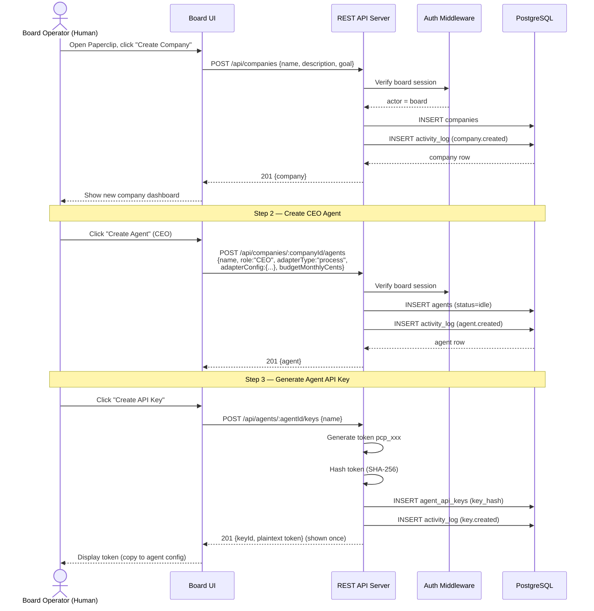
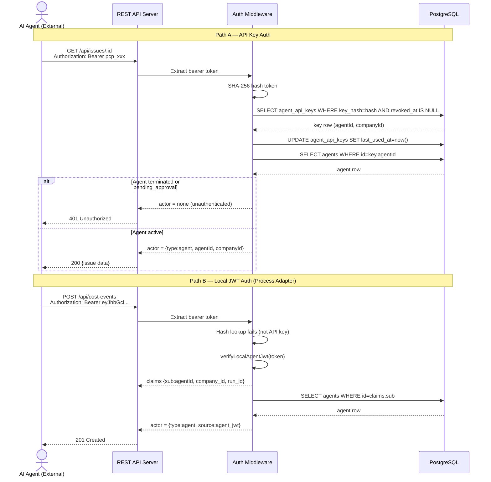
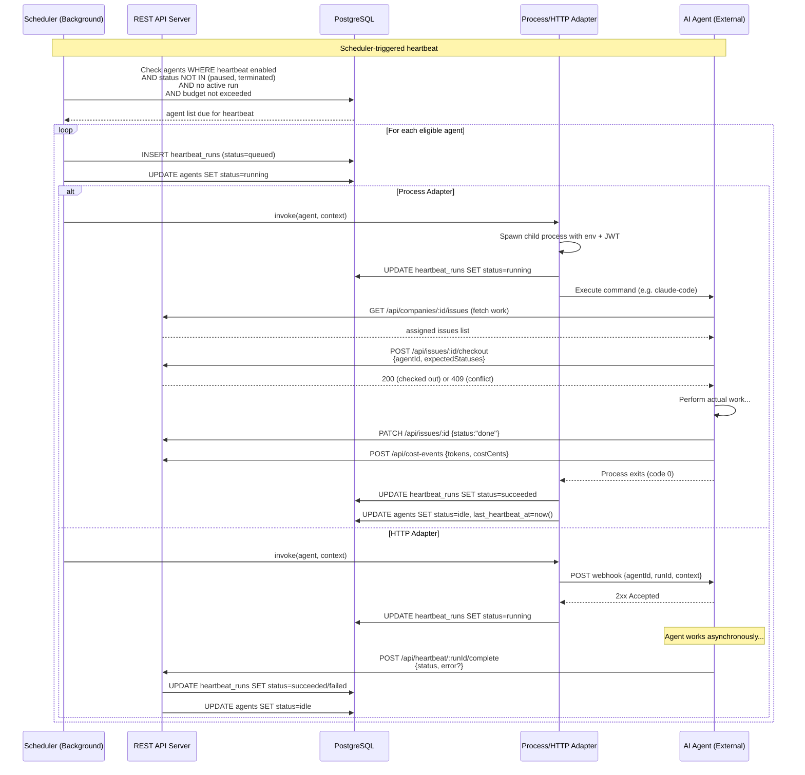
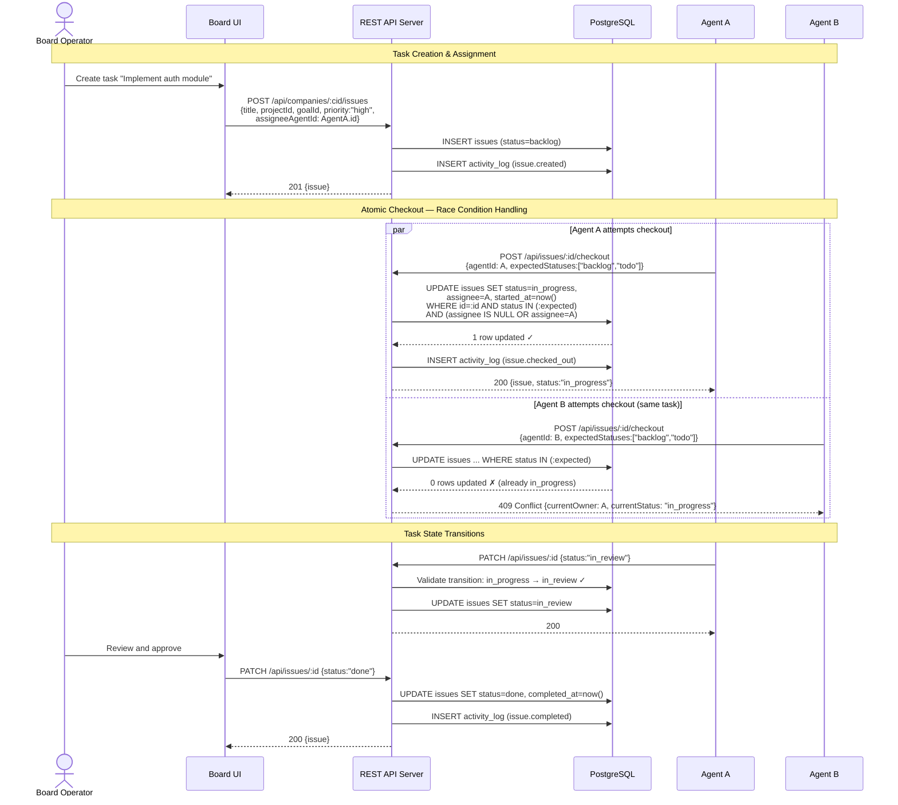
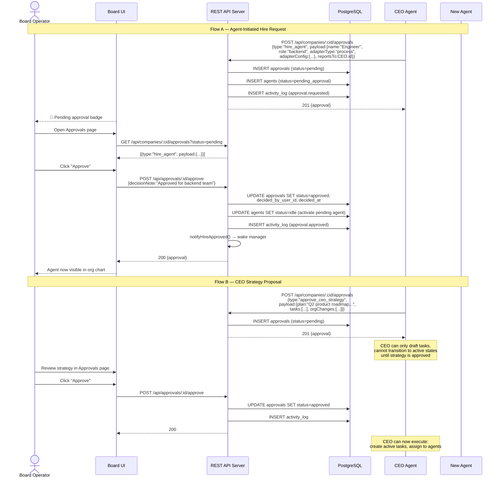
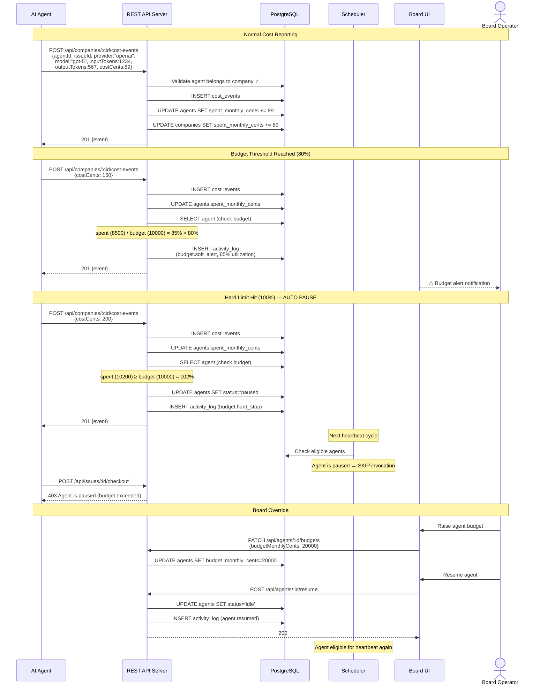
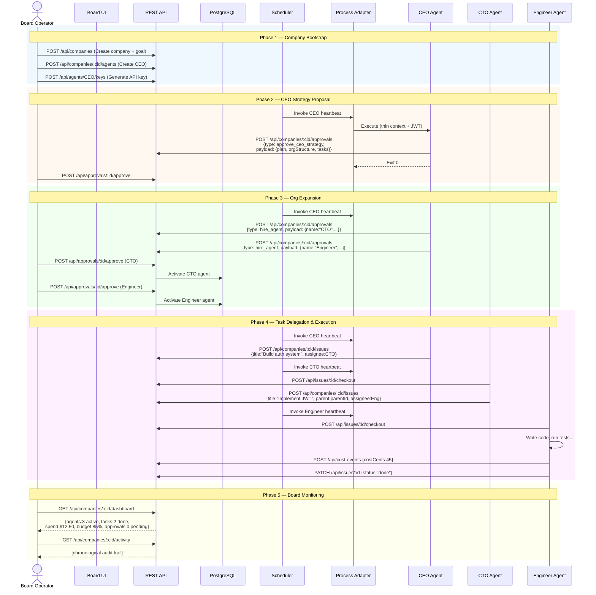
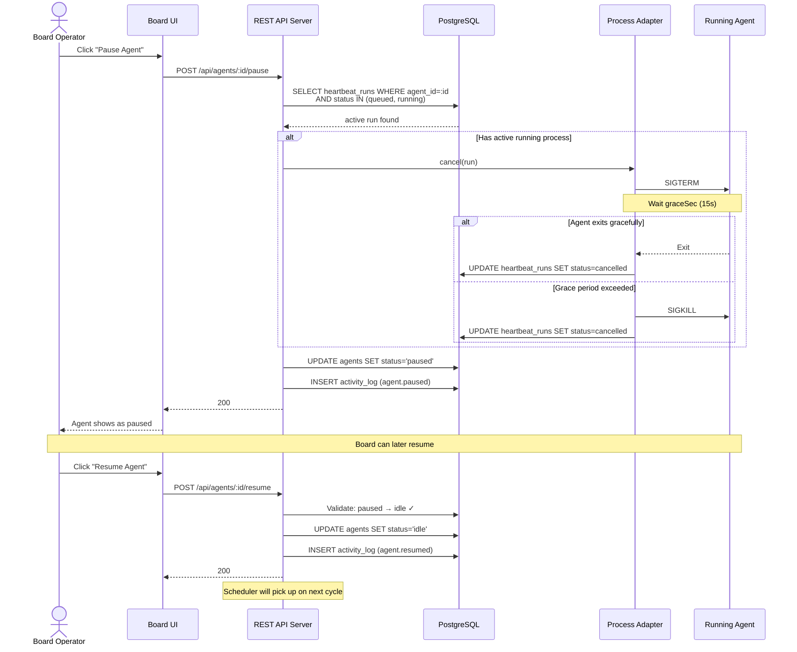

# Paperclip 业务交互时序图

## 项目概述

**Paperclip** 是一个面向自治 AI 公司的控制平面系统，核心参与者有三类：

| 角色 | 说明 |
|---|---|
| **Board Operator** | 人类运营者，通过 Web UI 管理公司、批准请求、监控运营 |
| **AI Agent** | 自治 AI 员工，通过 REST API + Bearer Token 执行任务、汇报成本 |
| **Scheduler** | 后台调度器，按间隔触发 Agent 心跳，检测卡死任务和预算阈值 |

---

## 1. 公司创建 & CEO 招聘流程



---

## 2. Agent 认证流程



---

## 3. 心跳调度 & Agent 执行流程



---

## 4. 任务生命周期 & 原子 Checkout 流程



---

## 5. 审批 & 治理流程 (招聘 Agent + CEO 战略提案)



---

## 6. 成本上报 & 预算执行流程



---

## 7. 端到端：完整公司运营生命周期



---

## 8. Agent 暂停 & 取消运行中的心跳流程



---

## 状态机参考

### Agent 状态转换

```
idle ──→ running ──→ idle
  │         │          ↑
  │         ├──→ error ┘
  │         │
  ├──→ paused ──→ idle
  │    ↑
  │    └── running (cancel first)
  │
  └──→ terminated (irreversible, board only)
```

### Issue 状态转换

```
backlog ──→ todo ──→ in_progress ──→ in_review ──→ done ✓
  │          │         │    ↑           │
  │          │         ↓    │           │
  │          ├──→ blocked ──┘           │
  │          │                          │
  └──────────┴──────────┴──────────┴──→ cancelled ✓
```

### Approval 状态转换

```
pending ──→ approved ✓
   │
   ├──→ rejected ✓
   │
   └──→ cancelled ✓
```
