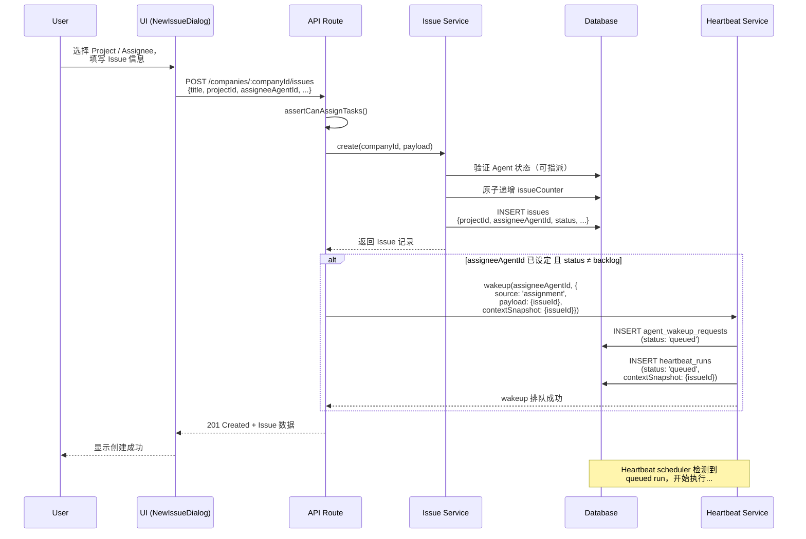
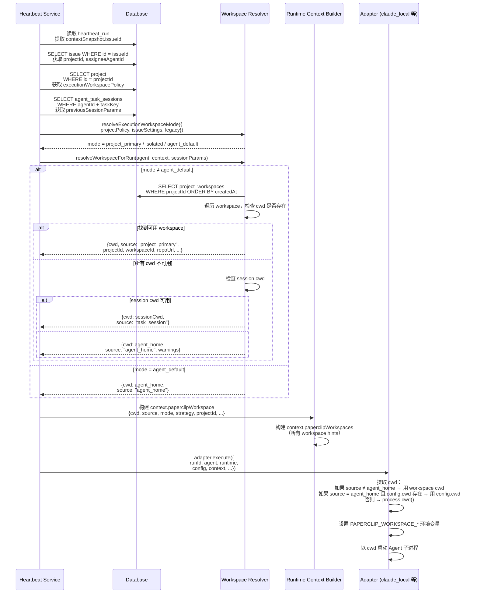
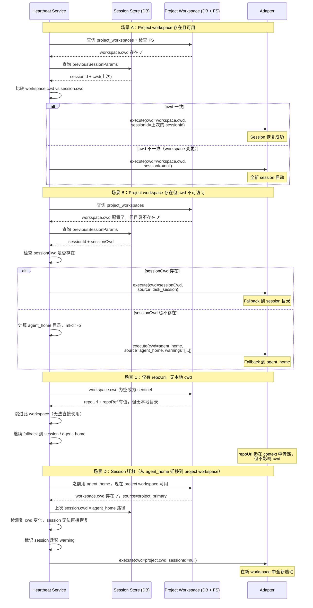
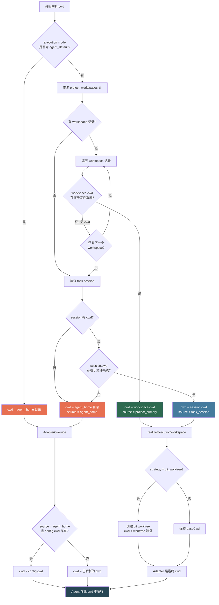
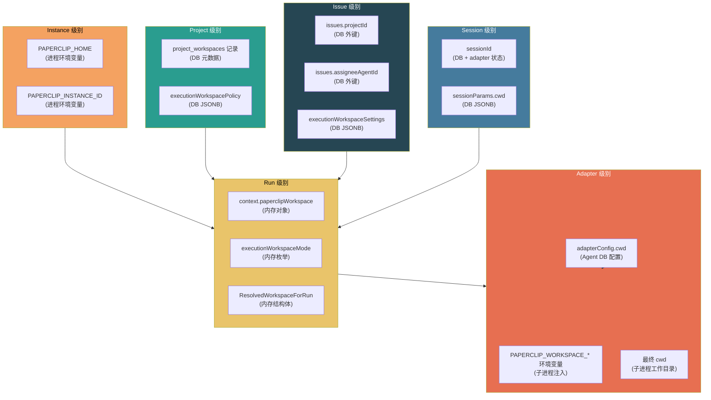

# 设计说明文档：Assignee 使用 Project 环境信息的完整过程

## 1. 文档目标

- 说明 Assignee（被指派的 Agent）在执行 Issue 时，如何获取并使用 Project 相关的环境信息
- 澄清 "Project 环境变量" 在当前实现中的真实含义——它们并非传统意义上的 shell 环境变量注入，而是一套分层的 runtime context 传递机制
- 完整描述从 Issue 创建、绑定 `projectId` 和 `assigneeAgentId`，到 Assignee 真正启动执行的端到端链路
- 说明最终工作目录 `cwd` 的决策过程，包括 project workspace、task session、agent_home 三层 fallback 关系
- 覆盖正常路径与异常 / fallback / session resume 场景下的链路变化

---

## 2. 核心结论

1. **Project 信息不是通过环境变量注入 Agent 的。** 它以结构化的 runtime context 对象 `context.paperclipWorkspace` 的形式传递给 adapter，adapter 再根据需要将部分字段写入子进程的环境变量。
2. **最终 `cwd` 由三层 fallback 机制决定：** `project_primary`（Project 配置的主 workspace 目录）→ `task_session`（上一次执行的 session 保存的 cwd）→ `agent_home`（系统为每个 Agent 自动创建的默认工作目录）。
3. **`adapterConfig.cwd` 仅在 `agent_home` 场景下生效。** 当 workspace source 为 `agent_home` 且 adapter 配置了 `cwd` 时，adapter 会优先使用配置的 `cwd` 而非 agent_home 目录。
4. **Session resume 有严格的前提条件。** 只有当上一次 session 记录的 `cwd` 与本次解析出的 `cwd` 完全一致时，才会恢复 session；否则会以全新 session 启动。
5. **`project_workspaces` 表是 workspace 信息的来源。** 每个 Project 可以配置多个 workspace，系统按创建时间顺序选取第一个 `cwd` 可访问的 workspace 作为 `project_primary`。
6. **Process adapter 不消费 workspace context。** 只有 claude_local、codex_local、opencode_local、cursor_local 四种 local adapter 才会读取 `context.paperclipWorkspace` 并注入 `PAPERCLIP_WORKSPACE_*` 环境变量。
7. **Execution workspace 有三种模式：** `project_primary`（共享 project workspace）、`isolated`（基于 git worktree 的隔离 workspace）、`agent_default`（使用 agent 原生 workspace，不使用 project 信息）。模式由 Project 的 `executionWorkspacePolicy` 和 Issue 级别的 `executionWorkspaceSettings` 共同决定。
8. **Wakeup 是触发 Agent 执行的唯一入口。** Issue 创建或 checkout 后，系统通过 `heartbeat.wakeup()` 将 `issueId` 写入 `contextSnapshot`，Agent 的 heartbeat 循环据此获取 issue 上下文。

---

## 3. 概念边界

用户口中的"Project 环境变量"，在当前实现中对应的是一套多层概念体系。为避免混淆，以下做明确区分：

### Project environment variables（不存在）

当前系统中，Project **不直接定义或注入 shell 环境变量**。没有类似"在 Project 上配置 `KEY=VALUE`，运行时自动注入到 Agent 进程的 `process.env`"这样的机制。

### Runtime context（核心传递载体）

指 heartbeat 在触发 adapter 执行时构建的 `context` 对象。其中最重要的子对象是 `context.paperclipWorkspace`，包含 `cwd`、`source`、`projectId`、`workspaceId`、`repoUrl`、`repoRef` 等字段。这是 Project 信息到达 adapter 的唯一通道。

### Workspace metadata（数据库存储层）

指 `project_workspaces` 表中的记录，包括 workspace 名称、本地 `cwd` 路径、`repoUrl`、`repoRef`、`isPrimary` 等字段。这些元数据由 Board 通过 UI/API 配置，在运行时被 heartbeat 服务读取并转化为 runtime context。

### Adapter config（agent 级配置）

指每个 Agent 的 `adapter_config` JSONB 字段，其中可以包含 `cwd`（adapter 配置的工作目录）。这是 Agent 维度的配置，独立于 Project，但在 workspace 解析的 fallback 链中会参与决策。

### Session params（运行间持久状态）

指 `agent_task_sessions` 表存储的 session 状态，主要包含 `sessionId` 和 `cwd`。session 跨多次 heartbeat run 持久化，用于支持 session resume（如 Claude Code 的 `--session-id` 参数）。

### Fallback workspace / agent_home（系统保底机制）

`agent_home` 不是一个环境变量，而是系统根据 Agent ID 自动计算的默认工作目录路径：`${PAPERCLIP_HOME}/instances/${PAPERCLIP_INSTANCE_ID}/workspaces/${agentId}`。当 Project workspace 和 task session 都不可用时，系统确保 Agent 至少有一个可用的工作目录。

---

## 4. 端到端主链路

### 步骤 1：Issue 绑定 `projectId`

**输入：** 用户在 UI 的 Issue 创建表单中选择一个 Project。

**处理：** UI 将 `projectId` 作为请求体的一部分发送到 `POST /companies/:companyId/issues`。Issue service 在插入 `issues` 表时，将 `projectId` 写入对应字段。如果 Project 配置了 `executionWorkspacePolicy`，系统还会自动将 policy 的默认 workspace 设置填入 Issue 的 `executionWorkspaceSettings`。

**输出：** 数据库中的 Issue 记录包含 `projectId` 外键，指向 `projects` 表。

### 步骤 2：Issue 绑定 `assigneeAgentId`

**输入：** 用户在同一创建表单中选择一个 Assignee Agent。

**处理：** Route 层验证当前用户的指派权限（`assertCanAssignTasks`），验证 Agent 存在且状态可指派（非 paused / terminated / pending_approval）。Service 将 `assigneeAgentId` 写入 Issue 记录。

**输出：** Issue 记录的 `assigneeAgentId` 指向被指派的 Agent。同时，用户可以在 UI 中配置 `assigneeAdapterOverrides`（如 model、reasoning effort）和 `executionWorkspaceSettings`（如选择 isolated 模式），这些以 JSONB 形式存入 Issue。

### 步骤 3：Wakeup 触发

**输入：** Issue 创建成功，且 `assigneeAgentId` 已设定，且 Issue 状态不是 `backlog`。

**处理：** Route 层调用 `heartbeat.wakeup(assigneeAgentId, { source: 'assignment', payload: { issueId }, contextSnapshot: { issueId, source: 'issue.create' } })`。Wakeup 服务创建一条 `agent_wakeup_requests` 记录和一条 `heartbeat_runs` 记录（状态为 `queued`），并将 `issueId` 存入 run 的 `contextSnapshot`。

**输出：** 一个 queued 状态的 heartbeat run，其中包含需要执行的 `issueId`。

### 步骤 4：Heartbeat 获取 Issue 上下文

**输入：** Heartbeat scheduler 检测到有 queued 状态的 run。

**处理：** Heartbeat 服务从 run 的 `contextSnapshot` 中提取 `issueId`，然后查询 `issues` 表获取完整的 Issue 信息，包括 `projectId`、`assigneeAgentId`、`status`、`executionWorkspaceSettings`、`assigneeAdapterOverrides` 等。

**输出：** 完整的 Issue 上下文数据，最重要的是 `projectId`，它将用于后续的 workspace 解析。

### 步骤 5：从 `projectId` 查找 Project workspace

**输入：** 从 Issue 获取的 `projectId`。

**处理：** 如果 execution workspace mode 不是 `agent_default`，系统查询 `project_workspaces` 表，获取该 Project 的所有 workspace 记录，按创建时间升序排列。逐一检查每个 workspace 的 `cwd` 路径是否在本地文件系统上实际存在且是一个目录。

**输出：** 如果找到可访问的 workspace → 返回 `source: "project_primary"`；如果所有 workspace 的 cwd 不可访问 → 继续到下一层 fallback。

### 步骤 6：组装 runtime context

**输入：** 解析后的 workspace 信息（`ResolvedWorkspaceForRun`）加上可能的 execution workspace realization 结果。

**处理：** 系统构建 `context.paperclipWorkspace` 对象，包含：`cwd`（最终工作目录）、`source`（来源层级）、`mode`（执行模式）、`strategy`（workspace 策略）、`projectId`、`workspaceId`、`repoUrl`、`repoRef`、`branchName`、`worktreePath`。同时构建 `context.paperclipWorkspaces`（所有可用 workspace 的 hint 列表）。如果配置了 runtime services，还会启动相关服务并填入 `context.paperclipRuntimeServices`。

**输出：** 完整的 `context` 对象，准备传递给 adapter。

### 步骤 7：Adapter 读取 context 值

**输入：** `context.paperclipWorkspace` 对象和 adapter config。

**处理：** Local adapter（claude_local / codex_local / opencode_local / cursor_local）从 `context.paperclipWorkspace.cwd` 中提取工作目录。如果 `source` 为 `agent_home` 且 adapter config 中配置了 `cwd`，则用 config 的 `cwd` 覆盖 workspace 的 `cwd`。Adapter 将 workspace 元信息写入子进程的环境变量（`PAPERCLIP_WORKSPACE_CWD`、`PAPERCLIP_WORKSPACE_SOURCE` 等）。

**输出：** Adapter 层面确定了最终的 `cwd` 和需要注入的环境变量。

### 步骤 8：最终决定 `cwd`

**输入：** workspace `cwd`、adapter config `cwd`、workspace `source`。

**处理：** 四种 local adapter 使用统一的优先级逻辑：
- 如果 workspace source 不是 `agent_home`，或者 adapter config 没有配置 `cwd` → 使用 workspace `cwd`
- 如果 workspace source 是 `agent_home` 且 adapter config 配置了 `cwd` → 使用 config `cwd`
- 如果以上都为空 → 使用 `process.cwd()`

**输出：** 子进程的工作目录 `cwd`，Agent 将在这个目录下执行。

### 步骤 9：Session 参与

**输入：** `agent_task_sessions` 表中的历史 session 记录和当前解析的 `cwd`。

**处理：** 系统查询该 Agent 在当前 task key 下的上次 session params，提取 `sessionId` 和 `cwd`。如果 session 的 `cwd` 与当前 `cwd` 一致（`path.resolve()` 后比较），则传递 `sessionId` 给 adapter 以恢复 session。如果不一致，则丢弃旧 session，以全新 session 启动。

**输出：** adapter 执行时携带的 `runtime.sessionId`（可能为空或为上次的 sessionId）。

### 步骤 10：Fallback 发生

**输入：** Project workspace 的 `cwd` 路径在文件系统上不存在。

**处理：**
- **Project workspace cwd 不存在** → 检查下一个 workspace；如果所有 workspace 都不可用 → 进入 tier 2
- **Task session cwd 不存在** → 进入 tier 3
- **Tier 3 agent_home** → 使用 `${PAPERCLIP_HOME}/instances/${PAPERCLIP_INSTANCE_ID}/workspaces/${agentId}`，系统自动创建该目录
- 每次 fallback 都会在 `warnings` 数组中记录原因，最终会记入 heartbeat run 日志

**输出：** 总会有一个可用的 `cwd`，至少是 agent_home 目录。

---

## 5. 交互时序图

### 图 1：Issue 创建到 Assignee 触发执行



### 图 2：Project 信息注入 Assignee 运行时



### 图 3：Fallback / Session Resume / Workspace 迁移



### 补充图：最终 cwd 决策树



### 补充图：变量作用域总览



---

## 6. 变量作用域说明

| 变量 / 字段名 | 类型 | 分类 | 生产者 | 消费者 | 作用域 | 生命周期 | 是否影响最终 cwd | 备注 |
|---|---|---|---|---|---|---|---|---|
| `projectId` | UUID 外键 | Runtime context 字段 | Issue 创建时由 User/Agent 指定 | Heartbeat service → workspace resolver | Issue-level | Issue 生命周期 | 间接影响（决定查哪些 workspace） | 通过 Issue 表传递，不直接决定 cwd |
| `issueId` | UUID 主键 | Runtime context 字段 | Issue 创建时生成 | Heartbeat service → wakeup → run context | Run-level | Issue 生命周期 | 不影响 | 用于定位 Issue 从而获取 projectId |
| `paperclipWorkspace.cwd` | 文件系统路径 string | Runtime context 字段 | Heartbeat workspace resolver | Adapter execute 函数 | Run-level | 单次 run | **是，核心决定字段** | 三层 fallback 之后的最终路径 |
| `paperclipWorkspace.source` | 枚举 string | Runtime context 字段 | Workspace resolver | Adapter（决定是否使用 config.cwd 覆盖） | Run-level | 单次 run | 间接影响（控制 adapter 覆盖逻辑） | `"project_primary"` / `"task_session"` / `"agent_home"` |
| `paperclipWorkspace.projectId` | UUID 或 null | Runtime context 字段 | Workspace resolver | Adapter（元数据传递）| Run-level | 单次 run | 不影响 | 用于 Agent 感知当前 Project |
| `paperclipWorkspace.workspaceId` | UUID 或 null | Runtime context 字段 | Workspace resolver | Adapter + session store | Run-level | 单次 run | 不影响 | 指向 project_workspaces 表主键 |
| `paperclipWorkspace.repoUrl` | URL string 或 null | Runtime context 字段 | project_workspaces 表 | Adapter（可选使用）| Run-level | 单次 run | 不影响 | 仅当 workspace 配置了 repoUrl 时有值 |
| `paperclipWorkspace.repoRef` | Git ref 或 null | Runtime context 字段 | project_workspaces 表 | Adapter（可选使用）| Run-level | 单次 run | 不影响 | 如 `main`、`refs/heads/dev` |
| `paperclipWorkspaces[]` | 对象数组 | Runtime context 字段 | Workspace resolver | Adapter（多 workspace 感知）| Run-level | 单次 run | 不影响 | 所有可用 workspace 的 hint 列表 |
| `adapterConfig.cwd` | 文件系统路径 string | Adapter config | Agent 创建/更新时由 Board 配置 | Adapter execute 函数 | Agent-level | Agent 配置生命周期 | **仅在 source=agent_home 时影响** | 覆盖 agent_home 但不覆盖 project workspace |
| `sessionParams.cwd` | 文件系统路径 string | Session params | 上一次 adapter 执行完成时写入 | Heartbeat workspace resolver + adapter session resume | Session-level | 跨 run 持久化 | **是（fallback tier 2）** | 用于 task_session 层 fallback 和 session resume 判断 |
| `PAPERCLIP_HOME` | 文件系统路径 string | **真正的环境变量** | 部署时由运维设置或使用默认值 | Server 进程（home-paths 模块）| Instance-level（进程级） | 进程生命周期 | 间接影响（决定 agent_home 的根路径） | 默认 `~/.paperclip` |
| `PAPERCLIP_INSTANCE_ID` | 标识符 string | **真正的环境变量** | 部署时由运维设置或使用默认值 | Server 进程（home-paths 模块）| Instance-level（进程级） | 进程生命周期 | 间接影响（决定 agent_home 的实例路径） | 默认 `"default"` |
| `agent_home` | 文件系统路径（概念） | 路径计算机制（非变量） | Server 进程 home-paths 模块 | Workspace resolver（fallback tier 3）| Agent-level | Agent 生命周期 | **是（fallback tier 3，总是可用）** | `${PAPERCLIP_HOME}/instances/${INSTANCE_ID}/workspaces/${agentId}` |
| `PAPERCLIP_WORKSPACE_CWD` | 文件系统路径 string | **真正的环境变量**（子进程注入） | Adapter execute 函数 | Agent 子进程 | Run-level（子进程级） | 子进程生命周期 | 不影响（已经在 cwd 决定之后注入） | 告知 Agent 当前 workspace 路径 |
| `PAPERCLIP_WORKSPACE_SOURCE` | 枚举 string | **真正的环境变量**（子进程注入） | Adapter execute 函数 | Agent 子进程 | Run-level（子进程级） | 子进程生命周期 | 不影响 | 告知 Agent workspace 来源层级 |
| `PAPERCLIP_AGENT_ID` | UUID string | **真正的环境变量**（子进程注入） | Adapter execute 函数 | Agent 子进程 | Run-level（子进程级） | 子进程生命周期 | 不影响 | Agent 身份标识 |
| `PAPERCLIP_RUN_ID` | UUID string | **真正的环境变量**（子进程注入） | Adapter execute 函数 | Agent 子进程 | Run-level（子进程级） | 子进程生命周期 | 不影响 | 当前 run 标识 |
| `PAPERCLIP_API_URL` | URL string | **真正的环境变量**（子进程注入） | Adapter execute 函数 | Agent 子进程 | Run-level（子进程级） | 子进程生命周期 | 不影响 | API 回调地址 |

---

## 7. 最终 `cwd` 决策过程

Assignee 最终运行目录的决定分为两个阶段：**服务端解析** 和 **adapter 端覆盖**。

### 阶段一：服务端解析（resolveWorkspaceForRun）

按以下优先级依次尝试：

**优先级 1：project_primary**
- 前提：Issue 关联了 Project，且 execution mode 不是 `agent_default`
- 查询 `project_workspaces` 表，遍历所有 workspace 记录
- 逐一检查 `workspace.cwd` 是否在文件系统上存在且为目录
- 找到第一个可用的即返回，`source = "project_primary"`

**优先级 2：task_session**
- 前提：优先级 1 未命中
- 检查上一次执行的 session params 中的 `cwd`
- 验证该路径在文件系统上存在且为目录
- 可用则返回，`source = "task_session"`

**优先级 3：agent_home（保底）**
- 前提：优先级 1 和 2 均未命中
- 计算路径：`${PAPERCLIP_HOME}/instances/${PAPERCLIP_INSTANCE_ID}/workspaces/${agentId}`
- 自动创建目录（`mkdir -p`）
- 返回，`source = "agent_home"`
- 记录 warning 说明 fallback 原因

### 阶段一扩展：realizeExecutionWorkspace

如果 workspace strategy 为 `git_worktree`（通常由 `executionWorkspacePolicy` 或 `executionWorkspaceSettings` 指定）：

- 在 baseCwd 基础上创建独立的 git worktree
- 根据模板生成分支名（通常包含 issue identifier）
- `cwd` 变为 worktree 路径
- 运行 provision command（如果配置了）

### 阶段二：adapter 端覆盖

Adapter 拿到 `context.paperclipWorkspace.cwd` 和 `context.paperclipWorkspace.source` 后，执行以下逻辑：

```
如果 source ≠ "agent_home":
    最终 cwd = workspace.cwd （不可覆盖）

如果 source = "agent_home" 且 adapterConfig.cwd 存在:
    最终 cwd = adapterConfig.cwd（config 覆盖 agent_home）

如果 source = "agent_home" 且 adapterConfig.cwd 不存在:
    最终 cwd = agent_home 路径

如果以上都为空:
    最终 cwd = process.cwd()（极端 fallback）
```

### Session resume 的前提条件

Session resume 发生在 adapter 内部，条件如下：
1. 上一次 session 存在有效的 `sessionId`
2. 上一次 session 记录的 `cwd` 为空（即不关心 cwd），**或者** 上一次 session 的 `cwd` 与当前 `cwd` 完全一致（`path.resolve()` 后比较）
3. 如果条件不满足，adapter 将以 `sessionId = null` 启动全新 session
4. 如果恢复 session 时遇到 "unknown session" 错误，adapter 会自动重试，以全新 session 启动

---

## 8. 场景矩阵

| 场景 | Project 信息来源 | Assignee 能拿到什么 | 最终 cwd | 是否会 fallback | 结果说明 |
|---|---|---|---|---|---|
| 有可用 project workspace（cwd 存在） | `project_workspaces` 表 + FS 验证 | `paperclipWorkspace` 完整对象（cwd, projectId, workspaceId, repoUrl, repoRef） | workspace.cwd | 否 | 最优路径。Agent 在 Project 指定的目录下执行 |
| Project workspace 配置了 cwd，但本地目录不存在 | `project_workspaces` 表（有记录）+ FS 不存在 | `paperclipWorkspace` 有 projectId 但 cwd 来自 fallback | session.cwd 或 agent_home | 是（tier 2/3） | 生成 warning。如果 session 有可用 cwd 则用 session，否则 fallback 到 agent_home |
| Project workspace 只有 repoUrl，无本地 cwd | `project_workspaces` 表（cwd 为空或 sentinel） | `paperclipWorkspace` 有 repoUrl 但 cwd 来自 fallback | session.cwd 或 agent_home | 是（tier 2/3） | repoUrl 作为元数据传递给 Agent，但不决定 cwd。适用于 Agent 自行 clone 的场景 |
| 没有 project workspace（Issue 未关联 Project 或 Project 无 workspace） | 无 | `paperclipWorkspace.projectId` 可能为 null | session.cwd 或 agent_home | 是（tier 2/3） | 如果 Issue 未关联 Project，直接跳到 session / agent_home |
| 有 task session 且 cwd 匹配 | session 表 | session cwd + sessionId | session.cwd（或 workspace.cwd，两者一致） | 否（如果 project workspace 可用且一致） | Session 恢复成功。Agent 继续上一次的工作状态 |
| 有 task session 但 cwd 不匹配 | session 表记录了旧 cwd | workspace.cwd（project 层面的新路径） | 新的 workspace.cwd | 否（使用 project workspace） | Session 不恢复。Agent 以全新 session 在新 cwd 下启动，旧 session 被放弃 |
| `useProjectWorkspace = false` | 被 Issue 的 `assigneeAdapterOverrides` 禁用 | `paperclipWorkspace.source = agent_home` | agent_home 或 config.cwd | 是（直接跳到 agent_home） | 显式禁用 project workspace。等效于 `agent_default` 模式 |
| 配置了 `adapterConfig.cwd` | Agent 的 adapter_config | workspace 正常解析 | 如果 source=agent_home: config.cwd；否则: workspace.cwd | 仅当 source=agent_home 时 config.cwd 生效 | adapter config 的 cwd 只是 agent_home 的替代品，不能覆盖 project workspace |
| 完全 fallback 到 agent_home | 无 project workspace + 无 session | `paperclipWorkspace.source = agent_home`，warnings 列表 | `~/.paperclip/instances/{id}/workspaces/{agentId}` | 是（tier 3） | 最后兜底。目录自动创建，Agent 在空白目录中启动 |

---

## 9. 常见误解

### 误解 1：Project 可以配置环境变量注入到 Agent 进程

**事实：** 当前系统中没有 Project 级别的 `KEY=VALUE` 环境变量配置机制。Project 信息以结构化 context 对象的形式传递给 adapter，adapter 将部分字段转化为 `PAPERCLIP_WORKSPACE_*` 环境变量注入子进程，但这些变量是系统自动生成的，不是用户自定义的。

### 误解 2：`context.paperclipWorkspace` 的字段就是环境变量

**事实：** `context.paperclipWorkspace` 是一个 JavaScript 对象，在 heartbeat service 和 adapter 之间通过函数调用传递，不经过 shell 或进程边界。只有 adapter 在启动子进程时，才会将其中部分字段写入子进程的 `process.env`。

### 误解 3：`agent_home` 是一个可以用 `$AGENT_HOME` 引用的环境变量

**事实：** `agent_home` 是一个路径计算概念，由 `resolvePaperclipHomeDir()` + `resolvePaperclipInstanceId()` + Agent ID 拼接而成。系统中没有名为 `AGENT_HOME` 的环境变量。最接近的等价概念是 `PAPERCLIP_HOME`（控制根目录）和 `PAPERCLIP_INSTANCE_ID`（控制实例隔离），两者共同决定了 agent_home 的路径前缀。

### 误解 4：`adapterConfig.cwd` 可以覆盖 Project workspace

**事实：** `adapterConfig.cwd` 只在 workspace source 为 `agent_home` 时生效。当存在可用的 project workspace（source = `project_primary`）或 task session workspace（source = `task_session`）时，`adapterConfig.cwd` 会被忽略。

### 误解 5：Session resume 在任何情况下都会生效

**事实：** Session resume 有严格的 cwd 匹配前提条件。如果上次 session 的 cwd 与本次 cwd 不一致（比如 workspace 配置变更、从 agent_home 迁移到 project workspace），session 将不会恢复，Agent 以全新 session 启动。

### 误解 6：Process adapter 和 local adapter 行为一致

**事实：** Process adapter 是一个极简的命令执行器，不读取 `context.paperclipWorkspace`，不注入 `PAPERCLIP_WORKSPACE_*` 环境变量，不支持 session。只有 claude_local、codex_local、opencode_local、cursor_local 四种 local adapter 才有完整的 workspace 感知和 session 管理能力。

### 误解 7：Project workspace 的 `repoUrl` 会自动 clone 到本地

**事实：** `repoUrl` 只是元数据。系统不会自动 clone 仓库。如果 workspace 只配置了 `repoUrl` 而没有本地 `cwd`（或 cwd 设为 sentinel 值），这个 workspace 不会被用于 cwd 解析，只会作为 context 元数据传递给 Agent。Agent 可以自行决定是否使用这个 URL。

### 误解 8：`executionWorkspaceMode` 和 `paperclipWorkspace.source` 是同一个概念

**事实：** `executionWorkspaceMode` 是一个策略配置（`project_primary` / `isolated` / `agent_default`），决定"系统应该如何解析 workspace"。`paperclipWorkspace.source` 是实际的解析结果（`project_primary` / `task_session` / `agent_home`），表示"最终用了哪个来源"。两者名称部分重叠但含义不同：mode 是意图，source 是结果。

---

## 10. 面向实现者的简明结论

### 如果你是后端工程师

整条链路的核心是 heartbeat service 中的 `resolveWorkspaceForRun()` 函数。它实现了三层 fallback 逻辑，每层都做文件系统存在性检查。理解这条链路的关键是：**Project workspace → task session → agent_home 的优先级是固定的，fallback 时自动生成 warning。** 新增 workspace 来源时，应在此函数中添加新的 tier，并保持向下兼容。`realizeExecutionWorkspace()` 是第二个关键函数，它将 baseCwd 转化为最终的执行 workspace（可能创建 git worktree）。

### 如果你是 adapter 作者

需要消费的核心字段：
- `context.paperclipWorkspace.cwd` — 最终工作目录
- `context.paperclipWorkspace.source` — 如果是 `agent_home` 且你的 adapter config 有 `cwd`，应该用 config 的 cwd 覆盖
- `runtime.sessionId` / `runtime.sessionParams` — 用于 session resume
- `context.paperclipWorkspaces` — 所有 workspace hints（可选消费）

需要注入的环境变量（子进程）：
- `PAPERCLIP_WORKSPACE_CWD` — 当前 cwd
- `PAPERCLIP_WORKSPACE_SOURCE` — workspace 来源
- `PAPERCLIP_AGENT_ID`、`PAPERCLIP_COMPANY_ID`、`PAPERCLIP_API_URL`、`PAPERCLIP_RUN_ID` — 基础身份和通信信息

执行完成后需要回写的 session params：
- `sessionId` — adapter 生成或恢复的 session 标识
- `cwd` — 本次执行的工作目录（用于下次 session resume 判断）

### 如果你是产品 / 运营

正确的描述方式：

> "Paperclip 允许为 Project 配置 workspace（工作目录），当 Agent 被分配到该 Project 下的 Issue 时，系统会自动将 Agent 的工作目录切换到 Project 的 workspace。如果 workspace 不可用，系统会自动 fallback 到 Agent 的默认工作目录。这不是环境变量注入，而是工作目录管理。"

避免使用"Project 环境变量"的说法，建议使用"Project workspace 配置"或"Project 工作目录设置"。

---

## 附录 A：给新工程师的 3 分钟速读版

1. **Issue 创建时绑定 Project 和 Assignee** → 数据写入 DB
2. **Wakeup 机制** 通知 Assignee Agent → 创建 heartbeat run
3. **Heartbeat service** 从 Issue 取 `projectId` → 查 `project_workspaces` → 验证 cwd 是否在本地存在
4. **三层 fallback**：project workspace → session 上次的 cwd → agent_home（总是可用）
5. **Context 对象** 携带所有 workspace 信息传给 adapter
6. **Adapter** 决定最终 cwd（仅当 agent_home 时才允许 config 覆盖）→ 注入 `PAPERCLIP_WORKSPACE_*` 环境变量 → 启动子进程
7. **Session** 跨次执行持久化，但 cwd 变化时不恢复

**一句话总结：** Project 信息通过 DB → context 对象 → adapter → 子进程环境变量的链路传递，而非直接注入环境变量。

---

## 附录 B：术语对照表

| 术语 | 定义 | 是否为 env var | 持久化位置 | 备注 |
|---|---|---|---|---|
| **环境变量 (Environment Variable)** | 操作系统进程级 `KEY=VALUE` 对 | 是 | 进程内存 | 如 `PAPERCLIP_HOME`、`PAPERCLIP_WORKSPACE_CWD` |
| **Runtime context** | Heartbeat → adapter 之间的内存对象传递 | 否 | 无（每次 run 重新构建） | `context.paperclipWorkspace` 等 |
| **Adapter config** | Agent 的 `adapter_config` JSONB 配置 | 否 | DB `agents` 表 | 包含 `cwd`、`model` 等 adapter 特定配置 |
| **Workspace metadata** | Project workspace 的配置信息 | 否 | DB `project_workspaces` 表 | 包含 `cwd`、`repoUrl`、`repoRef` |
| **Session params** | 跨 run 持久化的 session 状态 | 否 | DB `agent_task_sessions` 表 | 包含 `sessionId`、`cwd` |
| **Workspace** | Agent 执行代码的目录（广义） | — | 文件系统 | 可以是 project workspace、session 目录或 agent_home |
| **agent_home** | 系统为 Agent 自动管理的默认工作目录 | 否（路径计算概念） | 文件系统 | `${PAPERCLIP_HOME}/instances/${ID}/workspaces/${agentId}` |
| **Execution mode** | Workspace 解析策略（意图） | 否 | Issue/Project JSONB 配置 | `project_primary` / `isolated` / `agent_default` |
| **Workspace source** | 最终 cwd 的来源（结果） | 否（但注入为 env var） | 每次 run 计算 | `project_primary` / `task_session` / `agent_home` |
