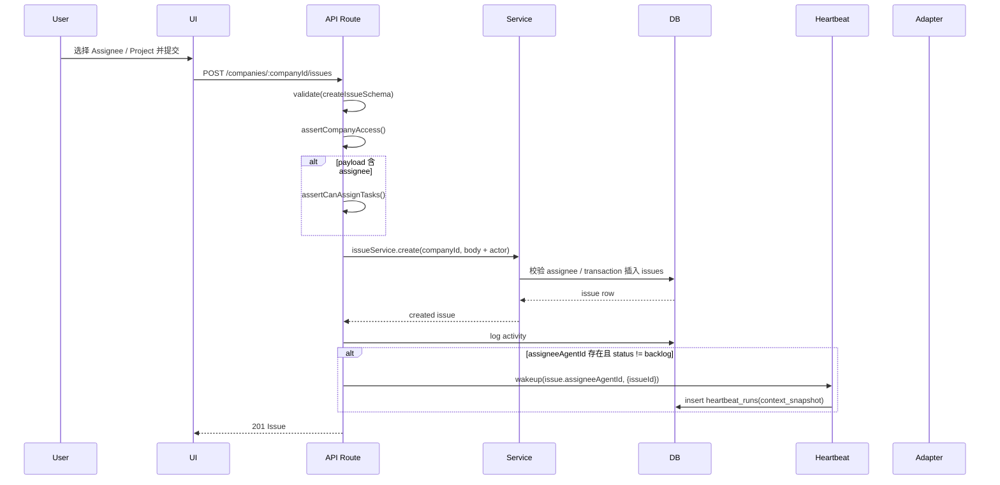
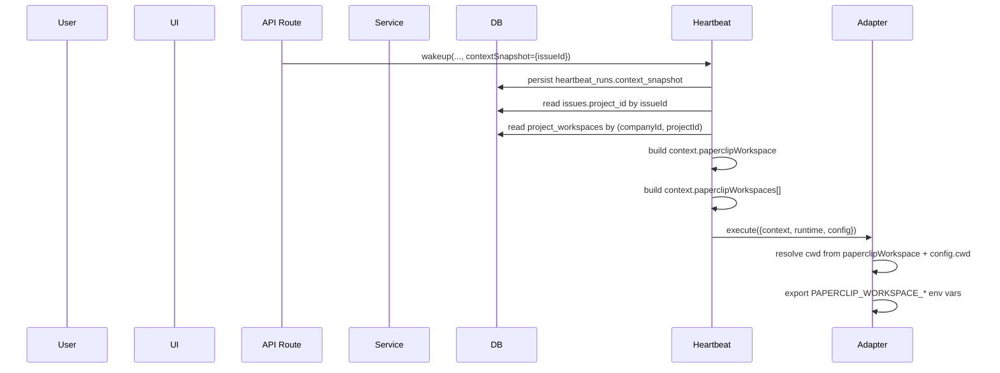
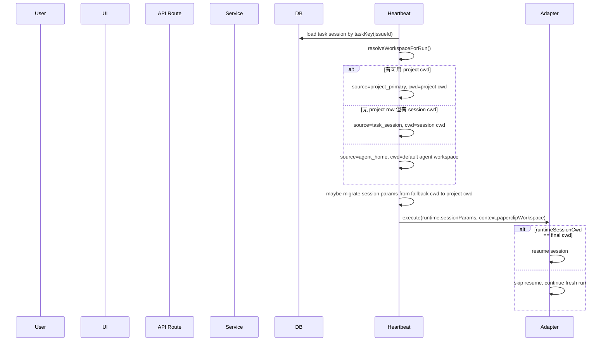
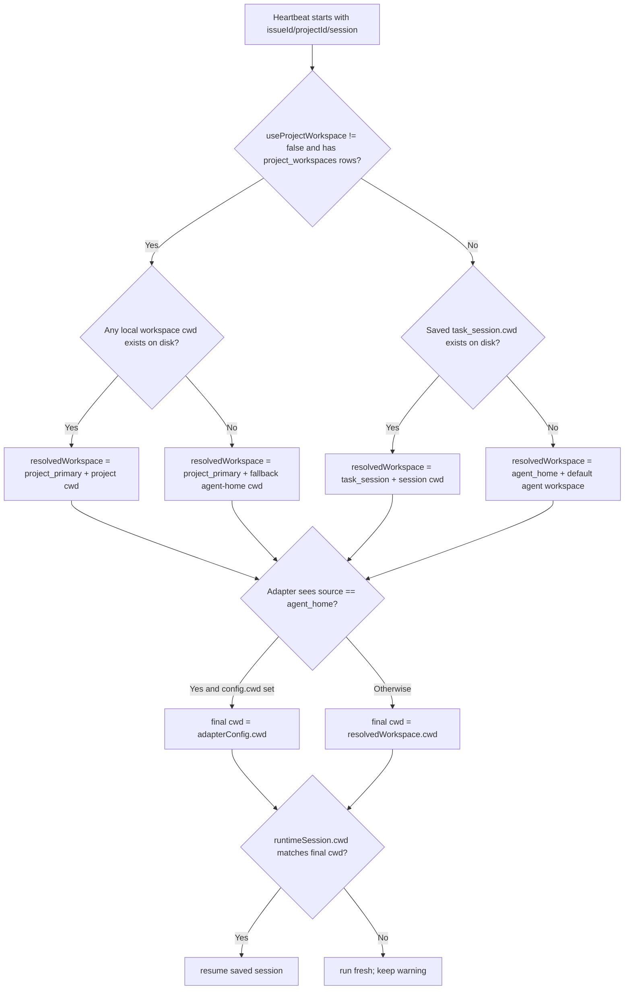

# 设计说明文档：Issue 创建中的 Assignee / Project 交互与 Project 环境共享机制

## 1. 文档目的

- 本文只基于当前仓库中的代码与已读文档，解释系统“现在实际上如何工作”，不补充仓库外假设。
- 分析范围覆盖 UI、`packages/shared`、API route、service、DB schema、heartbeat/runtime workspace resolution，以及 `claude_local` / `codex_local` / `opencode_local` / `cursor` 这四类 local adapter 的执行层。
- 本文重点回答两个问题：`Issue` 创建时 `Assignee` 与 `Project` 如何交互，以及 `Assignee` 在运行时如何共享 / 继承 / 使用 `Project` 的环境信息。
- 对每条关键结论，本文都会区分“代码中已有证据”和“未在代码中发现明确证据”；必要时会显式标注“推断”。
- 本文使用的术语中，`project workspace`、`task_session`、`agent home`、`contextSnapshot`、`adapterConfig.cwd` 都以当前实现为准，而不是以长期规格或直觉命名为准。

## 2. 结论摘要

- 创建 Issue 时，UI 里的 Assignee 和 Project 都是按 `companyId` 独立拉取候选列表；两者之间没有联动过滤，也没有 “选了 Project 后缩小 Assignee 列表” 的逻辑。证据：`ui/src/components/NewIssueDialog.tsx:201`，`ui/src/components/NewIssueDialog.tsx:207`，`ui/src/components/NewIssueDialog.tsx:664`，`ui/src/components/NewIssueDialog.tsx:699`。
- 代码里存在 “Assignee 必须属于同一 company” 的校验，但未在代码中发现 “Assignee 必须属于 Project” 的校验。证据：`server/src/services/issues.ts:300`，`server/src/services/issues.ts:312`，`server/src/services/issues.ts:621`，`packages/db/src/schema/index.ts:14`，`packages/db/src/schema/index.ts:15`，`packages/db/src/schema/index.ts:16`。
- `projectId` 会进入 `issues.project_id`，但创建成功后唤醒 heartbeat 时只显式传 `issueId`；heartbeat 运行前再通过 `issueId` 回查 `issues.project_id`。证据：`ui/src/components/NewIssueDialog.tsx:438`，`server/src/routes/issues.ts:424`，`server/src/routes/issues.ts:448`，`server/src/routes/issues.ts:451`，`server/src/services/heartbeat.ts:486`，`server/src/services/heartbeat.ts:490`。
- `project_workspaces` 是 Project 环境信息的主数据源；heartbeat 会把解析结果写进内存态 `context.paperclipWorkspace` 和 `context.paperclipWorkspaces`，然后把该 `context` 直接传给 adapter。证据：`packages/db/src/schema/project_workspaces.ts:13`，`server/src/services/heartbeat.ts:499`，`server/src/services/heartbeat.ts:512`，`server/src/services/heartbeat.ts:1119`，`server/src/services/heartbeat.ts:1127`，`server/src/services/heartbeat.ts:1277`。
- 未在代码中发现名为 `$AGENT_HOME` 的配置；当前最接近的等价机制是 `resolveDefaultAgentWorkspaceDir(agentId)` 生成的 instance-scoped fallback workspace，文档中把它称作 “agent home workspace”。证据：`server/src/home-paths.ts:56`，`server/src/home-paths.ts:61`，`doc/DEVELOPING.md:121`，`doc/DEVELOPING.md:123`。
- 当前 heartbeat 的 workspace 解析优先级是：优先尝试 project workspace，本地目录不可用时再看 task session，最后落到 agent home；但一旦存在 project workspace 记录，即使没有可用本地目录，也会返回 `source=project_primary` 并使用 fallback 目录。证据：`server/src/services/heartbeat.ts:499`，`server/src/services/heartbeat.ts:519`，`server/src/services/heartbeat.ts:547`，`server/src/services/heartbeat.ts:563`，`server/src/services/heartbeat.ts:575`，`server/src/services/heartbeat.ts:595`。
- 四个 local adapter 的最终 `cwd` 都遵循同一模式：`paperclipWorkspace.cwd` 优先；只有当 `paperclipWorkspace.source === "agent_home"` 且 `adapterConfig.cwd` 有值时，`adapterConfig.cwd` 才会覆盖；否则才会退到 `process.cwd()`。证据：`packages/adapters/claude-local/src/server/execute.ts:126`，`packages/adapters/claude-local/src/server/execute.ts:129`，`packages/adapters/codex-local/src/server/execute.ts:137`，`packages/adapters/codex-local/src/server/execute.ts:140`，`packages/adapters/opencode-local/src/server/execute.ts:107`，`packages/adapters/opencode-local/src/server/execute.ts:110`，`packages/adapters/cursor-local/src/server/execute.ts:173`，`packages/adapters/cursor-local/src/server/execute.ts:176`。
- `paperclipWorkspace.projectId` 会进入运行时 `context`，但在四个 local adapter 的 `cwd` 决策里未发现直接消费这个字段的代码；它更像是上下文元数据，而不是目录选择输入。证据：`server/src/services/heartbeat.ts:1122`，`packages/adapters/claude-local/src/server/execute.ts:115`，`packages/adapters/codex-local/src/server/execute.ts:126`，`packages/adapters/opencode-local/src/server/execute.ts:96`，`packages/adapters/cursor-local/src/server/execute.ts:162`。
- Issue 级 session 实际按 `taskKey=issueId` 存进 `agent_task_sessions`；assignment wake、timer wake、manual on-demand wake 会重置 task session，comment mention / comment wake 不会。证据：`server/src/services/heartbeat.ts:183`，`server/src/services/heartbeat.ts:188`，`packages/db/src/schema/agent_task_sessions.ts:13`，`packages/db/src/schema/agent_task_sessions.ts:22`，`server/src/services/heartbeat.ts:198`，`server/src/services/heartbeat.ts:202`，`server/src/services/heartbeat.ts:205`，`server/src/services/heartbeat.ts:207`。
- session 恢复有两层门槛：heartbeat 先决定应该用哪个 workspace；adapter 再检查“保存 session 的 cwd 是否和本次最终 cwd 一致”。不一致时会继续运行，但不会 resume 原 session。证据：`server/src/services/heartbeat.ts:1096`，`server/src/services/heartbeat.ts:1102`，`packages/adapters/claude-local/src/server/execute.ts:321`，`packages/adapters/claude-local/src/server/execute.ts:324`，`packages/adapters/codex-local/src/server/execute.ts:225`，`packages/adapters/opencode-local/src/server/execute.ts:183`，`packages/adapters/cursor-local/src/server/execute.ts:263`。
- 当前实现里，`project_primary` 这个名字会误导读者：heartbeat 选 workspace 时没有按 `isPrimary` 排序，而是按创建顺序扫描第一个存在的本地目录；因此 API/UI 暴露的 `primaryWorkspace` 与 runtime 真正拿到的目录不一定一致。证据：`server/src/services/projects.ts:97`，`server/src/services/projects.ts:104`，`server/src/services/heartbeat.ts:499`，`server/src/services/heartbeat.ts:509`，`server/src/services/heartbeat.ts:523`。

## 3. 问题一：创建 Issue 时 Assignee 与 Project 如何交互

### 3.1 UI 表单中的选择逻辑

- `NewIssueDialog` 打开后，用 `effectiveCompanyId` 同时请求 `agentsApi.list(companyId)` 和 `projectsApi.list(companyId)`，因此两个候选列表都首先被 company scope 限定。证据：`ui/src/components/NewIssueDialog.tsx:188`，`ui/src/components/NewIssueDialog.tsx:201`，`ui/src/components/NewIssueDialog.tsx:207`，`ui/src/api/agents.ts:59`，`ui/src/api/projects.ts:15`。
- Assignee 选择器和 Project 选择器在 UI 上是两个独立 `InlineEntitySelector`；Assignee 的 `onChange` 只改 `assigneeId`，Project 的 `onChange` 只改 `projectId`，未发现一方会重新过滤另一方。证据：`ui/src/components/NewIssueDialog.tsx:664`，`ui/src/components/NewIssueDialog.tsx:673`，`ui/src/components/NewIssueDialog.tsx:699`，`ui/src/components/NewIssueDialog.tsx:708`。
- 切换 dialog 顶部 company 时，UI 会同时清空 `assigneeId` 和 `projectId`，但这仍然只是 company 级联，而不是 project-assignee 联动。证据：`ui/src/components/NewIssueDialog.tsx:405`，`ui/src/components/NewIssueDialog.tsx:408`，`ui/src/components/NewIssueDialog.tsx:409`。
- Assignee 候选列表会过滤 `terminated`，但不会过滤 `pending_approval`；Project 候选列表直接使用 `orderedProjects`，未发现排除 `archivedAt` 的逻辑。证据：`ui/src/components/NewIssueDialog.tsx:229`，`ui/src/components/NewIssueDialog.tsx:230`，`ui/src/components/NewIssueDialog.tsx:487`，`ui/src/components/NewIssueDialog.tsx:497`，`server/src/services/projects.ts:264`。
- `openNewIssue` 可以从调用方注入默认 `projectId` / `assigneeAgentId`；例如 Project issue list 会预填 `projectId`，Agent detail 会预填 `assigneeAgentId`。证据：`ui/src/context/DialogContext.tsx:3`，`ui/src/context/DialogContext.tsx:54`，`ui/src/components/IssuesList.tsx:262`，`ui/src/components/IssuesList.tsx:264`，`ui/src/components/IssuesList.tsx:268`，`ui/src/pages/AgentDetail.tsx:460`。

### 3.2 默认值来源

- Dialog 默认 company 来自当前 `selectedCompanyId`；若 `newIssueDefaults` 有值则优先用 defaults，否则恢复本地 draft；再否则退到空表单。证据：`ui/src/components/NewIssueDialog.tsx:188`，`ui/src/components/NewIssueDialog.tsx:320`，`ui/src/components/NewIssueDialog.tsx:326`，`ui/src/components/NewIssueDialog.tsx:337`，`ui/src/components/NewIssueDialog.tsx:348`。
- UI 默认 `status` 是 `todo`，而 shared validator 的 API 默认 `status` 是 `backlog`。也就是说，UI 创建 Issue 时通常会显式传 `todo`，但 API 客户端如果省略该字段，后端默认会变成 `backlog`。证据：`ui/src/components/NewIssueDialog.tsx:175`，`ui/src/components/NewIssueDialog.tsx:349`，`packages/shared/src/validators/issue.ts:17`。
- UI 默认 `priority` 初始为空，但提交时会补成 `"medium"`。证据：`ui/src/components/NewIssueDialog.tsx:176`，`ui/src/components/NewIssueDialog.tsx:436`，`packages/shared/src/validators/issue.ts:18`。
- 当前 `NewIssueDialog` 只暴露 agent assignee，不暴露 `assigneeUserId`；但 shared schema 和 service 层是支持 user assignee 的。证据：`ui/src/components/NewIssueDialog.tsx:437`，`packages/shared/src/validators/issue.ts:19`，`packages/shared/src/validators/issue.ts:20`，`server/src/services/issues.ts:625`。

### 3.3 提交 payload 长什么样

- UI 提交 payload 只会在对应值非空时附带 `assigneeAgentId` 和 `projectId`；同时可能附带 `assigneeAdapterOverrides`，其中可包括 `adapterConfig` 覆盖和 `useProjectWorkspace=false`。证据：`ui/src/components/NewIssueDialog.tsx:422`，`ui/src/components/NewIssueDialog.tsx:431`，`ui/src/components/NewIssueDialog.tsx:437`，`ui/src/components/NewIssueDialog.tsx:438`，`ui/src/components/NewIssueDialog.tsx:439`。
- `createIssueSchema` 接受的核心字段包括 `projectId`、`status`、`priority`、`assigneeAgentId`、`assigneeUserId`、`assigneeAdapterOverrides`。证据：`packages/shared/src/validators/issue.ts:11`，`packages/shared/src/validators/issue.ts:12`，`packages/shared/src/validators/issue.ts:19`，`packages/shared/src/validators/issue.ts:20`，`packages/shared/src/validators/issue.ts:23`。

### 3.4 API / service / DB 如何处理

- `POST /companies/:companyId/issues` 先用 `createIssueSchema` 校验 body，然后执行 `assertCompanyAccess`；只有在请求里真的包含 assignee 时，才会做 `tasks:assign` 权限校验。证据：`server/src/routes/issues.ts:416`，`server/src/routes/issues.ts:418`，`server/src/routes/issues.ts:419`，`server/src/routes/issues.ts:420`。
- route 层会把 actor 信息注入 `createdByAgentId` / `createdByUserId`，然后调用 `issueService.create`。证据：`server/src/routes/issues.ts:423`，`server/src/routes/issues.ts:424`，`server/src/routes/issues.ts:426`，`server/src/routes/issues.ts:427`。
- service 层显式校验的规则只有：单 assignee、assignee agent 是否存在、assignee 是否同 company、assignee agent 不能是 `pending_approval` / `terminated`、`in_progress` 必须有 assignee。证据：`server/src/services/issues.ts:625`，`server/src/services/issues.ts:626`，`server/src/services/issues.ts:628`，`server/src/services/issues.ts:629`，`server/src/services/issues.ts:312`，`server/src/services/issues.ts:315`，`server/src/services/issues.ts:318`，`server/src/services/issues.ts:634`。
- `issueService.create` 会在一个 transaction 里先递增 company 的 `issueCounter`，生成 `identifier`，再插入 `issues` 表。证据：`server/src/services/issues.ts:637`，`server/src/services/issues.ts:639`，`server/src/services/issues.ts:644`，`server/src/services/issues.ts:647`，`server/src/services/issues.ts:658`。
- DB 层对 `project_id` 和 `assignee_agent_id` 只有普通 FK，没有 `company_id + project_id` 或 `company_id + assignee_agent_id` 这种复合约束；因此 company 一致性主要依赖 service 代码，而不是 DB 结构。证据：`packages/db/src/schema/issues.ts:22`，`packages/db/src/schema/issues.ts:23`，`packages/db/src/schema/issues.ts:30`。

### 3.5 返回错误与失败条件

| 条件 | 当前实现 | 返回错误 / 结果 | 证据 |
|---|---|---|---|
| body 不是合法 schema | route `validate()` 直接抛 `ZodError` | `400 Validation error` | `server/src/middleware/validate.ts:4`，`server/src/middleware/error-handler.ts:55` |
| company 无访问权限 | route `assertCompanyAccess` 拦截 | `403` | `server/src/routes/issues.ts:418` |
| 请求里带 assignee，但 actor 没有 `tasks:assign` | route `assertCanAssignTasks` 拦截 | `403` | `server/src/routes/issues.ts:419`，`server/src/routes/issues.ts:420`，`server/src/routes/issues.ts:92` |
| assignee agent 不存在 | service `assertAssignableAgent` | `404 Assignee agent not found` | `server/src/services/issues.ts:300`，`server/src/services/issues.ts:311` |
| assignee user 不存在或 membership 不活跃 | service `assertAssignableUser` | `404 Assignee user not found` | `server/src/services/issues.ts:323`，`server/src/services/issues.ts:336` |
| assignee 跨 company | service | `422 Assignee must belong to same company` | `server/src/services/issues.ts:312`，`server/src/services/issues.ts:313` |
| assignee 是 `pending_approval` | service | `409 Cannot assign work to pending approval agents` | `server/src/services/issues.ts:315`，`server/src/services/issues.ts:316` |
| assignee 是 `terminated` | service | `409 Cannot assign work to terminated agents` | `server/src/services/issues.ts:318`，`server/src/services/issues.ts:319` |
| `status=in_progress` 但无 assignee | service | `422 in_progress issues require an assignee` | `server/src/services/issues.ts:634`，`server/src/services/issues.ts:635` |
| 同时传 `assigneeAgentId` 和 `assigneeUserId` | service | `422 Issue can only have one assignee` | `server/src/services/issues.ts:625`，`server/src/services/issues.ts:626` |
| `projectId` 是合法 UUID，但并不存在 | 未在 service 中发现显式校验；更可能由 DB FK 抛异常后走通用 error handler | 推断为 `500 Internal server error`，未在代码中发现专门测试 | `packages/shared/src/validators/issue.ts:12`，`server/src/services/issues.ts:621`，`packages/db/src/schema/issues.ts:23`，`server/src/middleware/error-handler.ts:60` |

### 3.6 哪些规则存在，哪些不存在

#### 已在代码中发现明确证据的规则

- Assignee 必须属于同一 company。证据：`server/src/services/issues.ts:312`。
- `pending_approval` 和 `terminated` agent 不能被分配 Issue。证据：`server/src/services/issues.ts:315`，`server/src/services/issues.ts:318`。
- `in_progress` 必须带 assignee。证据：`server/src/services/issues.ts:634`。
- 单 Issue 只能有一个 assignee。证据：`server/src/services/issues.ts:625`。

#### 未在代码中发现明确证据的规则

- 未在代码中发现 “Project 会过滤 Assignee 候选集” 的逻辑。证据：`ui/src/components/NewIssueDialog.tsx:664`，`ui/src/components/NewIssueDialog.tsx:699`。
- 未在代码中发现 “Assignee 必须属于 Project” 的校验；当前 schema 里也没有 project-agent membership 表。证据：`packages/db/src/schema/index.ts:14`，`packages/db/src/schema/index.ts:15`，`packages/db/src/schema/index.ts:16`，`server/src/services/issues.ts:621`。
- 未在代码中发现 “projectId 必须属于当前 Issue 的 company” 的显式 service 校验。证据：`server/src/services/issues.ts:621`，`packages/db/src/schema/issues.ts:23`。

## 4. 问题二：Assignee 如何共享 / 使用 Project 环境信息

### 4.1 Project workspace 的数据来源与配置方式

- `ProjectWorkspace` 的数据模型是 `name/cwd/repoUrl/repoRef/metadata/isPrimary`；shared validator 要求至少有 `cwd` 或 `repoUrl` 之一。证据：`packages/shared/src/types/project.ts:8`，`packages/shared/src/validators/project.ts:4`，`packages/shared/src/validators/project.ts:16`，`packages/shared/src/validators/project.ts:21`。
- `project_workspaces` 表是 Project 环境信息的数据库载体，`company_id` 和 `project_id` 都落在这张表上。证据：`packages/db/src/schema/project_workspaces.ts:13`，`packages/db/src/schema/project_workspaces.ts:17`，`packages/db/src/schema/project_workspaces.ts:18`。
- 当前 UI 配置 Project workspace 的入口是 `NewProjectDialog` 和 `ProjectProperties`；两处都支持 local folder 和 repo 模式。证据：`ui/src/components/NewProjectDialog.tsx:57`，`ui/src/components/NewProjectDialog.tsx:161`，`ui/src/components/ProjectProperties.tsx:117`，`ui/src/components/ProjectProperties.tsx:201`，`ui/src/components/ProjectProperties.tsx:214`。
- route 支持在 `POST /companies/:companyId/projects` 时内联创建一个 `workspace`，但当前 UI 实现实际上是先创建 project，再单独调用 `/projects/:id/workspaces`。证据：`packages/shared/src/validators/project.ts:49`，`packages/shared/src/validators/project.ts:51`，`server/src/routes/projects.ts:73`，`server/src/routes/projects.ts:80`，`server/src/routes/projects.ts:83`，`ui/src/components/NewProjectDialog.tsx:151`，`ui/src/components/NewProjectDialog.tsx:181`。
- UI 对 repo workspace 做了额外限制，只接受 GitHub URL；而 shared/API validator 接受任意合法 URL。证据：`packages/shared/src/validators/project.ts:7`，`ui/src/components/NewProjectDialog.tsx:99`，`ui/src/components/NewProjectDialog.tsx:144`，`ui/src/components/ProjectProperties.tsx:151`，`ui/src/components/ProjectProperties.tsx:209`。

### 4.2 `project_workspaces` 的作用

- `projectService.list/getById` 会把 `workspaces` 和 `primaryWorkspace` 一并返回给 UI/API。证据：`server/src/services/projects.ts:103`，`server/src/services/projects.ts:124`，`server/src/services/projects.ts:129`，`server/src/services/projects.ts:130`，`packages/shared/src/types/project.ts:36`，`packages/shared/src/types/project.ts:37`。
- UI 创建 repo-only workspace 时会发送内部 sentinel `"/__paperclip_repo_only__"`；service 会把这个 sentinel 归一化成 `cwd=null`，只保留 `repoUrl`。证据：`ui/src/components/NewProjectDialog.tsx:45`，`ui/src/components/NewProjectDialog.tsx:176`，`server/src/services/projects.ts:15`，`server/src/services/projects.ts:163`，`server/src/services/projects.ts:166`，`server/src/services/projects.ts:419`。
- `isPrimary` 在 project service API 里被维护，但当前 heartbeat 选择 runtime 目录时并不按 `isPrimary` 排序。证据：`server/src/services/projects.ts:97`，`server/src/services/projects.ts:232`，`server/src/services/projects.ts:435`，`server/src/services/heartbeat.ts:499`，`server/src/services/heartbeat.ts:509`。

### 4.3 `issue.projectId` 如何被 heartbeat 使用

- 创建 Issue 成功后，如果有 agent assignee 且 status 不是 `backlog`，route 会调用 `heartbeat.wakeup()`；这一步只把 `issueId` 放进 `payload/contextSnapshot`。证据：`server/src/routes/issues.ts:442`，`server/src/routes/issues.ts:448`，`server/src/routes/issues.ts:451`。
- `enqueueWakeup()` 会把这份 seed `contextSnapshot` 交给 `enrichWakeContextSnapshot()`，补齐 `wakeReason`、`issueId`、`taskId`、`taskKey`、`wakeSource`、`wakeTriggerDetail`，然后写入 `heartbeat_runs.context_snapshot`。证据：`server/src/services/heartbeat.ts:1619`，`server/src/services/heartbeat.ts:1622`，`server/src/services/heartbeat.ts:1625`，`server/src/services/heartbeat.ts:239`，`server/src/services/heartbeat.ts:252`，`server/src/services/heartbeat.ts:270`，`packages/db/src/schema/heartbeat_runs.ts:34`。
- 真正执行 run 时，heartbeat 从 `run.contextSnapshot` 里取 `issueId`，再查 `issues.project_id`；如果 context 里也有 `projectId`，只有在没有 `issueId` 时才会退回使用。证据：`server/src/services/heartbeat.ts:1067`，`server/src/services/heartbeat.ts:1080`，`server/src/services/heartbeat.ts:486`，`server/src/services/heartbeat.ts:487`，`server/src/services/heartbeat.ts:488`，`server/src/services/heartbeat.ts:495`。

### 4.4 `contextSnapshot` / `context.paperclipWorkspace` / `context.paperclipWorkspaces` 的生成过程

- `contextSnapshot` 是持久化到 `heartbeat_runs.context_snapshot` 的 wake context；它主要由 enqueue 时生成和合并。证据：`packages/db/src/schema/heartbeat_runs.ts:34`，`server/src/services/heartbeat.ts:1622`，`server/src/services/heartbeat.ts:1917`。
- `context.paperclipWorkspace` 和 `context.paperclipWorkspaces` 则是在 run 执行前，heartbeat 解析 workspace 后追加到内存态 `context` 的字段。证据：`server/src/services/heartbeat.ts:1096`，`server/src/services/heartbeat.ts:1119`，`server/src/services/heartbeat.ts:1127`。
- 这两个字段随后被直接传给 adapter `execute()`；未在当前执行链里发现把它们回写到 `heartbeat_runs.context_snapshot` 的代码。证据：`server/src/services/heartbeat.ts:1277`，`server/src/services/heartbeat.ts:1282`。

### 4.5 `project_primary` / `task_session` / `agent_home` 三类来源的区别

#### `project_primary`

- 只要 `useProjectWorkspace !== false`，heartbeat 就会拿 `resolvedProjectId` 去查 `project_workspaces`。证据：`server/src/services/heartbeat.ts:484`，`server/src/services/heartbeat.ts:496`，`server/src/services/heartbeat.ts:499`。
- 若扫描到存在的本地目录，就返回该目录，并把 `source` 标为 `project_primary`。证据：`server/src/services/heartbeat.ts:523`，`server/src/services/heartbeat.ts:528`，`server/src/services/heartbeat.ts:533`。
- 若存在 workspace 记录但没有任何可用本地目录，heartbeat 仍返回 `source=project_primary`，只是把 `cwd` 改成 fallback agent-home 路径，并携带 warning。证据：`server/src/services/heartbeat.ts:547`，`server/src/services/heartbeat.ts:554`，`server/src/services/heartbeat.ts:560`，`server/src/services/heartbeat.ts:563`。

#### `task_session`

- 只有在没有 project workspace 记录时，heartbeat 才会考虑 `previousSessionParams.cwd`；该 cwd 存在则返回 `source=task_session`。证据：`server/src/services/heartbeat.ts:575`，`server/src/services/heartbeat.ts:582`，`server/src/services/heartbeat.ts:584`。
- `task_session` 同时会把之前 session 里保存的 `workspaceId/repoUrl/repoRef` 带回来。证据：`server/src/services/heartbeat.ts:586`，`server/src/services/heartbeat.ts:587`，`server/src/services/heartbeat.ts:588`。

#### `agent_home`

- 当既没有 project workspace 记录，也没有可用的 saved session cwd 时，heartbeat 会调用 `resolveDefaultAgentWorkspaceDir(agent.id)` 创建 fallback workspace，并把 `source` 标为 `agent_home`。证据：`server/src/services/heartbeat.ts:595`，`server/src/services/heartbeat.ts:596`，`server/src/services/heartbeat.ts:611`，`server/src/services/heartbeat.ts:613`，`server/src/home-paths.ts:56`。

### 4.6 `adapterConfig.cwd` 与 project workspace / task session / fallback workspace 的优先级

- 四个 local adapter 都先解析 `context.paperclipWorkspace`，再读取 `config.cwd`，最后算出 `cwd = effectiveWorkspaceCwd || configuredCwd || process.cwd()`。证据：`packages/adapters/claude-local/src/server/execute.ts:115`，`packages/adapters/claude-local/src/server/execute.ts:126`，`packages/adapters/claude-local/src/server/execute.ts:129`，`packages/adapters/codex-local/src/server/execute.ts:126`，`packages/adapters/codex-local/src/server/execute.ts:137`，`packages/adapters/codex-local/src/server/execute.ts:140`，`packages/adapters/opencode-local/src/server/execute.ts:96`，`packages/adapters/opencode-local/src/server/execute.ts:107`，`packages/adapters/opencode-local/src/server/execute.ts:110`，`packages/adapters/cursor-local/src/server/execute.ts:162`，`packages/adapters/cursor-local/src/server/execute.ts:173`，`packages/adapters/cursor-local/src/server/execute.ts:176`。
- 只有当 `workspaceSource === "agent_home"` 且 `configuredCwd` 非空时，adapter 才会故意忽略 `paperclipWorkspace.cwd`，改用 `adapterConfig.cwd`。证据：`packages/adapters/claude-local/src/server/execute.ts:127`，`packages/adapters/codex-local/src/server/execute.ts:138`，`packages/adapters/opencode-local/src/server/execute.ts:108`，`packages/adapters/cursor-local/src/server/execute.ts:174`。
- 这意味着：
  - `project_primary` 的真实 project cwd 会压过 `adapterConfig.cwd`。
  - `task_session.cwd` 也会压过 `adapterConfig.cwd`。
  - `agent_home` 才允许 `adapterConfig.cwd` 覆盖。
  - 但如果 heartbeat 因 project workspace 不可用而返回 `source=project_primary + cwd=fallback agent home`，adapter 仍不会使用 `adapterConfig.cwd`。证据：`server/src/services/heartbeat.ts:563`，`packages/adapters/claude-local/src/server/execute.ts:127`。
- `adapterConfig.cwd` 是 UI 中所谓 “Default working directory fallback for local adapters”，其语义与当前实现一致。证据：`ui/src/components/agent-config-primitives.tsx:28`，`packages/adapters/claude-local/src/ui/build-config.ts:53`，`packages/adapters/codex-local/src/ui/build-config.ts:57`，`packages/adapters/opencode-local/src/ui/build-config.ts:53`，`packages/adapters/cursor-local/src/ui/build-config.ts:60`。

### 4.7 Assignee 最终拿到哪些 Project 环境字段

- heartbeat 注入的核心字段是：
  - `context.paperclipWorkspace.cwd`
  - `context.paperclipWorkspace.source`
  - `context.paperclipWorkspace.projectId`
  - `context.paperclipWorkspace.workspaceId`
  - `context.paperclipWorkspace.repoUrl`
  - `context.paperclipWorkspace.repoRef`
  - `context.paperclipWorkspaces[]`
  证据：`server/src/services/heartbeat.ts:1119`，`server/src/services/heartbeat.ts:1127`。
- local adapters 会把其中一部分转成环境变量：
  - `PAPERCLIP_WORKSPACE_CWD`
  - `PAPERCLIP_WORKSPACE_SOURCE`
  - `PAPERCLIP_WORKSPACE_ID`
  - `PAPERCLIP_WORKSPACE_REPO_URL`
  - `PAPERCLIP_WORKSPACE_REPO_REF`
  - `PAPERCLIP_WORKSPACES_JSON`
  证据：`packages/adapters/claude-local/src/server/execute.ts:180`，`packages/adapters/claude-local/src/server/execute.ts:183`，`packages/adapters/claude-local/src/server/execute.ts:186`，`packages/adapters/claude-local/src/server/execute.ts:189`，`packages/adapters/claude-local/src/server/execute.ts:192`，`packages/adapters/claude-local/src/server/execute.ts:195`；`packages/adapters/codex-local/src/server/execute.ts:189`；`packages/adapters/opencode-local/src/server/execute.ts:148`；`packages/adapters/cursor-local/src/server/execute.ts:226`。
- `paperclipWorkspace.projectId` 会保留在 `context` 里，但未在四个 local adapter 的 env 注入里发现对应的 `PAPERCLIP_WORKSPACE_PROJECT_ID` 或其他专用环境变量。证据：`server/src/services/heartbeat.ts:1122`，`packages/adapters/claude-local/src/server/execute.ts:180`，`packages/adapters/codex-local/src/server/execute.ts:189`，`packages/adapters/opencode-local/src/server/execute.ts:148`，`packages/adapters/cursor-local/src/server/execute.ts:226`。
- adapter 执行结束后，会把 `cwd/workspaceId/repoUrl/repoRef` 再写回返回的 `sessionParams`，这样后续 `task_session` 可以继承这些值。证据：`packages/adapters/claude-local/src/server/execute.ts:468`，`packages/adapters/claude-local/src/server/execute.ts:471`，`packages/adapters/codex-local/src/server/execute.ts:355`，`packages/adapters/codex-local/src/server/execute.ts:358`，`packages/adapters/opencode-local/src/server/execute.ts:307`，`packages/adapters/opencode-local/src/server/execute.ts:310`，`packages/adapters/cursor-local/src/server/execute.ts:428`，`packages/adapters/cursor-local/src/server/execute.ts:431`。

### 4.8 `task_session`、runtime state 与 session 恢复 / workspace 迁移

- 对 issue 驱动的 run，`taskKey` 会从 `issueId` 派生，因此 session 是按 issue 维度存进 `agent_task_sessions`，不是只存一份全局 session。证据：`server/src/services/heartbeat.ts:183`，`server/src/services/heartbeat.ts:190`，`packages/db/src/schema/agent_task_sessions.ts:13`，`packages/db/src/schema/agent_task_sessions.ts:22`。
- `shouldResetTaskSessionForWake()` 会在 `issue_assigned`、`timer`、`manual on_demand` 这三类 wake 上跳过旧 task session；comment mention / comment wake 不会。证据：`server/src/services/heartbeat.ts:198`，`server/src/services/heartbeat.ts:202`，`server/src/services/heartbeat.ts:205`，`server/src/services/heartbeat.ts:207`，`server/src/__tests__/heartbeat-workspace-session.test.ts:91`。
- heartbeat 在 project workspace 恢复后，只有在“之前 session cwd 正好是 fallback agent-home 目录”且 “workspaceId 不冲突” 时，才会把保存的 session params 迁移到新的 project cwd。证据：`server/src/services/heartbeat.ts:97`，`server/src/services/heartbeat.ts:111`，`server/src/services/heartbeat.ts:124`，`server/src/services/heartbeat.ts:137`，`server/src/services/heartbeat.ts:149`，`server/src/__tests__/heartbeat-workspace-session.test.ts:23`。
- adapter 端最终是否 resume，还要再检查 “saved session cwd 是否等于本次最终 cwd”；不相等时会打印 warning 并放弃 resume。证据：`packages/adapters/claude-local/src/server/execute.ts:321`，`packages/adapters/claude-local/src/server/execute.ts:328`，`packages/adapters/codex-local/src/server/execute.ts:225`，`packages/adapters/codex-local/src/server/execute.ts:232`，`packages/adapters/opencode-local/src/server/execute.ts:183`，`packages/adapters/opencode-local/src/server/execute.ts:190`，`packages/adapters/cursor-local/src/server/execute.ts:263`，`packages/adapters/cursor-local/src/server/execute.ts:270`。
- run 结束后，如果 adapter 要清 session 或没有新的 session state，就删除 `agent_task_sessions`；否则 upsert 回当前 taskKey。证据：`server/src/services/heartbeat.ts:1380`，`server/src/services/heartbeat.ts:1381`，`server/src/services/heartbeat.ts:1387`，`server/src/services/heartbeat.ts:670`。

### 4.9 是否存在类似 `$AGENT_HOME` 的机制

- 未在代码中发现名为 `$AGENT_HOME` 的配置。证据：`server/src/home-paths.ts:14`，`server/src/home-paths.ts:20`，`server/src/home-paths.ts:56`。
- 当前最接近的等价机制是：
  - server 侧通过 `resolvePaperclipInstanceRoot()` 和 `resolveDefaultAgentWorkspaceDir(agentId)` 计算出 fallback workspace；
  - heartbeat 用 `source="agent_home"` 标记这种来源；
  - 文档把该目录称作 “agent home workspace”。证据：`server/src/home-paths.ts:28`，`server/src/home-paths.ts:56`，`server/src/services/heartbeat.ts:613`，`doc/DEVELOPING.md:121`。
- `PAPERCLIP_HOME` 和 `PAPERCLIP_INSTANCE_ID` 只影响这些默认目录的解析，不是 adapter 运行时必须存在的 env 变量。证据：`server/src/home-paths.ts:15`，`server/src/home-paths.ts:21`，`doc/DEVELOPING.md:99`，`doc/DEVELOPING.md:102`，`doc/DEVELOPING.md:125`。

## 5. 关键时序

### 5.1 创建 Issue 成功链路

1. UI 用当前 `companyId` 拉取 agents/projects，用户分别选择 Assignee 和 Project。`Project` 不会过滤 `Assignee`。证据：`ui/src/components/NewIssueDialog.tsx:201`，`ui/src/components/NewIssueDialog.tsx:207`，`ui/src/components/NewIssueDialog.tsx:664`，`ui/src/components/NewIssueDialog.tsx:699`。
2. UI 提交 `title/status/priority/assigneeAgentId?/projectId?/assigneeAdapterOverrides?` 到 `POST /companies/:companyId/issues`。证据：`ui/src/components/NewIssueDialog.tsx:431`，`ui/src/components/NewIssueDialog.tsx:438`，`ui/src/api/issues.ts:36`。
3. route 做 `validate(createIssueSchema)`、`assertCompanyAccess()`，若带 assignee 再做 `assertCanAssignTasks()`。证据：`server/src/routes/issues.ts:416`，`server/src/routes/issues.ts:418`，`server/src/routes/issues.ts:419`。
4. service 校验 assignee 规则并在 transaction 内插入 issue。证据：`server/src/services/issues.ts:625`，`server/src/services/issues.ts:629`，`server/src/services/issues.ts:637`，`server/src/services/issues.ts:658`。
5. route 记录 `issue.created` activity；若是 agent assignee 且 status 不是 backlog，则 enqueue 一个 wakeup。证据：`server/src/routes/issues.ts:430`，`server/src/routes/issues.ts:442`，`server/src/routes/issues.ts:447`。

### 5.2 Issue 分配后 heartbeat 解析 Project workspace 链路

1. create/update/checkout/comment 路由把 `issueId` 放进 wake payload/contextSnapshot。证据：`server/src/routes/issues.ts:448`，`server/src/routes/issues.ts:592`，`server/src/routes/issues.ts:734`，`server/src/routes/issues.ts:1000`。
2. `enqueueWakeup()` 规范化并持久化 `contextSnapshot`。证据：`server/src/services/heartbeat.ts:1622`，`server/src/services/heartbeat.ts:1625`，`server/src/services/heartbeat.ts:1917`。
3. 执行 run 时，heartbeat 读取 `context.issueId`，回查 `issues.projectId`。证据：`server/src/services/heartbeat.ts:486`，`server/src/services/heartbeat.ts:490`，`server/src/services/heartbeat.ts:495`。
4. heartbeat 查询 `project_workspaces`，生成 `paperclipWorkspace` 和 `paperclipWorkspaces`。证据：`server/src/services/heartbeat.ts:499`，`server/src/services/heartbeat.ts:512`，`server/src/services/heartbeat.ts:1119`，`server/src/services/heartbeat.ts:1127`。
5. adapter 用这些字段决定最终 `cwd` 并把 workspace 元数据导出成 env。证据：`packages/adapters/claude-local/src/server/execute.ts:126`，`packages/adapters/claude-local/src/server/execute.ts:180`，`packages/adapters/codex-local/src/server/execute.ts:137`，`packages/adapters/opencode-local/src/server/execute.ts:107`，`packages/adapters/cursor-local/src/server/execute.ts:173`。

### 5.3 Project workspace 不可用时 fallback 到 agent home / configured cwd 的链路

1. 若 project workspace 记录存在但没有任何可用本地目录，heartbeat 会生成 fallback agent-home 目录，并返回 `source=project_primary`。证据：`server/src/services/heartbeat.ts:547`，`server/src/services/heartbeat.ts:563`。
2. 因为 source 不是 `agent_home`，adapter 不会让 `adapterConfig.cwd` 覆盖这个 fallback 目录。证据：`packages/adapters/claude-local/src/server/execute.ts:127`，`packages/adapters/codex-local/src/server/execute.ts:138`，`packages/adapters/opencode-local/src/server/execute.ts:108`，`packages/adapters/cursor-local/src/server/execute.ts:174`。
3. 只有在 heartbeat 本身返回 `source=agent_home` 时，`adapterConfig.cwd` 才能覆盖。证据：`server/src/services/heartbeat.ts:611`，`packages/adapters/claude-local/src/server/execute.ts:127`。

### 5.4 session 恢复与 workspace 迁移链路

1. heartbeat 先根据 `taskKey=issueId` 找 `agent_task_sessions`。证据：`server/src/services/heartbeat.ts:1070`，`server/src/services/heartbeat.ts:1087`。
2. 若 wake 类型要求 reset，则旧 task session 被忽略。证据：`server/src/services/heartbeat.ts:1090`，`server/src/services/heartbeat.ts:1092`。
3. 若 project workspace 后来可用，且之前 session cwd 正好是 fallback agent-home 目录，则 heartbeat 会把 session params 的 cwd 迁移到 project cwd。证据：`server/src/services/heartbeat.ts:1102`，`server/src/services/heartbeat.ts:149`。
4. adapter 再检查 session 自带 cwd 是否等于本次最终 cwd；不等则继续跑，但不 resume。证据：`packages/adapters/claude-local/src/server/execute.ts:324`，`packages/adapters/codex-local/src/server/execute.ts:228`，`packages/adapters/opencode-local/src/server/execute.ts:186`，`packages/adapters/cursor-local/src/server/execute.ts:266`。

## 6. Mermaid 时序图

### 6.1 `Issue 创建：Project + Assignee`

### 6.2 `Project 环境注入：Issue -> Heartbeat -> Adapter`

### 6.3 `Fallback / Session Resume 决策`

## 7. 规则矩阵

| 场景 | 是否允许 | 校验层 | 返回错误 / 结果 | 证据 |
|---|---|---|---|---|
| 仅 Project，无 Assignee | 允许 | UI / route / service | 创建成功；不会因为 assignee 权限被拦；若无 assignee 不会唤醒 agent | `ui/src/components/NewIssueDialog.tsx:438`，`server/src/routes/issues.ts:419`，`server/src/routes/issues.ts:442` |
| 仅 Assignee，无 Project | 允许 | route / service | 创建成功，前提是 actor 有 `tasks:assign` 且 assignee 合法 | `server/src/routes/issues.ts:419`，`server/src/services/issues.ts:628` |
| Project + Assignee | 允许 | route / service | 创建成功；未发现 project-assignee 联动校验 | `ui/src/components/NewIssueDialog.tsx:437`，`ui/src/components/NewIssueDialog.tsx:438`，`server/src/services/issues.ts:621` |
| Assignee 不在 Project | 当前实现等同允许；未发现禁止规则 | 未在代码中发现明确证据 | 只要 assignee 同 company 且合法，就能创建 | `server/src/services/issues.ts:629`，`packages/db/src/schema/index.ts:14`，`packages/db/src/schema/index.ts:15` |
| Assignee 跨 company | 不允许 | service | `422 Assignee must belong to same company` | `server/src/services/issues.ts:312`，`server/src/services/issues.ts:313` |
| Project 跨 company | 当前代码层面可能允许；这是推断 | DB 只校验 FK，service 未校验 company | 若 UUID 存在，插入大概率成功；后续 workspace 解析会因 company 条件拿不到该项目 workspace | `packages/db/src/schema/issues.ts:23`，`server/src/services/issues.ts:621`，`server/src/services/heartbeat.ts:505` |
| `status=in_progress` 且无 assignee | 不允许 | service | `422 in_progress issues require an assignee` | `server/src/services/issues.ts:634`，`server/src/services/issues.ts:635` |
| `pending_approval` assignee | 不允许 | service | `409 Cannot assign work to pending approval agents`；UI 仍可能显示该候选项 | `server/src/services/issues.ts:315`，`server/src/services/issues.ts:316`，`ui/src/components/NewIssueDialog.tsx:488` |
| `terminated` assignee | 不允许 | UI + service | 标准 UI 列表默认不显示；若 API 强传则 `409` | `server/src/services/agents.ts:328`，`server/src/services/agents.ts:331`，`server/src/services/issues.ts:318` |
| Project workspace 缺失 | 允许运行 | heartbeat | fallback 到 task_session 或 agent_home，并打印 warning | `server/src/services/heartbeat.ts:575`，`server/src/services/heartbeat.ts:595`，`server/src/services/heartbeat.ts:603` |
| 仅 `repoUrl`，无本地 `cwd` | 允许配置 | validator / project service / heartbeat | workspace 可保存；run 时回退到 fallback cwd，但仍携带 repo 元数据 | `packages/shared/src/validators/project.ts:17`，`server/src/services/projects.ts:419`，`server/src/services/heartbeat.ts:558`，`server/src/services/heartbeat.ts:568` |
| session cwd 与当前 cwd 不一致 | 允许运行，但不 resume 原 session | adapter | 继续执行并输出 “will not be resumed” warning | `packages/adapters/claude-local/src/server/execute.ts:324`，`packages/adapters/codex-local/src/server/execute.ts:228`，`packages/adapters/opencode-local/src/server/execute.ts:186`，`packages/adapters/cursor-local/src/server/execute.ts:266` |

## 8. 运行时信息清单

| 字段名 | 来源 | 进入上下文的位置 | 被哪个 adapter / 层消费 | 实际用途 | 证据 |
|---|---|---|---|---|---|
| `context.paperclipWorkspace.cwd` | heartbeat `resolveWorkspaceForRun()` | `context.paperclipWorkspace.cwd` | 四个 local adapter | 作为 heartbeat 解析出的 workspace cwd 候选 | `server/src/services/heartbeat.ts:1120`，`packages/adapters/claude-local/src/server/execute.ts:116`，`packages/adapters/codex-local/src/server/execute.ts:127`，`packages/adapters/opencode-local/src/server/execute.ts:97`，`packages/adapters/cursor-local/src/server/execute.ts:163` |
| `context.paperclipWorkspace.source` | heartbeat | `context.paperclipWorkspace.source` | 四个 local adapter | 区分 `project_primary/task_session/agent_home`，决定 `config.cwd` 是否可覆盖 | `server/src/services/heartbeat.ts:1121`，`packages/adapters/claude-local/src/server/execute.ts:117`，`packages/adapters/codex-local/src/server/execute.ts:128`，`packages/adapters/opencode-local/src/server/execute.ts:98`，`packages/adapters/cursor-local/src/server/execute.ts:164` |
| `context.paperclipWorkspace.projectId` | heartbeat | `context.paperclipWorkspace.projectId` | 运行时 `context` 本身；未发现四个 local adapter 的 cwd 逻辑直接读取 | 保留 project identity 元数据；不直接决定 cwd | `server/src/services/heartbeat.ts:1122` |
| `context.paperclipWorkspace.workspaceId` | heartbeat / session carry-over | `context.paperclipWorkspace.workspaceId` | 四个 local adapter | 作为 workspace 标识，并回写到 sessionParams | `server/src/services/heartbeat.ts:1123`，`packages/adapters/claude-local/src/server/execute.ts:118`，`packages/adapters/codex-local/src/server/execute.ts:129` |
| `context.paperclipWorkspace.repoUrl` | `project_workspaces` 或 task session | `context.paperclipWorkspace.repoUrl` | 四个 local adapter | 暴露 repo 元数据，并回写到 sessionParams | `server/src/services/heartbeat.ts:1124`，`packages/adapters/claude-local/src/server/execute.ts:119`，`packages/adapters/codex-local/src/server/execute.ts:130` |
| `context.paperclipWorkspace.repoRef` | `project_workspaces` 或 task session | `context.paperclipWorkspace.repoRef` | 四个 local adapter | 暴露 repo ref 元数据，并回写到 sessionParams | `server/src/services/heartbeat.ts:1125`，`packages/adapters/claude-local/src/server/execute.ts:120`，`packages/adapters/codex-local/src/server/execute.ts:131` |
| `context.paperclipWorkspaces[]` | `project_workspaces` 全量 hints | `context.paperclipWorkspaces` | 四个 local adapter | 暴露候选 workspace hints，但不直接决定 cwd | `server/src/services/heartbeat.ts:512`，`server/src/services/heartbeat.ts:1127`，`packages/adapters/claude-local/src/server/execute.ts:121`，`packages/adapters/codex-local/src/server/execute.ts:132` |
| `runtime.sessionParams.cwd` | adapter 上一次 run 的返回值 | `runtime.sessionParams` | heartbeat + 四个 local adapter | `task_session` 复用与 resume cwd 对比 | `packages/adapters/claude-local/src/server/execute.ts:471`，`packages/adapters/codex-local/src/server/execute.ts:358`，`server/src/services/heartbeat.ts:575` |
| `runtime.sessionParams.workspaceId/repoUrl/repoRef` | adapter 上一次 run 的返回值 | `runtime.sessionParams` | heartbeat | `task_session` 源恢复 workspace 元数据 | `packages/adapters/claude-local/src/server/execute.ts:472`，`packages/adapters/codex-local/src/server/execute.ts:359`，`server/src/services/heartbeat.ts:586` |
| `PAPERCLIP_WORKSPACE_CWD` | adapter 从 context 导出 env | adapter process env | adapter 子进程 / 外部工具 | 把 resolved workspace cwd 暴露给子进程 | `packages/adapters/claude-local/src/server/execute.ts:180`，`packages/adapters/codex-local/src/server/execute.ts:189`，`packages/adapters/opencode-local/src/server/execute.ts:148`，`packages/adapters/cursor-local/src/server/execute.ts:226` |
| `PAPERCLIP_WORKSPACE_SOURCE` | adapter 从 context 导出 env | adapter process env | adapter 子进程 / 外部工具 | 暴露 workspace 来源 | `packages/adapters/claude-local/src/server/execute.ts:183`，`packages/adapters/codex-local/src/server/execute.ts:192`，`packages/adapters/opencode-local/src/server/execute.ts:149`，`packages/adapters/cursor-local/src/server/execute.ts:229` |
| `PAPERCLIP_WORKSPACE_ID` | adapter 从 context 导出 env | adapter process env | adapter 子进程 / 外部工具 | 暴露 workspace 标识 | `packages/adapters/claude-local/src/server/execute.ts:186`，`packages/adapters/codex-local/src/server/execute.ts:195`，`packages/adapters/opencode-local/src/server/execute.ts:150`，`packages/adapters/cursor-local/src/server/execute.ts:232` |
| `PAPERCLIP_WORKSPACE_REPO_URL/REF` | adapter 从 context 导出 env | adapter process env | adapter 子进程 / 外部工具 | 暴露 repo 信息 | `packages/adapters/claude-local/src/server/execute.ts:189`，`packages/adapters/claude-local/src/server/execute.ts:192`，`packages/adapters/codex-local/src/server/execute.ts:198`，`packages/adapters/codex-local/src/server/execute.ts:201` |
| `PAPERCLIP_WORKSPACES_JSON` | adapter 从 `paperclipWorkspaces[]` 导出 env | adapter process env | adapter 子进程 / 外部工具 | 暴露所有 workspace hints | `packages/adapters/claude-local/src/server/execute.ts:195`，`packages/adapters/codex-local/src/server/execute.ts:204`，`packages/adapters/opencode-local/src/server/execute.ts:153`，`packages/adapters/cursor-local/src/server/execute.ts:241` |

## 9. 配置与优先级清单

- [x] Project workspace 配置项：`name`、`cwd`、`repoUrl`、`repoRef`、`metadata`、`isPrimary`。证据：`packages/shared/src/validators/project.ts:4`，`packages/shared/src/validators/project.ts:12`。
- [x] Project workspace 允许 “仅 repoUrl” 或 “仅 cwd”；当前 UI 额外把 repo 限制成 GitHub URL。证据：`packages/shared/src/validators/project.ts:17`，`ui/src/components/NewProjectDialog.tsx:99`。
- [x] agent adapter 配置项里存在 `cwd`，其官方 UI 文案就是 “Default working directory fallback for local adapters”。证据：`ui/src/components/agent-config-primitives.tsx:28`。
- [x] `adapterConfig.cwd` 不是 project workspace 的替代，而是 heartbeat 解析不出更强 cwd 时的 fallback。证据：`packages/adapters/claude-local/src/server/execute.ts:126`，`packages/adapters/claude-local/src/server/execute.ts:129`。
- [x] fallback workspace 的真正实现是 `resolveDefaultAgentWorkspaceDir(agentId)`，位于 Paperclip instance root 下的 `workspaces/<agent-id>`。证据：`server/src/home-paths.ts:56`，`server/src/home-paths.ts:61`。
- [x] `PAPERCLIP_HOME` 与 `PAPERCLIP_INSTANCE_ID` 影响 instance root，因此也影响 default embedded DB、storage、agent fallback workspace。证据：`server/src/home-paths.ts:15`，`server/src/home-paths.ts:21`，`server/src/home-paths.ts:28`。
- [x] 未在代码中发现 `$AGENT_HOME`；当前最接近的等价概念是 heartbeat/source 层面的 `agent_home` 加上 `resolveDefaultAgentWorkspaceDir(agentId)`。证据：`server/src/services/heartbeat.ts:79`，`server/src/services/heartbeat.ts:613`，`server/src/home-paths.ts:56`。
- [x] 最终 `cwd` 解析优先级应分两段理解：
  - heartbeat 段：`project workspace (可用本地 cwd)` -> `task_session.cwd` -> `agent_home fallback`。证据：`server/src/services/heartbeat.ts:519`，`server/src/services/heartbeat.ts:575`，`server/src/services/heartbeat.ts:595`。
  - adapter 段：`effectiveWorkspaceCwd` -> `adapterConfig.cwd` -> `process.cwd()`。证据：`packages/adapters/claude-local/src/server/execute.ts:128`，`packages/adapters/claude-local/src/server/execute.ts:129`。

### 9.1 最终 `cwd` 决策树

## 10. 风险与设计缺口

### 10.1 高影响风险

- `Project` 对 `Assignee` 没有任何 project-level 过滤或约束；如果用户直觉认为 “Assignee 属于某个 Project”，当前实现不会帮助他们。证据：`ui/src/components/NewIssueDialog.tsx:664`，`server/src/services/issues.ts:621`。
- `projectId` 缺少 same-company 校验；这会让 “Issue 属于 company A，但引用 company B project” 在代码层面成为可能，至少 DB 结构没有阻止它。证据：`packages/db/src/schema/issues.ts:23`，`server/src/services/issues.ts:621`。这条结论包含推断成分，因为仓库里未发现对应集成测试。
- heartbeat 的 `project_primary` 实际不按 `isPrimary` 取值，而是按创建顺序扫描第一个存在的本地目录；这会让 API/UI 展示的 `primaryWorkspace` 与 runtime 真正使用的 cwd 发生偏差。证据：`server/src/services/projects.ts:97`，`server/src/services/heartbeat.ts:509`。
- 当 project workspace 记录存在但没有可用本地目录时，heartbeat 仍把 source 标成 `project_primary`；这会阻止 `adapterConfig.cwd` 接管，即便实际使用的是 fallback agent-home 目录。证据：`server/src/services/heartbeat.ts:563`，`packages/adapters/claude-local/src/server/execute.ts:127`。
- `NewIssueDialog` 允许用户把 status 切到 `in_progress` 而不选 assignee，但 service 会在提交时拒绝；这是显式的 UI / service 规则不一致。证据：`ui/src/components/NewIssueDialog.tsx:154`，`ui/src/components/NewIssueDialog.tsx:422`，`server/src/services/issues.ts:634`。
- `NewIssueDialog` 不过滤 `pending_approval` agent，service 却会拒绝；用户会在提交时才看到失败。证据：`ui/src/components/NewIssueDialog.tsx:488`，`server/src/services/issues.ts:315`。
- 当前 UI 创建 Issue 的 mutation 没有在组件内显式展示创建失败信息；虽然 API 会抛错，但在这个组件中未发现错误文案渲染。证据：`ui/src/components/NewIssueDialog.tsx:260`，`ui/src/components/NewIssueDialog.tsx:946`，`ui/src/api/client.ts:27`。
- 一旦出现跨 company `projectId`，`GET /issues/:id` 还会用 `projectsSvc.getById(issue.projectId)` 直接回查 project，而不是按 issue.companyId 再校验一次；这可能造成数据串联风险。证据：`server/src/routes/issues.ts:301`，`server/src/routes/issues.ts:303`，`server/src/services/projects.ts:283`。

### 10.2 文档 / 实现偏差

- V1 spec 要求 `issues` “必须 trace 到 company goal chain”，但当前 issue create/update 逻辑里未发现对 `goal_id / parent_id / project-goal linkage` 的写时校验。证据：`doc/SPEC-implementation.md:209`，`doc/SPEC-implementation.md:212`，`server/src/services/issues.ts:621`。
- 开发文档对 fallback workspace 的描述是 “当没有 resolved project/session workspace 时回退到 agent home workspace”；而当前实现还存在一种更隐蔽的情况：虽然 source 仍叫 `project_primary`，实际 cwd 已经回退到 agent-home。证据：`doc/DEVELOPING.md:121`，`server/src/services/heartbeat.ts:563`。

## 11. 改进建议

### 11.1 文档改进

- 在 Issue 文档里明确写出 “Project 不会过滤 Assignee，当前只有 company-scope assignee 校验，没有 project membership 规则”。最小改动方向：补充 `doc/SPEC-implementation.md` 的 `issues` 规则段落。
- 在 runtime/workspace 文档里增加一条：`project_primary` 是当前代码中的 source 名称，但不保证一定取 `isPrimary=true` 的 workspace，也不保证 cwd 真的是 project 目录。最小改动方向：补充 `doc/DEVELOPING.md` 或新增 runtime workspace 说明页。
- 在 agent 配置文档里明确 `adapterConfig.cwd` 只会覆盖 `agent_home` source，不会覆盖 `project_primary` 或 `task_session`。最小改动方向：补充 `ui/src/components/agent-config-primitives.tsx` 对应帮助文案来源的文档。

### 11.2 代码改进

- 给 `issueService.create/update` 增加 `assertProjectBelongsToCompany(companyId, projectId)`，并在 route/service 层返回明确的 `422`，不要把 `projectId` 交给 DB FK 才发现。建议文件：`server/src/services/issues.ts`。
- 如果产品概念里确实没有 “Assignee 属于 Project”，建议在 UI 明示；如果需要该规则，应先引入 project-agent membership 数据模型，再做 create/update 校验。建议文件：`packages/db/src/schema/*`，`server/src/services/issues.ts`，`ui/src/components/NewIssueDialog.tsx`。
- 让 heartbeat 在 runtime 选 workspace 时按 `isPrimary DESC, createdAt ASC` 排序，而不是只按创建顺序。建议文件：`server/src/services/heartbeat.ts`。
- 区分 “workspace source” 与 “actual cwd source”；例如新增 `resolvedBy` / `cwdOrigin` 字段，避免 `source=project_primary` 但 cwd 实际来自 fallback 的语义混淆。建议文件：`server/src/services/heartbeat.ts`，`packages/shared/src/types/heartbeat.ts`。
- 在 `NewIssueDialog` 增加前端校验：`in_progress` 必须有 assignee、隐藏 `pending_approval` agent、显示 create 失败原因。建议文件：`ui/src/components/NewIssueDialog.tsx`。
- 统一 repo workspace 规则：要么 API 文档明确 “任意 URL 都行”，要么 UI/API 都收紧成同一 host 白名单。建议文件：`packages/shared/src/validators/project.ts`，`ui/src/components/NewProjectDialog.tsx`，`ui/src/components/ProjectProperties.tsx`。
- 若要降低误判，建议把 `paperclipWorkspace.projectId` 也导出成一个显式 env var，或者在 adapter invocation meta 里强调 “context 有 projectId，但当前 cwd 逻辑不用它”。建议文件：`packages/adapters/*/src/server/execute.ts`。

## 12. 证据清单

### 12.1 UI

- `ui/src/components/NewIssueDialog.tsx:201`，`ui/src/components/NewIssueDialog.tsx:207`，`ui/src/components/NewIssueDialog.tsx:664`，`ui/src/components/NewIssueDialog.tsx:699`：Issue 创建表单如何拉 company-scoped agent/project 列表，以及两者无联动。
- `ui/src/components/NewIssueDialog.tsx:320`，`ui/src/components/NewIssueDialog.tsx:326`，`ui/src/components/NewIssueDialog.tsx:337`：Issue 默认值与 draft 恢复逻辑。
- `ui/src/components/NewIssueDialog.tsx:422`，`ui/src/components/NewIssueDialog.tsx:437`，`ui/src/components/NewIssueDialog.tsx:438`，`ui/src/components/NewIssueDialog.tsx:439`：Issue 创建 payload。
- `ui/src/context/DialogContext.tsx:54`，`ui/src/components/IssuesList.tsx:262`，`ui/src/pages/AgentDetail.tsx:460`：Issue 创建默认 assignee/project 的注入来源。
- `ui/src/components/NewProjectDialog.tsx:161`，`ui/src/components/NewProjectDialog.tsx:176`，`ui/src/components/ProjectProperties.tsx:201`，`ui/src/components/ProjectProperties.tsx:214`：Project workspace 配置入口。
- `ui/src/components/agent-config-primitives.tsx:28`：`adapterConfig.cwd` 的 UI 语义。

### 12.2 Shared types / validators

- `packages/shared/src/validators/issue.ts:11`，`packages/shared/src/validators/issue.ts:23`：Issue create/update contract。
- `packages/shared/src/types/issue.ts:47`，`packages/shared/src/types/issue.ts:75`：`assigneeAdapterOverrides` 类型。
- `packages/shared/src/validators/project.ts:12`，`packages/shared/src/validators/project.ts:16`：Project workspace 最小校验。
- `packages/shared/src/types/project.ts:8`，`packages/shared/src/types/project.ts:22`：Project / ProjectWorkspace API shape。

### 12.3 API routes

- `server/src/routes/issues.ts:416`，`server/src/routes/issues.ts:419`，`server/src/routes/issues.ts:424`：Issue create route 主逻辑。
- `server/src/routes/issues.ts:442`，`server/src/routes/issues.ts:447`，`server/src/routes/issues.ts:451`：Issue create 后的 wakeup seed。
- `server/src/routes/issues.ts:587`，`server/src/routes/issues.ts:599`，`server/src/routes/issues.ts:622`：Issue update / comment wakeup 场景。
- `server/src/routes/projects.ts:73`，`server/src/routes/projects.ts:83`，`server/src/routes/projects.ts:152`：Project / project workspace route。
- `server/src/routes/agents.ts:438`：company-scoped agent list route。

### 12.4 Services

- `server/src/services/issues.ts:300`，`server/src/services/issues.ts:312`，`server/src/services/issues.ts:315`，`server/src/services/issues.ts:318`：assignee 校验。
- `server/src/services/issues.ts:621`，`server/src/services/issues.ts:637`，`server/src/services/issues.ts:658`：Issue create transaction。
- `server/src/services/projects.ts:81`，`server/src/services/projects.ts:97`，`server/src/services/projects.ts:408`，`server/src/services/projects.ts:469`：project workspace 归一化、primary 维护与 CRUD。
- `server/src/services/heartbeat.ts:239`，`server/src/services/heartbeat.ts:480`，`server/src/services/heartbeat.ts:497`，`server/src/services/heartbeat.ts:547`，`server/src/services/heartbeat.ts:575`，`server/src/services/heartbeat.ts:595`：context enrichment 与 workspace resolution。
- `server/src/services/heartbeat.ts:1096`，`server/src/services/heartbeat.ts:1119`，`server/src/services/heartbeat.ts:1127`，`server/src/services/heartbeat.ts:1277`：runtime context 注入与 adapter 调用。
- `server/src/services/heartbeat.ts:183`，`server/src/services/heartbeat.ts:198`，`server/src/services/heartbeat.ts:1102`，`server/src/services/heartbeat.ts:1387`：task session key、reset、migration、upsert。

### 12.5 DB schema / constraints

- `packages/db/src/schema/issues.ts:22`，`packages/db/src/schema/issues.ts:23`，`packages/db/src/schema/issues.ts:30`：Issue 的 company/project/assignee 关系约束。
- `packages/db/src/schema/project_workspaces.ts:17`，`packages/db/src/schema/project_workspaces.ts:18`，`packages/db/src/schema/project_workspaces.ts:24`：Project workspace 表结构。
- `packages/db/src/schema/agent_task_sessions.ts:10`，`packages/db/src/schema/agent_task_sessions.ts:13`，`packages/db/src/schema/agent_task_sessions.ts:22`：Issue task session 的持久化结构。
- `packages/db/src/schema/heartbeat_runs.ts:23`，`packages/db/src/schema/heartbeat_runs.ts:24`，`packages/db/src/schema/heartbeat_runs.ts:34`：heartbeat run session / contextSnapshot 结构。
- `packages/db/src/schema/agent_runtime_state.ts:8`，`packages/db/src/schema/agent_runtime_state.ts:11`，`packages/db/src/schema/agent_runtime_state.ts:12`：全局 runtime state。

### 12.6 Adapter execution layer

- `packages/adapters/claude-local/src/server/execute.ts:126`，`packages/adapters/claude-local/src/server/execute.ts:129`，`packages/adapters/claude-local/src/server/execute.ts:321`，`packages/adapters/claude-local/src/server/execute.ts:468`：`claude_local` 的 cwd / resume / sessionParams。
- `packages/adapters/codex-local/src/server/execute.ts:137`，`packages/adapters/codex-local/src/server/execute.ts:140`，`packages/adapters/codex-local/src/server/execute.ts:225`，`packages/adapters/codex-local/src/server/execute.ts:355`：`codex_local` 的 cwd / resume / sessionParams。
- `packages/adapters/opencode-local/src/server/execute.ts:107`，`packages/adapters/opencode-local/src/server/execute.ts:110`，`packages/adapters/opencode-local/src/server/execute.ts:183`，`packages/adapters/opencode-local/src/server/execute.ts:307`：`opencode_local` 的 cwd / resume / sessionParams。
- `packages/adapters/cursor-local/src/server/execute.ts:173`，`packages/adapters/cursor-local/src/server/execute.ts:176`，`packages/adapters/cursor-local/src/server/execute.ts:263`，`packages/adapters/cursor-local/src/server/execute.ts:428`：`cursor` adapter 的 cwd / resume / sessionParams。
- `packages/adapters/claude-local/src/server/index.ts:15`，`packages/adapters/codex-local/src/server/index.ts:10`，`packages/adapters/opencode-local/src/server/index.ts:7`，`packages/adapters/cursor-local/src/server/index.ts:10`：四个 local adapter 的 session codec 都会携带 `cwd/workspaceId/repoUrl/repoRef`。

### 12.7 文档

- `doc/DEVELOPING.md:99`，`doc/DEVELOPING.md:102`，`doc/DEVELOPING.md:121`，`doc/DEVELOPING.md:125`：`PAPERCLIP_HOME` / `PAPERCLIP_INSTANCE_ID` 与 default agent workspace 文档说明。
- `doc/SPEC-implementation.md:189`，`doc/SPEC-implementation.md:211`，`doc/SPEC-implementation.md:212`，`doc/SPEC-implementation.md:213`：V1 对 issues 的显式 invariant。
