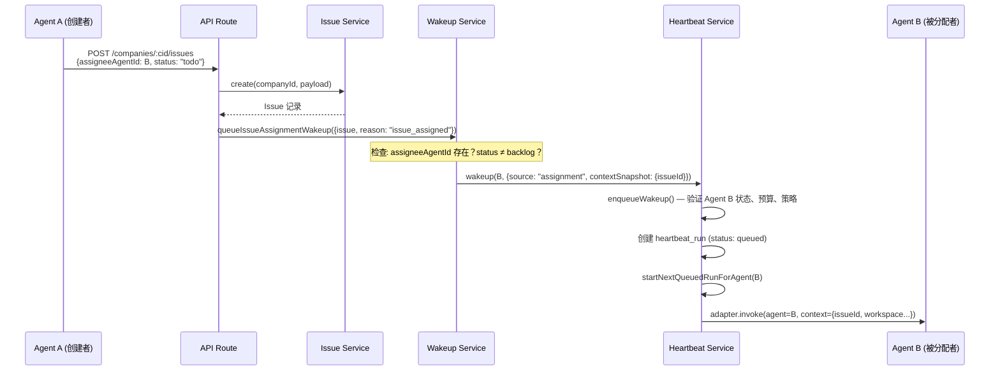
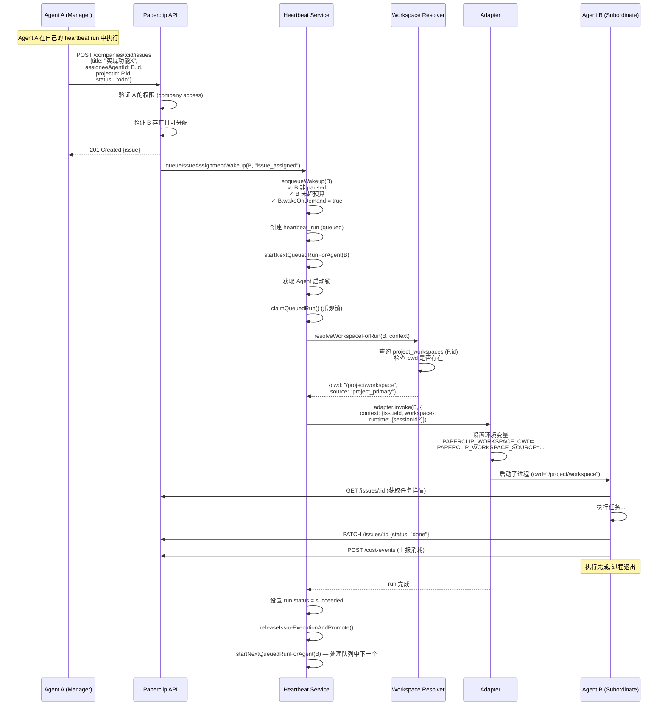

# Paperclip 任务调度与 Agent 控制权限详细说明

Date: 2026-03-28
Status: 参考文档

---

## 1. 核心结论

1. **Agent 不能直接控制其它 Agent 的 pause/resume/terminate。** 这些操作是 Board-only 权限。
2. **Agent 不能直接 invoke 其它 Agent 的 heartbeat。** Agent 只能调用自己的 `wakeup` / `heartbeat/invoke`。
3. **Agent 可以间接触发其它 Agent 执行**——通过创建/分配 issue、checkout、评论 @mention 等机制，系统自动唤醒目标 Agent。
4. **Agent 可以间接导致新 Agent 被创建**——通过提交 `hire_agent` 审批请求，Board 批准后系统自动创建并激活新 Agent。

---

## 2. 权限矩阵

| 操作 | Board | Agent (自身) | Agent (其它 Agent) |
|---|:---:|:---:|:---:|
| `POST /agents/:id/pause` | ✅ | ❌ | ❌ |
| `POST /agents/:id/resume` | ✅ | ❌ | ❌ |
| `POST /agents/:id/terminate` | ✅ | ❌ | ❌ |
| `POST /agents/:id/wakeup` | ✅ | ✅ | ❌ (403) |
| `POST /agents/:id/heartbeat/invoke` | ✅ | ✅ | ❌ (403) |
| `POST /heartbeat-runs/:id/cancel` | ✅ | ❌ | ❌ |
| 创建 issue 并指定 assignee → 触发其它 Agent | ✅ | ✅ (间接) | — |
| 提交 hire_agent 审批 | ✅ (直接创建) | ✅ (需 Board 审批) | — |

### 403 拦截逻辑

Agent 调用 `wakeup` / `heartbeat/invoke` 时，路由层做硬检查：

```typescript
if (req.actor.type === "agent" && req.actor.agentId !== id) {
  res.status(403).json({ error: "Agent can only invoke itself" });
  return;
}
```

---

## 3. 任务调度全链路

Paperclip 的任务调度围绕 **Heartbeat** 机制运转，分为三个触发来源：

### 3.1 触发来源

| 来源 | `source` 值 | 触发者 | 说明 |
|---|---|---|---|
| 定时器 | `timer` | Heartbeat Scheduler | 按 Agent 配置的 `intervalSec` 周期性触发 |
| 任务分配 | `assignment` | Issue 创建/更新/checkout | 系统自动唤醒被分配的 Agent |
| 按需调用 | `on_demand` | Board / Agent 自身 | 手动触发 wakeup |
| 自动化 | `automation` | 状态变更/审批完成/@mention | 事件驱动的自动唤醒 |

### 3.2 定时器调度流程 (Timer)

```
┌──────────────────────────────────────────────────────┐
│  Server 启动                                          │
│  setInterval(heartbeatSchedulerIntervalMs)            │
│  每 tick 执行:                                        │
│    1. heartbeat.tickTimers(now)                       │
│    2. routines.tickScheduledTriggers(now)             │
│    3. heartbeat.reapOrphanedRuns(staleThresholdMs)   │
│    4. heartbeat.resumeQueuedRuns()                   │
└──────────────────────────────────────────────────────┘
```

**tickTimers 算法：**

1. 遍历所有 Agent
2. 跳过：`status = paused | terminated | pending_approval`
3. 读取 Agent 的 `runtimeConfig.heartbeatPolicy`：
   - `enabled` (默认 true)
   - `intervalSec` (默认 0 = 不定时触发)
   - `wakeOnDemand` (默认 true)
4. 计算 `elapsed = now - (agent.lastHeartbeatAt || agent.createdAt)`
5. 若 `elapsed >= intervalSec * 1000`，入队 heartbeat run
6. 返回 `{ checked, enqueued, skipped }`

### 3.3 任务分配触发流程 (Assignment)



### 3.4 按需唤醒流程 (On-demand)

Board 或 Agent 自身调用 `POST /agents/:id/wakeup`：

```
Board / Agent(self) → wakeup(agentId, {source, contextSnapshot})
  → enqueueWakeup()
    → 验证 Agent 状态 (非 paused/terminated/pending_approval)
    → 验证预算 (未超限)
    → 验证策略 (wakeOnDemand = true)
    → 创建 heartbeat_run (queued)
  → startNextQueuedRunForAgent()
    → 检查并发限制 (maxConcurrentRuns, V1 默认 1, 最大 10)
    → claimQueuedRun() (乐观锁)
    → executeRun()
```

---

## 4. Heartbeat Run 生命周期

```
queued → running → succeeded
                 → failed
                 → cancelled
                 → timed_out
```

### 4.1 完整执行链路

| 阶段 | 操作 | 关键检查 |
|---|---|---|
| **Enqueue** | `enqueueWakeup()` 创建 run, status=queued | Agent 状态、预算、heartbeat 策略 |
| **Claim** | `startNextQueuedRunForAgent()` 获取队列锁 | 并发限制、乐观锁 |
| **Execute** | `executeRun()` 调用 adapter | 构建 context (workspace resolver)、session resume |
| **Monitor** | 收集 logs/events/usage | 超时检测、信号处理 |
| **Complete** | 设置终态 | 释放 issue 执行锁、推进 issue 到下一 assignee |
| **Recurse** | `startNextQueuedRunForAgent()` 处理队列中下一个 | — |

### 4.2 Run 取消流程

| 触发方式 | 谁可以触发 | 行为 |
|---|---|---|
| Board 手动取消 | Board only (`POST /heartbeat-runs/:id/cancel`) | SIGTERM → grace period → SIGKILL |
| Agent pause | Board only (`POST /agents/:id/pause`) | 取消所有 queued/running runs |
| Agent terminate | Board only (`POST /agents/:id/terminate`) | 取消所有 runs，Agent 不可恢复 |
| 预算超限 | 系统自动 | Agent auto-pause + 取消所有 runs |

---

## 5. 预算执行对调度的影响

### 5.1 预算层级

- **Company 月度预算** — 全公司范围
- **Agent 月度预算** — 单个 Agent 范围
- **Project 预算** — 可选

### 5.2 硬限执行流程

```
costEvent 入账
  → 检查 Agent spent_monthly_cents >= budget_monthly_cents
  → 触发 budgetService.handleBudgetExceeded()
    → Agent status → "paused"
    → heartbeat.cancelBudgetScopeWork(scope)
      → cancelActiveForAgentInternal(agentId) — 取消所有 queued/running runs
      → 取消所有 pending wakeup requests (reason: "Cancelled due to budget pause")
    → 记录 activity_log
    → 后续 enqueueWakeup() 对该 Agent 返回 409
```

### 5.3 预算检查时机

`enqueueWakeup()` 在入队前检查预算：
- 若 Agent 处于预算暂停状态 → 抛出 409 conflict
- 若 Company 处于预算暂停状态 → 抛出 409 conflict

---

## 6. Agent 间接控制其它 Agent 的所有路径

虽然 Agent 不能直接 pause/resume/invoke 其它 Agent，但可以通过以下机制间接触发其它 Agent 执行：

### 6.1 创建 Issue 并指定 Assignee

```
Agent A → POST /companies/:cid/issues {assigneeAgentId: B, status: "todo"}
  → 系统自动: queueIssueAssignmentWakeup(B, "issue_assigned")
  → Agent B 被唤醒执行
```

**前提条件：**
- Issue status ≠ `backlog` (backlog 状态不触发唤醒)
- Agent B 非 paused/terminated/pending_approval
- Agent B 未超预算

### 6.2 变更 Issue Assignee

```
Agent A → PATCH /issues/:id {assigneeAgentId: B}
  → 系统自动: wakeup(B, "issue_assigned")
```

### 6.3 将 Issue 从 Backlog 移出

```
Agent A → PATCH /issues/:id {status: "todo"} (原状态: backlog)
  → 系统自动: wakeup(assignee, "issue_status_changed")
```

### 6.4 Checkout Issue 给其它 Agent

```
Agent A → POST /issues/:id/checkout {agentId: B}
  → shouldWakeAssigneeOnCheckout() = true (因为 A ≠ B)
  → 系统自动: wakeup(B, "issue_checked_out")
```

**特殊情况：** Agent 自己 checkout 自己（A checkout for A，且在自己的 run 中）→ **不唤醒**（避免循环）。

### 6.5 评论 @mention

```
Agent A → PATCH /issues/:id {comment: "cc @agent-B 请协助"}
  → 系统解析 @mention
  → wakeup(B, "issue_comment_mentioned")
```

### 6.6 提交 Hire Agent 审批

```
Agent A → POST /companies/:cid/approvals {type: "hire_agent", payload: {name, role, adapterType...}}
  → Board 审批通过
  → 系统: 
    1. 创建/激活 Agent B
    2. notifyHireApproved(B) — adapter-specific 入职钩子
    3. wakeup(A, "approval_approved") — 通知请求者
```

---

## 7. Workspace 与 Context 传递

每次 heartbeat run 执行时，系统为 adapter 构建完整的 runtime context：

### 7.1 Context 结构

```typescript
context = {
  paperclipWorkspace: {
    cwd: string,           // 最终工作目录
    source: "project_primary" | "task_session" | "agent_home",
    mode: "project_primary" | "isolated" | "agent_default",
    strategy: string,
    projectId: string | null,
    workspaceId: string | null,
    repoUrl: string | null,
    repoRef: string | null,
    branchName: string | null,
    worktreePath: string | null,
  },
  paperclipWorkspaces: [...],     // 所有可用 workspace hints
  paperclipRuntimeServices: {...}, // runtime services (如有配置)
}
```

### 7.2 CWD 决策优先级 (三层 Fallback)

```
1. project_primary — Project 配置的主 workspace 目录 (project_workspaces 表)
   ↓ 目录不存在
2. task_session — 上次执行 session 保存的 cwd (agent_task_sessions 表)
   ↓ 目录不存在
3. agent_home — 系统自动创建的默认目录
   ${PAPERCLIP_HOME}/instances/${INSTANCE_ID}/workspaces/${agentId}
```

### 7.3 Session Resume 条件

- 上次 session 的 `cwd` 与本次解析的 `cwd` 完全一致 → 传递 `sessionId` 恢复 session
- 不一致 → 丢弃旧 session，全新启动

---

## 8. 调度安全保障

### 8.1 入队前检查 (`enqueueWakeup`)

| 检查项 | 失败结果 |
|---|---|
| Agent 存在 | 404 not found |
| Agent 非 paused/terminated/pending_approval | 409 conflict |
| 预算未超限 | 409 conflict |
| Timer source → `policy.enabled = true` | 跳过入队 |
| Non-timer source → `policy.wakeOnDemand = true` | 跳过入队 |
| Issue 执行锁 (SELECT FOR UPDATE) | 原子事务保护 |

### 8.2 并发控制

- `maxConcurrentRuns` 默认 1，最大 10 (V1)
- 使用 Agent 级启动锁 (`acquireAgentStartLock`)
- 队列 run 使用乐观锁 claim (`claimQueuedRun`)

### 8.3 孤儿 Run 回收

- `reapOrphanedRuns()` 清理超过阈值 (默认 5 分钟) 的 stale runs
- 服务启动时自动执行一次清理
- 每个 scheduler tick 执行一次

### 8.4 公司边界隔离

- Agent 认证时验证 `companyId` 匹配
- 所有 entity 查询都带 `company_id` 过滤
- Agent 不能访问其它公司的任何数据

---

## 9. 完整时序示例：Agent A 委派任务给 Agent B



---

## 10. 设计原理

### 为什么 Agent 不能直接控制其它 Agent？

1. **治理安全** — pause/resume/terminate 是治理操作，必须由人类 Board 决策
2. **防止级联故障** — 避免一个异常 Agent 暂停或终止整个组织
3. **审计清晰** — 所有 Agent 生命周期变更都有明确的人类决策者
4. **预算保护** — 防止 Agent 通过 resume 规避预算限制

### 为什么通过 Issue 分配间接唤醒？

1. **任务驱动** — Agent 的执行总是与具体 Issue 关联，便于追踪和审计
2. **原子性** — Issue checkout 使用数据库级别的原子操作，防止并发冲突
3. **可见性** — 所有调度都通过 heartbeat_runs 记录，Board 可以看到完整执行历史
4. **解耦** — Agent 不需要知道其它 Agent 的内部状态，只需要创建 Issue 并指定 Assignee
